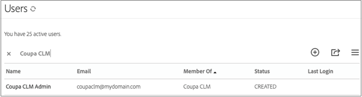
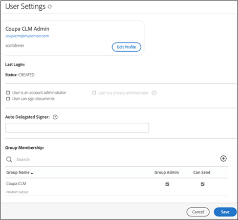

# [!DNL Coupa] インストールガイド{#coupa-installation-guide}

[**Adobe Sign サポートへのお問い合わせ**](https://adobe.com/go/adobesign-support-center)

## 概要 {#overview}

このドキュメントでは、署名を取得するために[!DNL Coupa BSM Suite]インスタンスを統合するようにAdobe Signアカウントを設定する方法について説明します。

前提条件:

* Adobe Sign Enterprise、[Adobe Sign Developer Edition](https://www.adobe.com/sign/developer-form.html)、または[Adobe Sign Enterprise試用版](https://www.adobe.com/sign/business.html)のサブスクリプション
* Adobe Sign管理者アクセス
* [!DNL Coupa BSM Suite] 標準または高度なインスタンス

統合を完了するための高レベルの手順は次のとおりです。

* [!DNL Coupa BSM Suite]で使用するAdobe署名グループの設定
* [!DNL Coupa BSM Suite]をAdobe Signに接続
* [!DNL Coupa BSM Suite]インスタンスに通知するAdobe Sign Webhookを作成します

## [!DNL Coupa BSM Suite]のAdobe署名グループの構成 {#configure-adobe-sign-for-coupa}

組織内で[!DNL Coupa]用のAdobe Signを専用で使用するには、管理者は[!DNL Coupa BSM Suite]用のAdobe Signグループを作成する必要があります。 このAdobe Signグループには、サービスアカウントとして機能する単一のグループ管理者ユーザーアカウントが必要です。 このサービスアカウントはすべての署名要求に使用されるので、`Bob.Smith@xyz.com`のような個人用のアカウントではなく、`Legal@xyz.com`、`Purchasing@xyz.com`、`CoupaCLM@xyz.com`など、匿名のアカウントにする必要があります。

### Adobe Signでのグループとユーザーの作成 {#create-sign-user-group}

Adobe Sign でユーザーを作成するには：

1. アカウント管理者として Adobe Sign にログインします。。
1. **[!UICONTROL アカウント]** > **[!UICONTROL ユーザー]**&#x200B;に移動します。
1. 新しいユーザーを作成するには、アイコンをクリックします。
1. 開いたダイアログで、新しいユーザーの詳細を指定します。

   1. アクセス可能な機能の電子メールを入力します。

      * このユーザーは、OAuth関係を確立し、維持します。
      * 電子メールアドレスは、確認用の実際のアドレスである必要があります。
   1. [!UICONTROL 名]と[!UICONTROL 姓]に適切な値を入力します。
   1. [[!UICONTROL プライマリグループ]]フィールドで、[**[!UICONTROL このユーザーの新しいグループを作成]**]を選択します。
   1. [[!UICONTROL 新しいグループ名]]フィールドに、*[!DNL Coupa BSM Suite]*&#x200B;のような直感的なグループ名を入力します。

   

1. **[!UICONTROL 保存]**&#x200B;を選択します。

   詳細を保存すると、[!UICONTROL ユーザー]ページに、[!UICONTROL CREATED]ステータスの新しいユーザーが表示されます。

   

   [!UICONTROL CREATED]のステータスは、ユーザーが電子メールアドレスをまだ確認していないことを示します。

1. 電子メール・アドレスを確認するには、次の手順に従います。
   1. 新しいユーザーの電子メールにログインします。
   2. 「Adobe Signへようこそ」の電子メールを見つけます。 必要に応じて、スパム/迷惑メールフォルダを確認します。
   3. 「**[!UICONTROL ここをクリックしてパスワードを設定します]**」というリンクをクリックします。
   4. パスワードを設定します。。

   電子メールアドレスを確認すると、ユーザーの状態が[!UICONTROL CREATED]から[!UICONTROL ACTIVE]に変わります。

   

### 認証ユーザーの定義 {#define-authenticating-user}

グループとそのグループ内のユーザーを作成したら、そのユーザーを「Group Admin」にする必要があります。

[!DNL Coupa BSM Suite]グループの新しいユーザーを昇格するには、次の手順に従います。

1. [!UICONTROL ユーザー]ページに移動します（まだ存在しない場合）。
2. ユーザーをダブルクリックします。

   ユーザー権限の[!UICONTROL 編集]ページが開きます。

3. [グループメンバーシップ]セクションで、[**[!UICONTROL グループ管理]**]と[**[!UICONTROL 送信可能]**]を選択します。
4. 「**[!UICONTROL ユーザーはアカウント管理者]**&#x200B;です。**[!UICONTROL ユーザーはドキュメントに署名できます。]**」オプションの選択を解除します。
5. 「**[!UICONTROL 保存]**」をクリックします。

   

## [!DNL Coupa BSM Suite]インスタンスの構成 {#configure-coupa}

[!DNL Coupa BSM Suite ]インスタンスとAdobe Signの間の接続を完了するには、サービス間に信頼関係を確立する必要があります。

[!DNL Coupa BSM Suite]を構成するには：

1. [!DNL Coupa BSM Suite]インスタンスを、上で作成したAdobe Signサービスアカウントに接続します。
1. Adobe Sign Webhookインスタンスを作成し、Coupa BSM Suiteインスタンスに契約の更新を通知します。

[!DNL Coupa BSM Suite]への接続方法とWebhookの作成と登録方法の詳細については、[Adobe Sign Coupa BSM Suite Instanceのサポートドキュメント](https://success.coupa.com/Support/Docs/Power_Apps/CLM_Standard/Signing_and_Approvals/Enable_E-Signatures_Through_Adobe_Sign_and_DocuSign){target=&quot;_blank&quot;}を参照してください。

## Adobe Signで[!DNL Webhook]を作成 {#create-webhook}

Coupa CLM統合では、Adobe SignからのWebhook通知を使用して、契約の状態に関する更新を送信します。 Webhookの設定を完了する必要があります。完了しない場合、署名のために送信された契約が不完全なままになるか、署名された契約がCoupa CLMに配信されません。

Adobe SignでWebhookを作成するには：

1. 上で作成したグループ管理者ユーザー（例： `coupaclm@MyDomain.com`）を使用して、Adobe Signにログインします。

1. **グループ** > **Webhooks**&#x200B;に移動します。

   

1. 新しい接続を作成するには、アイコンを選択します。

1. 開いた[作成]ダイアログで、必須フィールドに入力します。

   **注意： Coupa** からWebhookハンドラのURLを取得する必要があります。

   

1. 必要な通知パラメータを選択します。

1. **保存**&#x200B;を選択します。

## サポート {#support}

### [!DNL Coupa BSM Suite] 支援 {#coupa-support}

[!DNL Coupa BSM Suite ] は統合の所有者であり、統合の範囲、機能の要求、または統合の日々の機能に関する問題に関する質問に対する最初の窓口です。

お問い合わせは、[Coupaサポート](https://success.coupa.com/Support/Welcome_to_Coupa_Support){target=&quot;_blank&quot;}にお問い合わせください。

### Adobe Signのサポート {#adobe-sign-support}

Adobe Signは統合パートナーで、統合で署名を取得できない場合、または保留中の署名の通知が失敗した場合は、連絡を取る必要があります。

Adobe Signの使用または設定に関するヘルプは、Customer Success Manager(CSM)にお問い合わせいただくか、[Adobe Signサポート](https://adobe.com/go/adobesign-support-center)にお問い合わせください。

Adobe Sign管理者は、チケットを開いてヘルプ(?)からサポートを受けることもできます。 を選択します。

