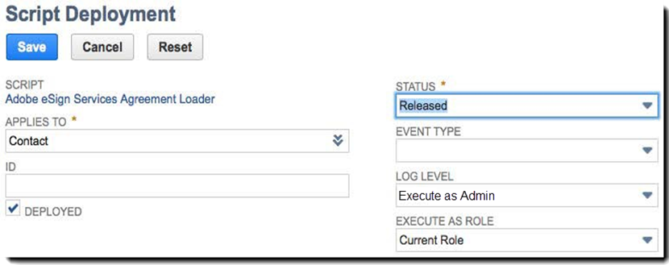

# [!DNL NetSuite] インストールおよびカスタマイズガイド (v4.0.4) {#install-customize-NetSuite}

## 概要 {#overview}

Adobe Sign [!DNL NetSuite] は、 [!DNL NetSuite]を選択します。 Adobe Signは、 [!DNL NetSuite] 統合により、契約書、見積書、その他の文書など、電子サインが必要な契約書を [!DNL NetSuite]を選択します。 顧客、リード、見積などから、Adobe Signの契約書を作成して送信できます [!DNL NetSuite] レコード、 Adobe Sign updates [!DNL NetSuite] 契約書のステータスを保持し、関連する [!DNL NetSuite] レコードは、完全に実行された後に作成されます。 送信元のすべての契約書の履歴を表示できます。 [!DNL NetSuite] を選択します。

詳しくは、 [Adobe Sign [!DNL NetSuite] リリースノート](https://experienceleague.adobe.com/docs/sign-integrations/using/netsuite/release-notes.html?lang=en) 」を参照してください。

## バンドルのインストールと OAuth の設定 {#install}

唯一の [!DNL NetSuite] 管理者はバンドルをインストールまたはアップデートできます。 OAuth を設定するには、 [!DNL NetSuite] 管理者には、Adobe Signへの管理者権限が必要です。 本番アカウントにバンドルをインストールする前に、 [!DNL NetSuite] サンドボックスアカウント。

参照 [Adobe Sign契約書の作成](#createagreement) 」を参照してください。

>[!CAUTION]
>
>v4.0.4 にアップグレードするユーザーは、既存の API キーを削除しないでください。
>
>参照 [カスタム環境設定](#configure) を参照してください。

### 初めてバンドルをインストールする

1. [!UICONTROL **Customization／SuiteBundler／Search &amp; Install Bundles**] に移動します。

1. 」を *バンドルの検索とインストール* 」ページで、「 **Adobe Sign** をキーワードとして選択し、 **[!UICONTROL 検索]**&#x200B;を選択します。

1. ツールバーの「 **Adobe Sign** バンドル名。

   

1. 」を *[!UICONTROL バンドルの詳細]* 」ページで、「 **[!UICONTROL Install]**&#x200B;を選択します。
1. 」を *[!UICONTROL Preview Bundle Install]* 」ページで、「 **[!UICONTROL バンドルのインストール]**&#x200B;を選択します。

   （ページのデフォルト値を変更する必要はありません）。

   

1. 表示されるインストールダイアログで、「 **[!UICONTROL OK]** 」をクリックします。

   インストールプロセスの実行中、バンドルのステータスには「*[!UICONTROL Pending]*」と表示されます。

   

1. 更新されたステータスを表示するには、「 **[!UICONTROL 更新]**&#x200B;を選択します。

   バンドルのインストールが完了すると、*[!UICONTROL Installed Bundles]* ページに *Adobe Sign for[!DNL NetSuite]* が表示されます。

   

1. 既にAdobe Signのお客様アカウントの場合は、次の手順に従ってください。  [インストールまたはアップグレード後の OAuth の設定](#oauth)を選択します。

   Adobe Signアカウントをお持ちでない場合は、 [エンタープライズ版の体験版に新規登録](https://esign.adobe.com/adobe-sign-[!DNL NetSuite]-trial-registration.html) アカウントを使用して、システムをテストします。 オンラインの登録手順に従って、Adobe Sign アカウントを有効にしてください。

## インストールまたはアップグレード後の OAuth の設定 {#oauth}

Adobe Signは、OAuth 2.0 を使用して、 [!DNL NetSuite]を選択します。

このプロトコルは、 [!DNL NetSuite] パスワードの入力を求めずにAdobe Signとやり取りするためのバンドル アプリケーション間で機密情報が直接共有されないので、アカウントが危険にさらされる可能性が低くなります。

この認証はお客様の実装に影響しませんが、バンドルを本番アカウントまたはサンドボックスアカウントにインストールまたはアップグレードした後に、ワンタイム設定を行う必要があります。

この [!DNL NetSuite] oauth を設定する管理者には、Adobe Signに対するアカウントレベルの管理者アクセス権も必要です。

1. 入力 [!DNL NetSuite]で、 *Adobe Sign Config* リストページです。

1. 検索対象 **[!UICONTROL Adobe Sign Config]** （カスタムレコードタイプ）ヘッダーの検索フィールドを使用します。

1. 検索結果ページで、「 **表示** 」を *Adobe Sign Config* 記録します。

   

1. Adobe Sign Config List ページで、「 **[!UICONTROL 表示]** 」を *OAuth を使用したAdobe Sign API へのアクセス* 記録します。

   

1. Adobe Sign Config ページで、「 **[!UICONTROL Adobe Signでログイン]**

   

1. 表示されるAdobe Signログインページで、資格情報を入力し、「 **[!UICONTROL サインイン]**&#x200B;を選択します。

   

1. 表示されるアクセスの確認ページ（OAuth の場合）で、「 **[!UICONTROL アクセスを許可]**

   

1. 認証が完了すると、 [!DNL NetSuite]を選択します。

   

   >[!NOTE]
   >
   >サンドボックスアカウントで OAuth を設定すると、認証の完了時に「Could not determine customer comp ID」というエラーが発生する場合があります。
   >
   >
   >続行するには、URL(system) のアカウントドメイン部分を変更する必要があります。[!DNL NetSuite].com) にアクセスして、 [!DNL NetSuite] サンドボックス：
   >
   >
   >変更:
   >
   >
   >system.[!DNL NetSuite].com/app/site/hosting/scriptlet.nl?script=745&amp;deploy=1&amp;web_access_point=https://echosign.com
   >
   >
   >宛先 :
   >
   >
   >を選択します。**sandbox.**[!DNL NetSuite].com/app/site/hosting/scriptlet.nl?script=745&amp;deploy=1&amp;web_access_point=https://echosign.com

## バンドルの更新（既存ユーザー）

[!DNL NetSuite] バンドルアップデートは定期的にAdobeから提供されます。 Adobe Sign for [!DNL NetSuite] 統合は最新のバンドルにアップデートできます。

>[!CAUTION]
>
>新しいバージョンにアップグレードするユーザーは、既存の API キーを削除しないでください。
>
>API キーの仕組みに関する詳細については、「[カスタム環境設定の指定](#configure)」を参照してください。

### 前提条件 {#prerequisites}

v4.0.4 バンドルへのアップデートに要する時間は、現在のステータスが「署名用に送信」である契約書の数によって変わります。 通常、100 件の契約書を更新するのに 7～10 分かかります。 アップデート時間を見積もるレコード数をメモします。

署名用に送信された契約書の数を決定するには：

1. 次の場所に移動 **[!UICONTROL Customization/Lists, Records, and Files/Record Types]**&#x200B;を選択し、 *Adobe Sign契約*

   または、検索バーで「Adobe Sign契約書」を検索します。

1. 」を [!UICONTROL Adobe Sign Agreements] レコードを作成するには、 **[!UICONTROL 検索]**&#x200B;を選択します。

   

1. 」を **[!UICONTROL ステータス]** 」ドロップダウンで、「 **[!UICONTROL 署名用に送信]** を選択し、 **[!UICONTROL 送信]**&#x200B;を選択します。

   

   アップデート時間を見積もるレコード数をメモします。

   

### バンドルのアップデート {#updating-the-bundle}

1. 次の場所に移動 **[!UICONTROL Customization/SuiteBundler/Search &amp; Install/List]** 次のように、現在のバンドルを探します。

   >[!NOTE]
   >
   >新しいバージョンのバンドルがある場合は、 *バージョン* 現在のバンドルの番号。

1. アクションドロップダウンメニューから、 **[!UICONTROL 更新]**&#x200B;を選択します。

   

1. Preview Bundle Update ページで、 **[!UICONTROL バンドルの更新]** ページに表示されるデフォルト値は変更されません。

   インストール中、バンドルのステータスは *保留中*&#x200B;を選択します。

   .

   >[!NOTE]
   >
   >バンドルをアップデートするときに、次のような警告メッセージが表示されることがあります。 カスタマイズしていない場合は、 [!DNL NetSuite] 電子サインレコードを追加したら、次に進むことができます。 不明な場合は、本番アカウントのバンドルをアップデートする前に、サンドボックスアカウントにバンドルをインストールして、まずテストすることをお勧めします。

   

1. 更新されたステータスを表示するには、「 **[!UICONTROL 更新]**&#x200B;を選択します。

   

   >[!NOTE]
   >
   >複数の契約書が *署名用に送信* 」ステータスを表示する場合、「 **[!UICONTROL 実行ログ]** 」サブタブ ( *Adobe Sign Bundle Installation* スクリプトを使用して、アップデートの進行状況を確認します。 参照 [アップデートの進行状況の確認](#determineprogress) 」を参照してください。

   バンドルアップデートの完了後、*Installed Bundles* ページに「*Adobe Sign for[!DNL NetSuite]*」が表示されます。

   

## バンドルの設定 {#configure}

### カスタム環境設定  {#set-custom-preferences}

カスタム環境設定を使用して、契約書の作成方法や [!DNL NetSuite]を選択します。 また、 *Adobe Signでのユーザーの自動プロビジョニング* 環境設定では、 [!DNL NetSuite] ユーザーが契約書を送信すると、Sign サービスで自動プロビジョニングされます。 [!DNL NetSuite]を選択します。

1. **[!UICONTROL Setup／Company／General Preferences]** に移動します。
1. ページを下にスクロールし、 **[!UICONTROL カスタム環境設定]** 」サブタブに移動します。

   

1. 必要に応じて、Adobe Sign環境設定を有効にして設定します。

   * **アカウントの EchoSign API キーを入力**:このフィールドに値を追加または編集しないでください。
   * **親レコードの取引先担当者を署名者として使用**:有効にすると、契約書が作成されるときに、デフォルトで親レコードの取引先担当者が最初の署名者に設定されます。 送信者は、契約書を送信する前に、容易にデフォルト署名者を削除または編集したり、その他の署名者を追加したりできます。
   * **Use Trans.署名者として連絡する（存在する場合）**:この環境設定は、 *親レコードの取引先担当者を署名者として使用* 環境設定も有効になります。 有効にすると、トランザクションレコード（見積など）から契約書を生成するときに、デフォルトでトランザクションの主担当者が最初の署名者に設定されます。 参照 [トランザクションレコード](#transrecords) 」を参照してください。 トランザクションの主担当者がいない場合、または [!DNL NetSuite] オブジェクトレコード（顧客レコード、パートナーレコードなど）のデフォルトの受信者は、顧客電子メールの主取引先責任者です。 送信者は、契約書を送信する前に、容易にデフォルト署名者を削除または編集したり、その他の署名者を追加したりできます。
   * **受信者を承認者としてマークすることを許可**:有効にすると、送信者は受信者を承認者としてマークできます。 承認者としてマークされた受信者は契約書を確認して承認できますが、署名する必要はありません。承認者は、承認プロセス中にフィールドへのデータの入力を求められることがあります。
   * **優先契約フォルダー Id**:最終的な署名済み契約書を保存するフォルダーを指定するために使用されます。 このフィールドに値を設定しない場合は、最終的な署名済み契約書はデフォルトで元の文書ファイルと同じフォルダーに保存されます。フォルダー ID は数値でなければなりません。
   * **自動接続トランザクションPDF**:有効にすると、トランザクションPDFは、トランザクションレコードから新しい契約書が作成されたときに、自動的に契約書に添付されます。
   * **署名済みPDFを追加（添付ファイルまたはリンク）**:If *リスト* がドロップダウンから選択されている場合、署名済みPDFはファイルへのリンクとして自動的に追加されます。 ドロップダウンから「*Attachment*」を選択した場合は、署名済み PDF が契約レコードの添付ファイルとして に保存されます。[!DNL NetSuite]
   * **契約書に監査証跡PDFを含める**:有効にすると、監査証跡PDFは、契約書が署名された後に自動的に契約書レコードに添付されます。
   * **ID 確認方法の適用先**:いずれかの ID 確認方法を有効にすると、その ID 確認方法を誰に適用するかが決まります。 オプションは次のとおりです *すべての署名者、外部署名者のみ*、または *内部署名者のみ*&#x200B;を選択します。

   **Identity Verification Methods** {#identity-verification-methods}

   契約書を作成するときに有効にする ID 確認方法を選択できます。ここで複数の ID 確認方法を有効にすると、Adobe Sign契約書ページに **[!UICONTROL 署名者の ID を確認]** 」オプションを選択します。

   * **署名に必要なパスワードを有効にする**:署名者に対し、指定したワンタイムパスワードの入力を求めます。

   * **ナレッジベース認証を有効にする**:署名者に対し、名前と住所、オプションで SSN の末尾 4 桁を入力した後、提供された情報を確認する一連の質問に答えることを要求します。 米国でのみ使用できます。

   * **Web ID 認証を有効にする**:署名者に対し、次のいずれかのサイトにログインして ID を確認することを要求します。Facebook、Google、LinkedIn、Microsoft Live、Twitter、Yahoo!

   * **Adobe Signでのユーザーの自動プロビジョニング**:有効にすると、契約書を送信するユーザー [!DNL NetSuite] は、Adobe Signユーザーアカウントで自動的にプロビジョニングされます。

1. 選択 **[!UICONTROL 保存]** 」をクリックして環境設定を保存します。

## 自動ステータス更新の設定 {#asu}

Adobe Sign統合バンドルを使用すると、 [!DNL NetSuite] 送信元の契約書のステータスについて [!DNL NetSuite]を選択します。 この機能が有効になっている場合、 [!DNL NetSuite] には、常に契約書のステータスが反映されます。 自動ステータス更新を有効にするには、以下のことを実行します。

1. 次の場所に移動 **[!UICONTROL Setup > Company > Enable Features]を選択します。**
1. ツールバーの「 **[!UICONTROL SuiteCloud]** 」サブタブに移動します。
1. 以下のオプションを有効にします。

   * 「SuiteBuilder」セクションで、「**[!UICONTROL Custom Records]**」オプションを有効にします。

   * 「SuiteScript」セクションで、「**[!UICONTROL Client SuiteScript]**」オプションと「**[!UICONTROL Server SuiteScript]**」オプションを有効にし、両方の利用規約に同意します。

1. 選択 **[!UICONTROL 保存]**&#x200B;を選択します。

   オプションは図のように設定されます。

   

## オブジェクトとレコードタイプ {#objects}

Adobe Sign統合バンドルは既に、Adobe Sign契約オブジェクトを多くの標準で公開しています [!DNL NetSuite] オブジェクトの例：お客様、見積、リード、オポチュニティ、パートナーのレコード カスタムレコードも含め、これ以外のレコードタイプでも Adobe Sign バンドルを使用できます。

「契約書」タブには、次の 2 つのタイプを表示できます。 [!DNL NetSuite] レコード：エンティティレコードとトランザクションレコード。 通常、トランザクションレコードは、トランザクション文書に変換できるレコード（見積など）であるとPDFます。一方、エンティティレコードはエンティティに変換できないPDFです。

## トランザクションレコード {#transrecords}

契約書がトランザクションレコードから作成されている場合、契約書レコードの最初の文書は、その契約書が送信されたレコードのPDF版であり、最初の受信者は、レコードの電子メールアドレスです。 最初の文書を元のレコードのPDF版にしたくない場合は、 **[!UICONTROL Setup/Company/General Preferences/Custom Preferences サブタブ]** を選択し、 **[!UICONTROL 自動接続トランザクションPDF]** 」オプションを選択します。 参照 [カスタム環境設定](#configure) 」を参照してください。

「Custom Preferences」で「**[!UICONTROL Use Trans.Contact as First Signer]**」環境設定を有効にして、トランザクションの主担当者を自動的に最初の署名者として追加することもできます。トランザクションレコードに関連付けられている場合は、 **[!UICONTROL 契約書]** および **[!UICONTROL Send for Signature]** ボタン、

## エンティティレコード {#entity-records}

契約書がエンティティレコードから作成される場合、最初の受信者はレコードの電子メールアドレスです。 エンティティレコードに関連付けられている場合は、「Agreements」タブだけが表示されます。

## バンドルのカスタマイズ {#customize}

バンドルのカスタマイズには、以下の作業が含まれます。

* 適切なレコードタイプに、「Agreements」サブタブと「Send for Signature」ボタンのスクリプトを導入します。
* Adobe Sign レコードタイプの役割権限を設定します。
* 権限を変更して、「*Agreements*」サブタブと「*Send for Signature*」ボタンへのアクセスを許可します。

### 追加のレコードタイプに対するAdobe Sign契約書の設定  {#configuring-adobe-sign-agreements-for-additional-record-types}

を使用して *契約書* サブタブと *Send for Signature* 」ボタンをクリックします。

1. **[!UICONTROL Customization／Scripting／Scripts] に移動します。**

1. 」を *スクリプト* 表示されるリストページで、導入する必要があるスクリプトを見つけ、「 ****[!UICONTROL 表示]****&#x200B;を選択します。

   * を選択して、 *Send for Signature* 」ボタンをクリックし、「 **[!UICONTROL Adobe Sign Estimate Button]** スクリプト。

   * を選択して、 *契約書* 」タブで、「 **[!UICONTROL Adobe Sign Agreement Loader]** スクリプト。

1. Script ページで、「 **[!UICONTROL スクリプトの展開]**&#x200B;を選択します。

   

1. Script Deployment ページで、以下のようにします。

   * *Applies To* リストからレコードのタイプを選択します。
   * オプションで、スクリプト導入 ID を入力することもできます

      詳しくは、 *カスタムスクリプト展開 ID の作成* トピックを [!DNL NetSuite] 詳しくは、ヘルプセンターを参照してください。 ID を入力しなかった場合は ID が生成されます。

   * 「**[!UICONTROL Deployed]**」チェックボックスをオンにします。

   

   * 「*Status*」を「**[!UICONTROL Released]**」に設定します。

      DITA ファイルの拡張子を指定する必要はありません。 *イベントタイプ* または *ログレベル*&#x200B;を選択します。

   * 」を [!UICONTROL *ロールとして実行]*ドロップダウンで、 **[!UICONTROL 管理者として実行]**&#x200B;を選択します。

   * を **[!UICONTROL 対象]** サブタブがアクティブです（デフォルトでアクティブ）。アクセスを許可する役割またはユーザーを選択します。 すべての役割およびユーザーにアクセスを許可する場合は、それぞれ「**[!UICONTROL Select all]**」オプションを有効にします。

   * 選択 **[!UICONTROL 保存]**&#x200B;を選択します。 変更確認が表示されたら、「 **[!UICONTROL 戻る]**&#x200B;を選択します。

1. select **[!UICONTROL リスト]** 」をクリックすると、 *スクリプト* リストページです。
1. 他のスクリプトに対しても上記の手順 2 と手順 3 を繰り返します。

## Adobe Sign レコードタイプの役割権限の設定 {#setting-role-permissions-for-adobe-sign-record-types}

最大 [!DNL NetSuite] 役割には、追加のカスタマイズを行わずにAdobe Signを使用する権限が必要です。 ただし、追加のカスタム役割を作成した場合は、権限を付与する必要があります。

1. **[!UICONTROL Customization／Lists, Records, &amp; Files／Records Types]** に移動します。

   

   >[!NOTE]
   >
   >「*Record Types*」アイテムが表示されない場合は、**[!UICONTROL Setup／Company／Enable Features／「Suite Cloud」]**&#x200B;タブに移動して「*Custom Records*」オプションを有効にします。

1. 」を *レコードタイプ* 」ページで、「 **[!UICONTROL Adobe Sign Agreement]** 選択するには

   

1. 」を *カスタムレコードタイプ* 」ページで、「 **[!UICONTROL 権限リストを使用]** 」を *アクセスタイプ* 」ドロップダウンから選択します。

   

   >[!NOTE]
   >
   >「*Use Permission List*」アクセスタイプを必要とする Adobe Sign レコードタイプは、「*Adobe Sign Agreement*」レコードタイプだけです。
   >
   >
   >その他の Adobe Sign レコードタイプのアクセスタイプを設定する手順については、手順 6 を参照してください。

1. ツールバーの「 **[!UICONTROL 権限]** 」サブタブに移動します。

   役割と権限のリストが表示されます。

   

1. 「[!UICONTROL Adobe Sign Agreement]&quot;レコードタイプ。

   >[!NOTE]
   >
   >詳しくは、 *[カスタムレコードタイプのアクセス許可リストを設定する](https://system.[!DNL NetSuite].com/app/help/helpcenter.nl?fid=section_N2879931.html)* トピックを [!DNL NetSuite] 詳細については、ヘルプセンター

   1. 「*Role*」リストから役割を選択します。
   1. 設定 *レベル* を **[!UICONTROL フル]**&#x200B;を選択します。
   1. 設定 *既定のフォーム* を **[!UICONTROL カスタム EchoSign 契約フォーム]**&#x200B;を選択します。
   1. 選択 **[!UICONTROL フォームの制限]** チェックボックスを選択します。
   1. 選択 **[!UICONTROL 追加]** 」をクリックして、役割行の変更を保存します。

   

   新しい行が次のように表示されます。

   

   他のカスタム役割についても上記の手順 a から手順 e を繰り返します。

   * select **[!UICONTROL 保存]** 」を *カスタムレコードタイプ* 」ページを開きます。
   この *[!UICONTROL 顧客レコードタイプ]* ページが再表示されます。

1. 他のすべての Adobe Sign レコードタイプについても上記の手順 1 から手順 3 を繰り返して、「*Access Type*」を

   **[!UICONTROL 権限は不要]を選択します。**」に設定します。以下のレコードタイプが対象となります。

   * Adobe Sign Config
   * Adobe Sign 文書
   * Adobe Sign Event
   * Adobe Sign Language
   * Adobe Sign Script Errors
   * Adobe Sign Signed Agreement
   * Adobe Sign Signer

### 「契約書」タブへのアクセスと「Send for Signature」ボタン  {#granting-access-to-the-agreement-tab-and-send-for-signature-button}

Adobe Sign統合バンドルは既に、Adobe Sign契約オブジェクトを多くの標準で公開しています [!DNL NetSuite] オブジェクト（顧客、見積もり） [見積]、リードなどを含む )。 「*Agreement*」サブタブは、以下のタイプのオブジェクトで自動的に有効になります：カスタマー、リード、商談、パートナー、見込み客、見積、ベンダー請求書。

この *[!UICONTROL Send for Signature]* ボタンは自動的に有効になります **o[!UICONTROL quote オブジェクトに対してのみ]**&#x200B;を選択します。

[!DNL NetSuite] 管理者は、機能を拡張して追加の CRM オブジェクトに契約書を作成できるようにできます。それには、CRM オブジェクトに「*Agreement*」サブタブ、「*Send for Signature*」ボタン、またはその両方を追加できるように権限を変更します。

#### 権限を変更して「Send for Signature」ボタンへのアクセスを許可  {#modifying-permissions-to-grant-access-to-the-send-for-signature-button}

1. **[!UICONTROL Customization／Scripting／Scripts]** に移動します。

   *Scripts* リストページが表示されます。

   * 必要に応じて、フィルターを使用してAdobe Signスクリプトを見つけます

1. 」を *スクリプト* 」ページで、「 *Adobe Sign Estimate Button* スクリプト ( *Send for Signature* 」ボタン ) をクリックし、「 **表示**&#x200B;を選択します。

   

1. *Script* ページで、以下のようにします。

   * パネルで「 **[!UICONTROL 導入]** サブタブ

   * 「*適用対象*&quot;変更するエンティティのリンクを選択します。

      * この例では&#x200B;**[!UICONTROL 見積]**&#x200B;です。

   

   * パネルで「 **[!UICONTROL 編集]** 」ボタンを *スクリプトの導入* ページ

   

   * を **[!UICONTROL 対象]** 」サブタブがアクティブな状態で、アクセスを許可する役割またはユーザーを選択します。

      * すべての役割およびユーザーにアクセスを許可する場合は、それぞれ「**[!UICONTROL Select all]**」オプションを有効にします。
   * select **[!UICONTROL 保存]**

   

#### 権限を変更して「Agreements」タブへのアクセスを許可  {#modifying-permissions-to-grant-access-to-the-agreements-tab}

1. **[!UICONTROL Customization／Scripting／Scripts]** に移動します。
1. 」を [!UICONTROL スクリプト] 」ページで、「 *[!UICONTROL Adobe Sign Agreement Loader]* スクリプト ( *「契約書」タブ*) を選択し、 **[!UICONTROL 表示]**&#x200B;を選択します。
1. *Script* ページで、以下のようにします。

   1. ツールバーの「 **[!UICONTROL 導入]** サブタブ
   1. 「*[!UICONTROL 適用対象]*」アクセス権を変更するエンティティのリンクを選択します
   1. 」を *[!UICONTROL スクリプトの導入]* 」ページで、「 **[!UICONTROL 編集]** ボタン
   1. 「**[!UICONTROL Audience]**」サブタブがアクティブな状態で（デフォルトでアクティブになっています）、アクセスを許可する役割またはユーザーを選択します。すべての役割およびユーザーにアクセスを許可する場合は、それぞれ「**[!UICONTROL Select all]**」オプションを有効にします。
   1. select **[!UICONTROL 保存]**

## Adobe Sign [!DNL NetSuite] 束

契約書を送信するには [!DNL NetSuite] これらの契約書の更新を受け取る場合、ユーザーは同じログイン ID（電子メールアドレス）を [!DNL NetSuite] Adobe Signでも

### Adobe Sign 契約書の作成

サンドボックスまたは本番アカウントで新しいバンドルをインストールした後、新しい契約書を作成してバンドルをテストしてください。Adobe Sign 契約書は、エンティティレコードまたはトランザクションレコードから、あるいはスタンドアロンの契約書として作成できます。

>[!NOTE]
>
>契約書の作成プロセスは、どの方法で作成するかによって若干異なります。一般的なプロセスとしては、契約書のオプションを指定し、1つまたは複数の契約書文書を追加し、受信者を指定します。以下に説明するプロセスでは、カスタマーレコードから契約書を作成する場合を想定しています。

1. 契約書を送信するカスタマーレコードを選択または作成するか、別のレコードを選択できます [!DNL NetSuite] 「 Agreements 」タブが有効になっているレコードタイプ。

1. レコードから、 **[!UICONTROL 契約書]** 」サブタブに移動します。
1. 選択 **[!UICONTROL 新規契約書]**&#x200B;を選択します。

   

1. 」を *[!UICONTROL Adobe Sign Agreement]* 」ページで、「 **[!UICONTROL 編集]**&#x200B;を選択します。

   

1. 契約書のオプションを次のように指定します。

   * **契約書名**  — 契約書の名前を入力します。
   * **メッセージ** — 受信者へのカスタムメッセージを入力します。
   * **Signature Type -**&#x200B;文書で受け付ける署名タイプを選択します。オプションは次のとおりです *電子サイン* および *Fax 署名*&#x200B;を選択します。

   * **私もこの契約書に署名しなければなりません**  — このオプションを有効にすると、送信者も契約書に署名する必要があります。
   * **署名の順序**-If the *私もこの契約書に署名しなければなりません* 」オプションが有効になっている場合、送信者と受信者が署名する順序を選択します。 オプションには、「I sign, then recipients sign」、「Recipients sign, then I sign」と「None」があります。

   * **文書のプレビュー、署名の位置指定（またはフォームフィールド）**  — このオプションを有効にすると、送信者は契約書を受信者に送信する前に、契約書をプレビューして、フィールド（署名、イニシャル、その他のフォームフィールドをドラッグ&amp;ドロップ）を追加できます。
   * **署名者の ID を確認**  — このオプションを有効にして、次のいずれかの ID 確認オプションを選択します。

      * このオプションは、以下に示す 3 つの ID 確認方法のうち 2 つ以上が「Custom Preferences」で有効にされている場合にのみ表示されます。(「 [カスタム環境設定](#customize) を参照してください )。 有効になっている環境設定が 1 つしかない場合は、「**[!UICONTROL Verify Signer Identity]**」オプションは表示されません。

   **Identity Verification Methods**

   * **署名に必要なパスワード**  — 署名者に対し、指定したワンタイムパスワードの入力を求めます。
   * **ナレッジベース認証**  — 署名者に対し、名前と住所、オプションで SSN の末尾 4 桁を入力した後、提供された情報を確認する一連の質問に答えることを要求します。 米国でのみ使用できます。
   * **Web ID 認証**  — 署名者に対し、次のいずれかのサイトにサインインして ID を確認することを要求します。Facebook、Google、LinkedIn、Twitter、Yahoo! または Microsoft Live です。
   * **パスワードの表示に必要なPDF**  — このオプションを有効にすると、受信者が契約書または署名済み契約書のPDFを開く前にパスワードの入力を要求されます。 すべてのPDFに送信されるユーザーファイルは暗号化されており、ファイルを開くときにパスワードが必要です。 パスワードは復元できないので、忘れないように注意してください。パスワードを忘れた場合は、そのトランザクションを削除して、もう一度開始する必要があります。
   * **パスワード/パスワードの確認** — *パスワードの表示に必要なPDF* 」オプションが有効になっている場合は、契約書の表示に使用するパスワードを入力します。
   * **受信者に署名を依頼**  — 受信者にリマインダーを送信するかどうかと頻度を指定します。 オプションには、「*Never*」、「*Daily*」と「*Weekly*」があります。
   * **言語：** 受信者に対して署名ページと電子メール通知を表示する言語を指定します。
   * **最初の署名者の署名をホスト**  — このオプションを有効にすると、送信者が最初の署名者に対して対面署名をホストできます。
   * **署名期限までの日数**  — 契約書の署名期限を示す整数を入力します（今日の日付+日数）。
   * **親レコード**  — オプションで、契約書にリンクする親レコードを選択します。

   

1. ツールバーの「 **[!UICONTROL 文書]** タブを選択します。

   

1. 」を *文書* サブタブで、 *Adobe Sign Document* 」ドロップダウンをクリックし、「 **[!UICONTROL 添付]**&#x200B;を選択します。

   または、「 **[!UICONTROL 新しいAdobe Sign文書]** を選択して、 *[!UICONTROL Adobe Sign Document]* ページを開き、 [!DNL NetSuite] ファイルキャビネットで、トランザクションレコードからファイルを選択するか（該当する場合）、新しい文書を添付します。

   1 つの契約書に複数の文書を追加できます。

1. 選択 **[!UICONTROL 受信者]** 」サブタブをクリックし、取引先担当者リストから選択するか電子メールアドレスを入力して、受信者を指定します。

   

   受信者はそれぞれ、署名者または CC としてマークできます。「*Allow Marking Recipients as Approvers Signers*」カスタム環境設定が有効な場合は、受信者を承認者としてマークすることもできます。参照 [カスタム環境設定](#customize) 」を参照してください。

   * **署名者**&#x200B;は、契約書に署名する必要があります。
   * **承認者** 契約書を承認する必要がありますが、署名する必要はありません。また、オプションで、契約書にデータを追加する必要があります。
   * **CC 受信者** 契約書が更新されたときと、契約書が署名され完了したときに通知されます。 CC 受信者は、署名または承認プロセスの参加者ではありません。

      「*Use Parent Record Contact as Signer*」カスタム環境設定が単独で、または「*Use Trans.Contact as Signer*」環境設定と共に有効にされている場合、最初の受信者はデフォルトで決定されますが、変更も可能です。

1. 選択 **[!UICONTROL 追加]** を入力します。

1. 選択 **[!UICONTROL 保存]** 」をクリックして契約書を保存します。

### 署名用に契約書を送信

契約書を送信する準備が整ったら、「 **[!UICONTROL Send for Signature]** 」ボタンをクリックします。

* DITA マップの *文書のプレビューまたは署名の位置指定* 」オプションが有効になっている場合は、「 **[!UICONTROL Send for Signature]**&#x200B;を選択します。 ウィンドウが表示されたら、文書を送信する前にプレビューを表示するか、フォームフィールドを文書にドラッグします。 選択 **[!UICONTROL 送信]** を選択して、受信者に契約書を送信します。

* DITA マップの *[!UICONTROL 最初の署名者の署名をホスト]* 」オプションが有効になっている場合は、「 **[!UICONTROL Send for Signature]**&#x200B;を選択します。 開いたウィンドウで、送信者を招待した状態で署名者が文書に署名できるようにします。

   「*Host Signing for First Signer*」フィールドの隣に表示される「*Host Signing for Current Signer*」リンクは、文書に署名し終わるまで使用できます。このリンクを使用して、複数の署名者に契約書に署名してもらったり、ポップアップウィンドウを誤って閉じてしまった場合は開き直したりできます。

契約書が送信されると、受信者は、署名待ちの文書があることを知らせる電子メールを受信します。

受信者が文書に署名し終わると、送信者は、文書が署名されたことを知らせる電子メールを受信します。

#### 見積からの送信

Adobe Signは、 [!DNL NetSuite] 見積のPDFが自動的に生成され、契約レコードに添付されます。

見積の表示時に、「 **[!UICONTROL Send for Signature]**&#x200B;を選択します。 契約書に添付された見積が生成され、表示されます。 「*Send for Signature*」ボタンは、他のトランザクションレコードタイプにも追加できます参照 [オブジェクトとレコードタイプ](#objects) 」を参照してください。

### ステータスのトラックとリマインダーの送信

契約書を送信した後：

* 契約書の詳細セクションで、文書のステータスが「*Out for Signature*」に変化します。
* この *Send for Signature* ボタンは次の 3 つのボタンに置き換えられました。

   * **ステータスの更新**  — ステータス更新が設定されていない場合は、ステータスを手動で更新します。 参照 [自動ステータス更新の設定](#asu) 」を参照してください。
   * **リマインダーを送信**  — 現在の署名者にリマインダーを送信します。
   * **契約書をキャンセル**  — 契約書をキャンセルします。 契約書を署名用に送信した後でも、まだすべての受信者が署名していなければ、キャンセルできます。

新しい「*Events*」サブタブが契約レコードに表示され、ここで契約書のステータスをトラックできます。

契約イベントの履歴が表示され、契約書が送信、表示および署名された日付などの情報を確認できます。

契約書が署名された後：

* ステータスが「*Signed*」に変化します。。
* リンクを使用して、この契約書の親レコードに戻ることができます。
* 「Signed Document（署名済み文書）」および「Audit Trail（監査証跡）」の下にある「download（ダウンロード）」リンクを使用して、これらの文書にアクセスできます。
* 追加 *署名済み文書* サブタブには、署名済み文書のサムネールが表示されます。

>[!NOTE]
>
>契約書が署名用に送信された後は、レコードを編集できません。 これは、イベントの記録を保持するためです。

## バンドルのアンインストール

バンドルをアンインストールするには、 [!DNL NetSuite] ヘルプ 詳しくは、 *[バンドルのアンインストール](https://docs.oracle.com/cloud/latest/[!DNL NetSuite]cs_gs/NSBDL/NSBDL.pdf)* トピックを [!DNL NetSuite] 詳しくは、ヘルプセンターを参照してください。

バンドルをアンインストールすると、署名されていない契約書は削除されます。 署名済み契約書および対応する監査PDFファイルは影響を受けません。

署名されていない契約書を保持する必要がある場合は、バンドルをアンインストールしないでください。

## トラブルシューティング

### アップデートの進行状況の確認

アップデートに長い時間がかかっている場合は、Adobe Sign Bundle Installation スクリプトの「Execution Log」サブタブでアップデートの進行状況を確認できます。それには以下を実行します。

1. **[!UICONTROL Customization／Scripting／Scripts]** に移動します。
1. 」を [!UICONTROL スクリプト] 」ページで、「 *[!UICONTROL Adobe Sign Bundle Installation]* スクリプトを作成し、「 **[!UICONTROL 編集]**&#x200B;を選択します。
1. 」を [!UICONTROL スクリプト] 」ページで、「 **実行ログ** 」サブタブに移動します。
1. select **更新**&#x200B;を選択します。

   実行ログはステータスを反映して更新されます。 「*Details*」列に、契約書の更新状況が表示されます。

   

### アクセストークンの問題の解決

契約書を操作しているときに、「Access token provided is invalid or has expired」というメッセージが表示されることがあります。

これには以下の理由が考えられます。

* この [!DNL NetSuite]/OAuth を設定したAdobe Sign管理者がアクセストークンを取り消した
* 送信元の契約書がないため、アクセストークンが期限切れになっている [!DNL NetSuite] 過去 60 日間
* この [!DNL NetSuite]/Adobe Sign管理者が初期 OAuth 構成を正常に完了しませんでした

この問題を解決するには、OAuth 設定プロセスを再度実行します。 詳細については、「[インストールまたはアップグレード後の OAuth の設定](#oauth)」を参照してください。

### 文書ステータスの問題の解決 {#resolvestatus}

If [自動ステータス更新](#asu) が設定されているのに契約書を送信しても契約書のステータスが更新されない場合は、次の操作を試してください。

1. *Adobe Sign External Update* スクリプトの導入実行ログで、Adobe Sign からの呼び出しを受信できているか確認します。それには以下を実行します。

   1. **[!UICONTROL Customization／Scripting／Script Deployments]** に移動します。
   1. 」を *スクリプトデプロイ* 」ページで、「 *Adobe Sign External Update* スクリプトを作成し、「 **[!UICONTROL 編集]**
      1. 」を *[!UICONTROL スクリプトの導入]* 」ページで、「 **[!UICONTROL 実行ログ]** 」サブタブに移動します。
      * DITA マップの *契約書レコードの更新* 各契約 ID のエントリ

1. *Adobe Sign Update Agreements* スクリプトの導入実行ログを調べてエラーがないか確認します。それには以下のようにします。

   1. 次の場所に移動 **[!UICONTROL Customization > Scripting > Script Deployments]**&#x200B;を選択します。
   1. 」を [!UICONTROL スクリプトデプロイ] 」ページで、「 *[!UICONTROL Adobe Sign Update Agreements]* スクリプトで「[!UICONTROL スケジュール]」ステータスを表示してから、「 **[!UICONTROL 編集]**&#x200B;を選択します。
   1. 」を [!UICONTROL スクリプトの導入] 」ページで、「 **[!UICONTROL 実行ログ]** 」サブタブに移動します。
   1. Under [!UICONTROL 種類]で、 **[!UICONTROL エラー]** 」をクリックして結果をフィルタリングします。

1. 最後に、上記の手順 2 の説明に従い、*Adobe Sign Manager* スクリプトの実行ログでエラーがないか確認します。

### MIME タイプエラーの解決  {#resolving-mime-type-errors}

契約書の送信時に MIME タイプエラーが発生した場合は、「ファイル名」フィールドの名前が、アップロードされたファイルのファイル名と拡張子と一致していない可能性があります。 「ファイル名」フィールドを空白のままにすると、正しいファイル名と拡張子が自動的に入力されます。

### スクリプトログの表示 {#viewing-script-logs}

導入実行ログは、文書ステータスの問題に関連しないスクリプトに対しても表示することができます参照 [文書ステータスの問題の解決](#resolvestatus) 」を参照してください。

1. **[!UICONTROL Customization／Scripting／Scripts]** に移動します。

   *Scripts* リストページが表示されます。必要に応じて、フィルターを使って適切なスクリプトを見つけます。

1. 選択 **[!UICONTROL 表示]** を入力します。

1. ツールバーの「 **[!UICONTROL 実行ログ]** 」サブタブをクリックして、スクリプトログを表示します。

## サポート {#support}

次の [Adobe Sign Support portal](https://adobe.com/go/adobesign-support-center_jp) faq、ドキュメント、ナレッジベースの記事にアクセスしたり、Adobeサポートに問い合わせたりするには、
