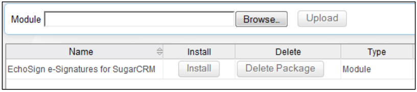
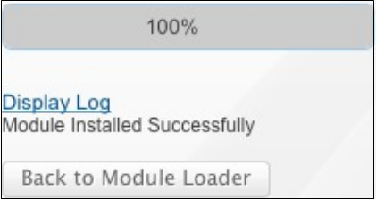

# [!DNL SugarCRM] インストールガイド {#sugarcrm-install-guide}

[カスタマーケアへのお問い合わせ](https://adobe.com/go/adobesign-support-center_jp)

Adobe [!DNL EchoSign] 対象 [!DNL SugarCRM] は、 [!DNL SugarCRM] 電子サインと Fax 署名に使用できます。 ユーザーは SugarCRM から契約書を直接送信したり、契約履歴を表示したり、関連するアカウント、連絡先、見積もりなどに電子サイン済みの契約書を保存したりできます。
Adobe [!DNL EchoSign] 対象 [!DNL SugarCRM] は、6.3 ～ 6.7 のオンデマンドまたはオンプレミスソリューションを含む、SugarCRM のサポートされているすべてのバージョンで利用できます。

このドキュメントは、 [!DNL SugarCRM] 管理者のインストールと構成のAdobe [!DNL EchoSign] 対象 [!DNL SugarCRM] プラグイン。

## このプラグインをインストール {#install-plugin}

1. Adobe [!DNL EchoSign] 対象 [!DNL SugarCRM]  ファイルを [SugarExchange リスト](http://www.sugarexchange.com/product_details.php?product=1123)を選択します。
1. ログイン [!DNL SugarCRM] を使用します。
1. 移動 **[!UICONTROL 管理]** > **[!UICONTROL モジュールローダー]**&#x200B;を選択します。

   

1. Adobe [!DNL EchoSign] 対象 [!DNL SugarCRM] プラグインで、 **[!UICONTROL 参照]**&#x200B;を選択し、アーカイブファイルを選択して、 **[!UICONTROL アップロード]**&#x200B;を選択します。
1. アーカイブファイルがアップロードされたら、「 **[!UICONTROL Install]** 」をクリックします。
1. 利用条件を確認して、「 **[!UICONTROL 承認]** > **[!UICONTROL コミット]**&#x200B;を選択します。
1. プラグインが正常にインストールされると、進行状況バーに 100%成功と表示されます。  プログレスバーが 100%に達していない場合は、「 **[!UICONTROL ログの表示]** を使用して、SugarCRM で発生したエラーを確認します。

   

1. インストール後、 **[!UICONTROL 管理/修復]** を選択し、 **[!UICONTROL 迅速な修復と再構築]**&#x200B;を選択します。

>[!NOTE]
>
>プラグインを [!DNL SugarCRM] オンデマンドで、 [!DNL SugarCRM] パッケージをインストールできるように、OnDemand のパッケージインスペクターの制限を一時的に解除します。 これは標準プロセスの一部です。

## プラグインのアップグレード {#upgrade-plugin}

Adobe [!DNL EchoSign] 対象 [!DNL SugarCRM] 新しいバージョンにプラグインをインストールする場合、以前のバージョンをアンインストールせずにプラグインをインストールする必要があります。
プラグインをアップグレードしたら、 **[!UICONTROL 管理]** > **[!UICONTROL 修復]** を選択し、 **[!UICONTROL 迅速な修復と再構築]**&#x200B;を選択します。

**注意：** 以前のプラグインをアンインストールする場合は、アンインストール中にテーブルを削除しないでください。 そうでない場合は、 [!DNL EchoSign] 契約書データ。

## プラグインの設定 {#configure-plugin}

1. 既にAdobe [!DNL EchoSign] お客様が手順 2 に進みます。

   DITA マップに [!DNL EchoSign] アカウント [14 日間無料体験版に新規登録](https://sugarcrmintegration.echosign.com/public/login) オンライン登録手順に従って、Adobe [!DNL EchoSign] アカウント
1. Sign in to [Echo Sign account](http://www.echosign.com) and follow these steps:
   1. 選択 **[!UICONTROL アカウント]** タブを選択します。
   1. Select **[!UICONTROL EchoSign API]** on the lower left side.
   1. 選択 **[!UICONTROL API アクセスの有効化]** ページから API キーを取得します。

   

1. SugarCRM で、 **[!UICONTROL 管理]** > **[!UICONTROL Adobe EchoSign Settings]** を選択し、「 **[!UICONTROL EchoSign API キー]**&#x200B;を選択します。
1. 必要に応じて、次の設定でプラグインを構成します。

   1. 見積から契約書を作成するときにPDFを自動的に添付するには、次の手順に従います。見積のPDFを [!DNL SugarCRM] ユーザーが見積モジュールから EchoSign 契約書を作成します。
   1. 受信者リストの管理：受信者サブパネルに表示するモジュールを [!DNL EchoSign] 契約書モジュール。 これにより、 [!DNL EchoSign] これらのモジュールの「Agreements」サブパネル。
   1. 次のモジュールに送信ボタンを追加します。作成する場合に選択します [!DNL EchoSign] 見積モジュールのプライマリアクションに含まれる「Agreement」ボタン/アクション。
   1. 選択 **[!UICONTROL 保存]** 」をクリックします。

**注意：** Adobe [!DNL EchoSign] 対象 [!DNL SugarCRM] プラグインには [PHP SOAP 拡張機能](http://www.php.net/manual/en/book.soap.php)を選択します。 SOAP サポートを有効にするには、enable-soap を使用して PHP を設定します。

## 契約書の更新を取得 ( [!DNL SugarCRM] バージョン 6.3 以降 ) {#get-agreement-updates}

バージョン 6.3 以降では、次の 2 つのオプションを使用して契約書の更新を取得できます。 以前のバージョンの SugarCRM では、プラグインはデフォルトでコールバックメソッド（オプション 1）のみを提供していました。

### オプション 1:更新を EchoSign にプッシュするコールバックメソッドの設定

If your website is public facing, you can have Adobe EchoSign ping your [!DNL SugarCRM] instance whenever a new event occurs. [!DNL SugarCRM] 次に、契約書のステータスやイベントを更新し、署名済み文書（署名されている場合）を自動的にリアルタイムでダウンロードします。 (If you are behind a firewall, you need to whitelist the [!DNL EchoSign] server IP addresses or use the Scheduled Job method of updating EchoSign Agreements described in the next section of this guide).

1. 移動 **[!UICONTROL 管理]** > **[!UICONTROL Adobe EchoSign Settings]**&#x200B;を選択します。
1. チェックボックスをオンにします。 **[!UICONTROL EchoSign コールバックメソッドの使用]** 契約のイベントおよびステータスを更新します。
1. 選択 **[!UICONTROL 保存]**&#x200B;を選択します。

### オプション 2:スケジュールされたジョブの設定 [!DNL SugarCRM] ファイアウォール内のインスタンス

この [!DNL EchoSign] 対象 [!DNL SugarCRM] プラグインは、スケジュールされたジョブを使用してクエリを実行することもできます [!DNL EchoSign] 」を参照してください。 Scheduled job query method can be used if you have an on-premise [!DNL SugarCRM] installation is behind a firewall.

設定するには：

1. Go to **[!UICONTROL Administration]** > **[!UICONTROL Scheduler]**.
1. タブのドロップダウンメニューから、「 **[!UICONTROL スケジューラの作成]**&#x200B;を選択します。
1. 「ジョブ名」を入力します。
1. 「ジョブ」フィールドで、「 **[!UICONTROL Adobe EchoSign Status Updater]**&#x200B;を選択します。
1. 必要な頻度でジョブを実行するように設定します。 10 分ごとに実行するように設定することをお勧めします。つまり、契約書が開かれた後、読み取られた後、または署名された後、最大 10 分かかる場合があります。 [!DNL SugarCRM] を選択します。

   **注意：** 署名用に送信された契約書が多い場合、この処理を頻繁に行うとシステムの速度が低下することがあります。

   

1. 移動 **[!UICONTROL 管理]** > **[!UICONTROL Adobe EchoSign Settings]**&#x200B;を選択します。
1. チェックボックスをオフにする **[!UICONTROL EchoSign コールバックメソッドの使用]** 契約のイベントおよびステータスを更新します。
1. Select **[!UICONTROL Save]**.
注意：スケジュールの有効化 [!DNL SugarCRM] を選択します。

EchoSign 契約書を他の [!DNL SugarCRM] モジュール：

1. 移動 **[!UICONTROL 管理]** > **[!UICONTROL スタジオ]**&#x200B;を選択します。
1. 左の列フォルダーツリーから、追加するモジュールを選択します [!DNL EchoSign] 契約書、
1. 選択 **[!UICONTROL 関連付け]**> **[!UICONTROL 関連付けの追加]**&#x200B;を選択します。
1. ドロップダウンメニューから「タイプ」を選択します。 **[!UICONTROL 1 対多]** とモジュールを **[!UICONTROL EchoSign 契約書]**&#x200B;を選択します。
1. 選択 **[!UICONTROL 保存とデプロイ]**&#x200B;を選択します。

   

   [!DNL EchoSign] 契約書がモジュールに表示され、そこで契約書を作成して追跡できるようになりました。

   

**その他の設定手順**

* **非表示 [!DNL EchoSign] モジュール**:次の [!DNL EchoSign] 受信者 [!DNL EchoSign] Events modules を開くには、Administration» Display Module Tabs and Subpanels に移動し、非表示の列に移動します。
* **packageScan の無効化**:ご使用のシステムで packageScan を有効にしている場合は、インストール時に無効にする必要があります。 を使用している場合 [!DNL SugarCRM] オンデマンド、連絡先 [!DNL SugarCRM] packagesscan を無効にするサポートが追加されました。

## プラグインのアンインストール {#uninstall-plugin}

1. ログイン [!DNL SugarCRM] を使用します。
1. 移動 **[!UICONTROL 管理]** > **[!UICONTROL モジュールローダー]**&#x200B;を選択します。
1. 選択 **[!UICONTROL アンインストール]** 次の [!UICONTROL SugarCRM プラグイン用 EchoSign]を選択します。
1. 選択 **[!UICONTROL コミット]** 」をクリックしてアンインストールを開始します。 プラグイン用に作成されたデータベーステーブルを削除することもできます。

   

   プラグインが正常にアンインストールされると、進行状況バーに 100%成功と表示されます。 プログレスバーが 100%に達していない場合は、「 [!UICONTROL ログの表示] を使用して、SugarCRM で発生したエラーを確認します。

   

## 使用Adobe [!DNL EchoSign] 対象 [!DNL SugarCRM] {#use-echosign-for-sugarcrm}

Adobe [!DNL EchoSign] 取引先企業、取引先担当者、見積もりなどの契約に関連付けられている場合 [!DNL SugarCRM] モジュール、 ファイルの添付、受信者の指定、および署名用に送信できます。 Adobe [!DNL EchoSign] 更新 [!DNL SugarCRM] 」をクリックし、署名済み契約書を [!DNL SugarCRM] 完全に実行されたら

### Adobe [!DNL EchoSign] 契約書 {#create-edit-agreements}

You can create Agreements through the [!DNL EchoSign] Agreements module or through modules configured by a [!DNL SugarCRM] administrator.

1. 」を [!UICONTROL アクション] リストを [!UICONTROL EchoSign 契約書] 」タブで、「 **[!UICONTROL EchoSign 契約書の作成]**&#x200B;を選択します。
1. のメインセクション [!DNL EchoSign] 「契約書」では、次の情報を入力するか、様々な契約書オプションから選択します。

   1. **[!UICONTROL 名前：]** 契約書の名前を入力します。
   1. **[!UICONTROL Signature Type:]** Select the type of signature accepted for the document. オプションには、「電子サイン」と「Fax 署名」があります。
   1. **[!UICONTROL この契約書にも署名する必要があります：]** 送信者も契約書に署名する必要があるかどうかを指定します。
   1. **[!UICONTROL 署名の順序：]** 前の「 I Also Need to Sign This Agreement 」オプションがオンになっている場合は、送信者と受信者が署名する順序も選択します。
   1. **[!UICONTROL 受信者に署名を依頼：]** 受信者に文書への署名を促す頻度を選択します。 オプションは、[Daily] または [Weekly] です。
   1. **[!UICONTROL 署名期限までの日数：]** 契約書に署名するまでの日数を指定します。
   1. **[!UICONTROL プレビュー、署名の位置指定、フォームフィールドの追加を行います。]**  このオプションを選択すると、契約書を送信前にプレビュー表示したり、署名フィールド、イニシャルフィールド、またはその他のフォームフィールドをドラッグ&amp;ドロップで契約書にドロップしてから受信者に送信できます。 文書をプレビューしたり、必要なフィールドを文書にドラッグしたりした後は、「送信」ボタンを選択して受信者に契約書を送信してください。
   1. **[!UICONTROL 最初の署名者のホスト署名：]** 送信者が対面で契約書の署名をホストするかどうかを指定します。
      * **[!UICONTROL メッセージ：]** 受信者へのメッセージを含めます。
      * **[!UICONTROL 取引先、商談、見積：]** この契約書に関連付けられている取引先、商談、または見積を選択または変更します。
      * **[!UICONTROL 言語：]** 受信者に対して署名ページと電子メール通知を表示する言語を指定します。

      

1. In the [!UICONTROL Security Options] section of the [!UICONTROL EchoSign Agreement], enter the following information:

   a) **[!UICONTROL 署名に必要なパスワード：]** 受信者が文書に署名する前にパスワードを入力する必要があるかどうかを指定します。
b) **[!UICONTROL 開くパスワード：]** 受信者が契約書または署名済みの契約書のPDFを開く前に、パスワードを入力する必要があるかどうかを示す c) **[!UICONTROL パスワード：]** 文書への署名や文書を開くときに使用するパスワードを指定します。
d) **[!UICONTROL パスワードの確認：]** 文書への署名または文書を開くときに使用するパスワードを確認します。

1. の「その他」セクション [!DNL EchoSign] 契約書で、次の情報を入力します。

   a) **[!UICONTROL User:]** Specify a [!DNL SugarCRM] user. デフォルトは、現在システムにログインしているユーザーです。
b) **[!UICONTROL グループ版：]** プライマリチームの割り当てを変更するには、新しいプライマリチームの名前を入力します。 To assign additional teams to the record, click **[!UICONTROL Select]** and select a team from the Team List, or select **[!UICONTROL Add to]** to add team fields and enter the team names. 詳細については、 [!DNL SugarCRM] アプリケーションガイド

1. 選択 **[!UICONTROL 保存]**&#x200B;を選択します。

### [!DNL EchoSign] 契約書の詳細ビュー {#agreement-detail-view}

After an [!DNL EchoSign] Agreement is saved, the Detail View of the agreement includes the following subpanels:

* **[!UICONTROL 受信者：]** このサブパネルにリストされた連絡先は、「文書」サブパネルで指定された文書を受け取ります。 契約書を送信する前に、1 人以上の受信者を追加する必要があります。
* **[!UICONTROL 文書：]** 新しい文書をアップロードするか、既ににアップロードされている文書を選択します。 [!DNL SugarCRM] をクリックして署名用に送信します。
* **[!UICONTROL イベント：]** 契約書が署名用に送信された日時、表示された日時、署名された日時など、契約書に関するすべてのアクションがこのサブパネルに一覧表示されます。
を編集するには [!DNL EchoSign] 契約書で、「 [!UICONTROL 編集] 」ボタンを [!UICONTROL 詳細表示] 」をクリックします。

**注意：** 契約書が署名用に送信されると、 [!UICONTROL 編集] ボタンが詳細表示から削除され、イベントの記録が保持されます。 ただし、「編集」ボタンを有効にすることはできます。 そのためには、 [!UICONTROL 管理者] > [!UICONTROL Adobe EchoSign Settings] を選択し、 *[!UICONTROL 契約書が署名用に送信された後、編集または削除する機能を無効にします。]*&#x200B;を選択します。

### 文書を [!DNL EchoSign] 契約書 {#add-document}

[!DNL SugarCRM] ユーザーは、新しい文書をアップロードしたり、既ににアップロードされている文書を選択したりすることができます。 [!DNL SugarCRM] EchoSign 契約レコードの Documents サブパネルを使用します。
文書をアップロードするには、 **[!UICONTROL 文書をアップロード]** 」を [!UICONTROL 文書] サブパネル。

の「ドキュメントモジュール」セクションを参照してください。 [!DNL SugarCRM] そのフォームの個々のフィールドについて詳しくは、アプリケーションガイドを参照してください。

文書を選択するには、「 **[!UICONTROL 選択]** をクリックします。 「レコード情報の表示と管理」を参照してください。 [!DNL SugarCRM] サブパネルで関連情報を管理する方法の詳細については、アプリケーションガイドを参照してください。

### 受信者の指定 [!DNL EchoSign] 契約書 {#specify-recipient}

1. 」を [!UICONTROL 受信者] のサブパネル [!DNL EchoSign] 契約書で、「 **[!UICONTROL 受信者を追加]**&#x200B;を選択します。
1. 次の情報を入力します。a) [!UICONTROL 受信者：] ドロップダウンメニューから受信者のタイプを選択します。 テキストフィールドに受信者の名前または電子メールアドレスを入力します。 [!DNL SugarCRM] 入力すると名前が検索され、選択範囲のリストが表示されます。 一致するものが見つかった場合は、名前を選択します。 矢印アイコンを選択して、ポップアップウィンドウから名前を選択することもできます。 フィールドから名前を消去するには、 **[!UICONTROL X]** アイコンをクリックします。
b) [!UICONTROL 役割：] ドロップダウンメニューから役割を選択します。 オプションには、「署名者」、「CC」、「承認者」があります。 承認者は文書に署名する必要はありません。
1. 「保存」を選択します。

### 署名用に契約書を送信 {#send-for-signature}

契約書を署名用に送信する準備が整ったら、「 **[!UICONTROL Send for Signature]** を選択します。 受信者は、署名待ちの文書があることを知らせる電子メールを受け取ります。 受信者が文書に署名すると、送信者は電子メール通知を受信します。
DITA マップの [!UICONTROL 最初の署名者の署名をホスト] 」オプションがオンになっている場合、「 **[!UICONTROL Send for Signature]** 送信者を招待した署名者が文書に署名できるようにする。

「[!UICONTROL Host Signing for First Signer]」フィールドの隣に表示される「**[!UICONTROL Host Signing for Current Signer]**」リンクは、文書に署名し終わるまで使用できます。このリンクを使用して、複数の署名者に契約書への署名をホストしたり、ポップアップウィンドウを誤って閉じた場合に開き直したりできます。
If [!UICONTROL プレビュー、署名の位置指定、フォームフィールドの追加を行う] 」オプションがオンになっている場合は、「 **[!UICONTROL Send for Signature]** を選択して、送信者が文書を送信する前に、文書をプレビューしたり、フィールドを文書にドラッグしたりできるようにします。 選択する必要があります **[!UICONTROL 送信]** をクリックして、契約書を受信者に送信します。

図 5:「Send for Signature」を選択して、署名のために受信者に文書を送信します。

### 見積レコードからの送信 {#send-from-quote-record}

Adobe [!DNL EchoSign] は、 [!DNL SugarCRM] 見積のPDFが自動的に生成され、契約レコードに添付されます。
見積の表示時に、「 **[!UICONTROL EchoSign 契約書の作成]** 見積を生成し、自動的に契約書に添付します。 新しい契約書では、関連する商談、取引先、見積も自動的に関連付けられます。

契約書への見積PDFの自動添付をオフにするには、 **[!UICONTROL 管理]** > **[!UICONTROL Adobe EchoSign Settings]**&#x200B;を選択し、チェックボックスをオフにします *[!UICONTROL 見積から契約書を作成するときにPDFを自動的に添付]*&#x200B;を選択します。

### 契約書をキャンセル {#cancel-agreement}

キャンセルするには、 [!DNL EchoSign] すべての受信者がまだ文書に署名していない場合は、署名用に送信された後の契約書。 A [!UICONTROL 契約書をキャンセル] 」ボタンは、文書が署名用に送信された後、契約書の詳細ビューに表示されます。 選択 **[!UICONTROL 契約書をキャンセル]** 」をクリックして契約書をキャンセルします。

注意：PDF が [!DNL EchoSign] 契約書が署名用に送信され、レコードが削除されたら、契約書を削除する前にキャンセルする必要があります。

### 署名のトラック {#track-signatures}

この [!UICONTROL イベント] のサブパネル [!DNL EchoSign] 「契約書」では、署名用に送信された契約書のステータスをトラックします。 で最新のアップデートを表示するには [!DNL EchoSign] 契約書で、「 **[!UICONTROL ステータスの更新]**&#x200B;を選択します。 この [!UICONTROL ステータスの更新] 」ボタンは、契約書が署名用に送信された後でのみ使用できます。

契約書が署名用に送信されたら、「 **[!UICONTROL ステータスの更新]** 」をクリックして最新のステータスを取得します。

### リマインダーの送信 {#send-reminders}

契約書の送信後に現在の署名者にリマインダーを送信するには、 **[!UICONTROL リマインダーを送信]**&#x200B;を選択します。 署名待ちの契約書に関する電子メールのリマインダーが、現在の署名者にすぐに送信されます。

