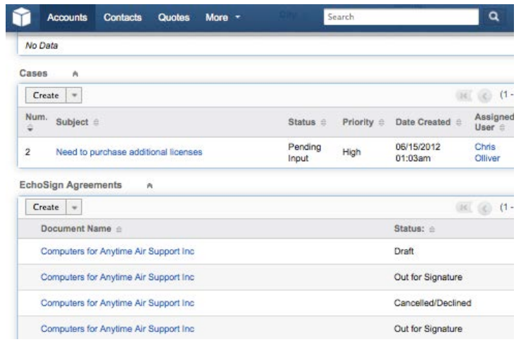

# [!DNL SugarCRM]  インストールガイド {#sugarcrm-install-guide}

[カスタマーケアに問い合わせる](https://adobe.com/go/adobesign-support-center)

Adobe [!DNL EchoSign] for [!DNL SugarCRM]は、電子署名とFAX署名を[!DNL SugarCRM]で自動化する、主要な電子署名とWeb契約ソリューションです。 ユーザーは、SugarCRMから直接契約を送信し、契約履歴を表示し、関連するアカウント、連絡先、見積りなどと共にeSigned契約を保存できます。
[!DNL SugarCRM]向けAdobe [!DNL EchoSign]は、オンデマンドまたは社内ソリューション向けの6.3 ～ 6.7を含む、SugarCRMのサポートされるすべてのバージョンで利用できます。

このドキュメントは、[!DNL SugarCRM]管理者がAdobe [!DNL EchoSign]を[!DNL SugarCRM]プラグイン用にインストールおよび設定する方法を学ぶためのガイドです。

## このプラグインのインストール {#install-plugin}

1. [SugarExchangeリスト](http://www.sugarexchange.com/product_details.php?product=1123)から、[!DNL SugarCRM]アーカイブファイルのAdobe [!DNL EchoSign]を取得します。
1. 管理者アカウントで[!DNL SugarCRM]にログインします。
1. **[!UICONTROL 管理]** > **[!UICONTROL モジュールローダ]**&#x200B;に移動します。

   

1. Adobe [!DNL EchoSign]のアーカイブファイルを[!DNL SugarCRM]プラグイン用にアップロードするには、**[!UICONTROL 「参照」]**&#x200B;を選択し、アーカイブファイルを選択して、**[!UICONTROL 「アップロード」]**&#x200B;を選択します。
1. アーカイブ・ファイルをアップロードした後、[**[!UICONTROL インストール]**]を選択してインストールを開始します。
1. 条件を確認し、**[!UICONTROL 同意]** > **[!UICONTROL コミット]**&#x200B;を選択します。
1. プラグインが正常にインストールされた場合、進行状況バーに100%の成功が示されます。  進捗バーが100%に達しない場合は、[**[!UICONTROL ログを表示]**]を選択して、SugarCRMで発生したエラーを確認します。

   

1. インストール後、**[!UICONTROL [管理]>[修復]]**&#x200B;に移動し、**[!UICONTROL [クイック修復と再構築]]**&#x200B;を選択します。

>[!NOTE]
>
>[!DNL SugarCRM] OnDemandにプラグインをインストールする場合は、[!DNL SugarCRM]でサポートチケットを作成し、OnDemandのパッケージ検査の制限を一時的に削除して、パッケージをインストールできるようにします。 これは標準プロセスの一部です。

## プラグインのアップグレード {#upgrade-plugin}

[!DNL SugarCRM]のAdobe [!DNL EchoSign]プラグインを新しいバージョンに更新する場合は、以前のバージョンをアンインストールせずにプラグインをインストールする必要があります。
プラグインをアップグレードした後、**[!UICONTROL 管理]** > **[!UICONTROL 修復]**&#x200B;に移動し、**[!UICONTROL クイック修復と再構築]**&#x200B;を選択します。

**注：以前のプ** ラグインをアンインストールした場合は、アンインストール中に表を削除しないでください。そうでないと、[!DNL EchoSign]契約データが失われる可能性があります。

## プラグインの設定 {#configure-plugin}

1. すでにAdobe [!DNL EchoSign]のお客様の場合は、手順2に進みます。

   [!DNL EchoSign]アカウントをお持ちでない場合は、[14日間の無料試用版](https://sugarcrmintegration.echosign.com/public/login)にサインアップし、オンライン登録の手順に従ってAdobe [!DNL EchoSign]アカウントを有効にします。
1. [Echo Signアカウント](http://www.echosign.com)にサインインし、次の手順に従います。
   1. [**[!UICONTROL アカウント]**]タブを選択します。
   1. 左下の&#x200B;**[!UICONTROL EchoSign API]**&#x200B;を選択します。
   1. [**[!UICONTROL APIアクセスを有効にする]**]を選択し、ページからAPIキーを取得します。

   

1. SugarCRMで、**[!UICONTROL 管理]** > **[!UICONTROL Adobe EchoSign設定]**&#x200B;に移動し、**[!UICONTROL EchoSign API Key]**&#x200B;というラベルのフィールドにAPIキーを入力します。
1. 必要に応じて、次の設定でプラグインを設定します。

   1. Quoteから契約を作成する際にPDFを自動的に添付する：[!DNL SugarCRM]ユーザーがQuotesモジュールからEchoSign契約を作成した場合に、見積もりのPDFを自動的に添付するかどうかを選択します。
   1. 受信者の一覧の管理：[!DNL EchoSign]契約モジュールの「受信者」サブパネルに表示するモジュールを選択します。 これにより、[!DNL EchoSign] [契約]サブパネルがこれらのモジュールに追加されます。
   1. 送信ボタンを次のモジュールに追加します。Quoteモジュールの主なアクションに「Create [!DNL EchoSign] Agreement」ボタン/アクションを含める場合に選択します。
   1. **[!UICONTROL 保存]**&#x200B;を選択して、設定を保存します。

**注： Adobe** forプラグイン [!DNL EchoSign] には、 [!DNL SugarCRM] PHP  [SOAP拡張モジュールが必要です](http://www.php.net/manual/en/book.soap.php)。SOAPサポートを有効にするには、PHPをenable-soapで設定します。

## 契約の更新情報の取得（[!DNL SugarCRM]バージョン6.3以降） {#get-agreement-updates}

バージョン6.3以降では、次の2つのオプションを使用して契約の更新を取得できます。 以前のバージョンのSugarCRMでは、このプラグインは既定でコールバックメソッド（オプション1）のみを提供していました。

### オプション1:EchoSignに更新をプッシュするためのコールバックメソッドを設定する

Webサイトが公開されている場合は、新しいイベントが発生するたびにAdobe EchoSignを使用して[!DNL SugarCRM]インスタンスにpingを送信できます。 [!DNL SugarCRM] 次に、契約のステータス、イベントを更新し、署名済みドキュメント（署名済みの場合）を自動的にリアルタイムでダウンロードします。（ファイアウォールを使用している場合は、[!DNL EchoSign]サーバのIPアドレスをホワイトリストにするか、このガイドの次のセクションで説明するEchoSign Agreementsの更新にScheduled Jobメソッドを使用する必要があります）。

1. **[!UICONTROL 管理]** > **[!UICONTROL Adobe EchoSign設定]**&#x200B;に移動します。
1. [**[!UICONTROL EchoSignコールバックメソッド]**&#x200B;を使用して、契約のイベントと状態を更新する]チェックボックスをオンにします。
1. **[!UICONTROL 保存]**&#x200B;を選択します。

### オプション2:ファイアウォールの背後にある[!DNL SugarCRM]インスタンスに対してスケジュール済みジョブを設定する

[!DNL SugarCRM]プラグインの[!DNL EchoSign]は、スケジュール済みジョブを使用して、署名のために外に出た契約の更新を[!DNL EchoSign]に照会することもできます。 社内[!DNL SugarCRM]のインストールがファイアウォールの内側にある場合は、スケジュール済みのジョブクエリメソッドを使用できます。

設定する手順は、次のとおりです。

1. **[!UICONTROL 管理]** > **[!UICONTROL スケジューラ]**&#x200B;に移動します。
1. タブのドロップダウン・メニューから、「**[!UICONTROL スケジューラの作成]**」を選択します。
1. ジョブ名を入力します。
1. 「ジョブ」フィールドで、「**[!UICONTROL Adobe EchoSignステータス更新]**」を選択します。
1. 必要に応じてジョブを実行する頻度を設定します。 10分ごとに実行するように設定することをお勧めします。つまり、契約が開かれ、読み取り、または署名された後、[!DNL SugarCRM]がその情報で更新されるまでに最大10分かかる場合があります。

   **注意：署名** に関する契約が多い場合、この実行が頻繁に行われると、システムの速度が低下する可能性があります。

   

1. **[!UICONTROL 管理]** > **[!UICONTROL Adobe EchoSign設定]**&#x200B;に移動します。
1. [**[!UICONTROL EchoSignコールバックメソッド]**&#x200B;を使用して、契約のイベントと状態を更新する]チェックボックスをオフにします。
1. **[!UICONTROL 保存]**を選択します。
注：[!DNL SugarCRM]のスケジューラをオンにして、これを動作させます。

他の[!DNL SugarCRM]モジュールにEchoSign契約を追加するには：

1. **[!UICONTROL 管理]** > **[!UICONTROL Studio]**&#x200B;に移動します。
1. 左側の列フォルダツリーで、[!DNL EchoSign]契約を追加するモジュールを選択します。
1. [**[!UICONTROL 関係]**>**[!UICONTROL 関係の追加]**]を選択します。
1. ドロップダウン・メニューから、「**[!UICONTROL 一対多]**」と入力し、「**[!UICONTROL EchoSign Agreements]**」と入力します。
1. [**[!UICONTROL 保存と展開]**]を選択します。

   

   [!DNL EchoSign] これで、モジュールに免除承諾が表示され、免除承諾を作成して追跡できます。

   

**その他の設定手順**

* **モジュール [!DNL EchoSign] を非表示にする**:[管理] - [モジュールのタ [!DNL EchoSign] ブとサブパネ [!DNL EchoSign] ルを表示]を選択し、非表示の列に移動すると、[受信者とイベント]モジュールを非表示にできます。
* **packageScanを無効にしています**:独自のシステムでpackageScanを有効にした場合は、インストール中に無効にする必要があります。[!DNL SugarCRM]オンデマンドを使用している場合は、[!DNL SugarCRM]サポートに連絡して、packageScanを無効にしてください。

## プラグインのアンインストール {#uninstall-plugin}

1. 管理者アカウントで[!DNL SugarCRM]にログインします。
1. **[!UICONTROL 管理]** > **[!UICONTROL モジュールローダ]**&#x200B;に移動します。
1. [!UICONTROL SugarCRMプラグイン]のEchoSignの横の&#x200B;**[!UICONTROL Uninstall]**&#x200B;を選択します。
1. **[!UICONTROL 「コミット]**」を選択してアンインストールを開始します。 プラグイン用に作成されたデータベース表を削除する場合も選択できます。

   

   プラグインが正常にアンインストールされると、進行状況バーに100%の成功が示されます。 進捗バーが100%に達しない場合は、[[!UICONTROL ログを表示]]を選択して、SugarCRMで発生したエラーを確認します。

   

## Adobe [!DNL EchoSign]を[!DNL SugarCRM]に使用 {#use-echosign-for-sugarcrm}

アカウント、連絡先、見積もり、または他の[!DNL SugarCRM]モジュールに関連付けられたAdobe [!DNL EchoSign]契約を作成できます。 ファイルの添付、受信者の指定、および署名の送信を行うことができます。 Adobe [!DNL EchoSign]は、契約の現在のステータスで[!DNL SugarCRM]を更新し、完全に実行された契約を[!DNL SugarCRM]に保存します。

### Adobe [!DNL EchoSign]契約の作成と編集 {#create-edit-agreements}

契約は、[!DNL EchoSign]契約モジュールまたは[!DNL SugarCRM]管理者が構成したモジュールを使用して作成できます。

1. [[!UICONTROL EchoSign Agreements]]タブの[[!UICONTROL アクション]]リストから、[**[!UICONTROL Create EchoSign Agreement]**]を選択します。
1. [!DNL EchoSign]契約の主要セクションで、次の情報を入力するか、さまざまな契約オプションから選択します。

   1. **[!UICONTROL 名称：]** 基本契約の名称を入力します。
   1. **[!UICONTROL 署名の種類：文]** 書に対して受け入れる署名の種類を選択します。オプションは、[電子署名]と[FAX署名]です。
   1. **[!UICONTROL この契約に署名する必要もあります。送]** 信者も契約に署名する必要があるかどうかを指定します。
   1. **[!UICONTROL 署名の順序：前]** の[この契約に署名する必要もある]オプションがオンの場合は、送信者と受信者が署名する順序も選択します。
   1. **[!UICONTROL [署名する受信者に通知]:]** 受信者に文書に署名するよう通知する頻度を選択します。オプションは、[日単位]または[週単位]です。
   1. **[!UICONTROL 署名期限までの日数：]** 契約に署名するまでの日数を指定します。
   1. **[!UICONTROL [プレビュー、署名、またはフォームフィールドの追加]：送信前に契約をプレビューするか、受信者に送信する前に契約に署名フィールド、初期フィールド、またはその他のフォームフィールドをドラッグアンドドロップする場合は、このオプションを選択します。]**  文書をプレビューした後、または目的のフィールドを文書にドラッグした後、[送信]ボタンを選択して、承諾を受信者に送信します。
   1. **[!UICONTROL 最初の署名者のホスト署名：]** 送信者が契約の直接署名をホストするかどうかを指定します。
      * **[!UICONTROL メッセージ：]** 受信者のメッセージを含めます。
      * **[!UICONTROL アカウント、商談、見積：この契]** 約に関連付けられたアカウント、商談、または見積を選択または変更します。
      * **[!UICONTROL 言語：]** 署名ページと電子メール通知を受信者に表示する言語を指定します。

      

1. [!UICONTROL EchoSign Agreement]の[!UICONTROL Security Options]セクションに、次の情報を入力します。

   a) **[!UICONTROL 署名に必要なパスワード：]**受信者が文書に署名する前にパスワードを入力する必要があるかどうかを示します。
b) **[!UICONTROL 開くために必要なパスワード：]**受信者が契約書または署名済みの契約書のPDFを開く前に、パスワードを入力する必要があるかどうかを示します。
c) **[!UICONTROL パスワード：]**署名またはドキュメントを開く際に使用するパスワードを指定します。
d) **[!UICONTROL パスワードの確認：]**&#x200B;署名またはドキュメントを開く際に使用するパスワードを確認します。

1. [!DNL EchoSign]契約の「その他」セクションに、次の情報を入力します。

   a) **[!UICONTROL ユーザー：]**[!DNL SugarCRM]ユーザーを指定します。 デフォルトは、現在システムにサインインしているユーザーです。
b) **[!UICONTROL チーム：]**&#x200B;プライマリチームの割り当てを変更するには、新しいプライマリチームの名前を入力します。 レコードに追加のチームを割り当てるには、[**[!UICONTROL 選択]**]をクリックしてチームリストからチームを選択するか、[**[!UICONTROL 追加]**]を選択してチームフィールドを追加し、チーム名を入力します。 詳細については、「 [!DNL SugarCRM]アプリケーションガイド」の「ユーザーとチームへのレコードの割り当て」を参照してください。

1. **[!UICONTROL 保存]**&#x200B;を選択します。

### [!DNL EchoSign] 契約詳細ビュー {#agreement-detail-view}

[!DNL EchoSign]契約を保存した後、契約の詳細ビューには次のサブパネルが含まれます。

* **[!UICONTROL 受信者：このサブ]** パネルに一覧表示される連絡先は、[ドキュメント]サブパネルで指定されたドキュメントを受け取ります。契約を送信する前に、1人以上の受信者を追加する必要があります。
* **[!UICONTROL ドキュメント：新し]** いドキュメントをアップロードするか、既にににアップロードされて署名を送信するドキ [!DNL SugarCRM] ュメントを選択してください。
* **[!UICONTROL イベント：]** 契約が署名、表示、署名のために送信された日時など、契約に関するアクションは、このサブパネルに一覧表示されます。[!DNL EchoSign]契約を編集するには、契約の[!UICONTROL 詳細ビュー]の[!UICONTROL 編集]ボタンを選択します。

**注：承** 諾が署名用に送信された後、[編集]ボタンが詳細ビ  ューから削除され、イベントの記録が保持されます。ただし、[編集]ボタンを有効にすることもできます。 これを行うには、[!UICONTROL 管理者] > [!UICONTROL Adobe EchoSign設定]に移動し、*[!UICONTROL 署名用の契約が送信された後、編集または削除の機能を無効にする]*&#x200B;オプションをオフにします。

### [!DNL EchoSign]契約にドキュメントを追加する {#add-document}

[!DNL SugarCRM] ユーザーは、EchoSign契約レコードの「ドキュメント」サブパネルを使用して、新しいドキュメントをアップロ [!DNL SugarCRM] ードしたり、に既にアップロードされたドキュメントを選択したりできます。ドキュメントをアップロードするには、[!UICONTROL ドキュメント]サブパネルで「**[!UICONTROL ドキュメントのアップロード]**」を選択します。

このフォームの個々のフィールドの詳細については、『[!DNL SugarCRM]アプリケーションガイド』の「ドキュメントモジュール」セクションを参照してください。

ドキュメントを選択するには、ドキュメントサブパネルの&#x200B;**[!UICONTROL 選択]**&#x200B;をクリックします。 サブパネルで関連情報を管理する方法の詳細については、「 [!DNL SugarCRM]アプリケーションガイド」の「レコード情報の表示と管理」を参照してください。

### [!DNL EchoSign]契約の受信者を指定します {#specify-recipient}

1. [!DNL EchoSign]契約の[!UICONTROL 受信者]サブパネルから、**[!UICONTROL 受信者の追加]**&#x200B;を選択します。
1. 次の情報を入力します。
a) [!UICONTROL 受信者：]ドロップダウンメニューから受信者の種類を選択します。 テキストフィールドに受信者の名前または電子メールアドレスを入力します。 [!DNL SugarCRM] は、入力時に名前を検索し、選択の一覧を表示します。一致する名前が見つかった場合は、名前を選択します。 矢印アイコンを選択して、ポップアップウィンドウから名前を選択することもできます。 フィールドから名前を消去するには、**[!UICONTROL X]**アイコンを選択します。
b) [!UICONTROL 役割：]ドロップダウンメニューから役割を選択します。 オプションは、署名者とCCと承認者です。 承認者はドキュメントに署名する必要はありません。
1. 「保存」を選択します。

### 署名の契約を送信 {#send-for-signature}

契約を署名用に送信する準備が整ったら、ページの左上にあるドロップダウン・メニューから[**[!UICONTROL 署名用に送信]**]を選択します。 受信者は、署名待ちのドキュメントを通知する電子メールを受信します。 受信者がドキュメントに署名すると、送信者は電子メール通知を受け取ります。
[[!UICONTROL 最初の署名者のホスト署名]]オプションがオンの場合、署名者が送信者が存在するドキュメントに署名できるように、[**[!UICONTROL 署名用に送信]**]を選択できます。

「[!UICONTROL Host Signing for First Signer]」フィールドの隣に表示される「**[!UICONTROL Host Signing for Current Signer]**」リンクは、文書に署名し終わるまで使用できます。このリンクを使用して、複数の署名者に対する契約の署名をホストしたり、ポップアップウィンドウを誤って閉じた場合に再び開くことができます。
[!UICONTROL [プレビュー、署名、フォームフィールドの追加]]オプションがオンの場合は、[**[!UICONTROL 署名用に送信]**]を選択して、送信者がドキュメントをプレビューしたり、送信前にフィールドをドキュメントにドラッグしたりします。 受信者に契約を送信するには、そのウィンドウで[**[!UICONTROL 送信]**]を選択する必要があります。

図5:[署名用に送信]を選択して、ドキュメントを受信者に送信して署名を作成します。

### 見積もりレコードから送信 {#send-from-quote-record}

Adobe [!DNL EchoSign]は、[!DNL SugarCRM]のQuoteと直接統合されているため、QuoteのPDFが自動的に生成され、契約レコードに添付されます。
Quoteを表示する場合は、「**[!UICONTROL Create EchoSign Agreement]**」を選択してQuoteを生成し、QuoteをAgreementに自動的に添付します。 また、新しい契約により、関連するOpportunity、Account、Quoteが自動的に関連づけられます。

見積もりPDFの契約への自動添付を無効にするには、「**[!UICONTROL 管理]**>**[!UICONTROL Adobe EchoSign設定]**」に移動し、「*[!UICONTROL Quoteから契約を作成する際にPDFを自動的に添付する]*」チェックボックスをオフにします。

### 契約書をキャンセル {#cancel-agreement}

すべての受信者がまだドキュメントに署名していない場合は、署名の送信後に[!DNL EchoSign]契約を取り消すことができます。 ドキュメントに署名が送信された後、契約の詳細ビューに[[!UICONTROL 契約のキャンセル]]ボタンが表示されます。 契約を取り消すには、[**[!UICONTROL 契約の取り消し]**]を選択します。

注：[!DNL EchoSign]契約が署名用に送信され、レコードが削除された場合は、契約を削除する前に契約を取り消す必要があります。

### 署名の追跡 {#track-signatures}

[!DNL EchoSign]契約の[!UICONTROL イベント]サブパネルは、署名のために送信される契約の状態を追跡します。 [!DNL EchoSign]契約の最新の更新情報を表示するには、[**[!UICONTROL 更新状況]**]を選択します。 [[!UICONTROL 更新状態]]ボタンは、契約が署名用に送信された後にのみ使用できます。

### アラームの送信 {#send-reminders}

契約を送信した後に現在の署名者にアラームを送信するには、[**[!UICONTROL アラームの送信]**]を選択します。 署名を待っている契約に関する電子メール通知を、現在の署名者に直ちに送信します。

