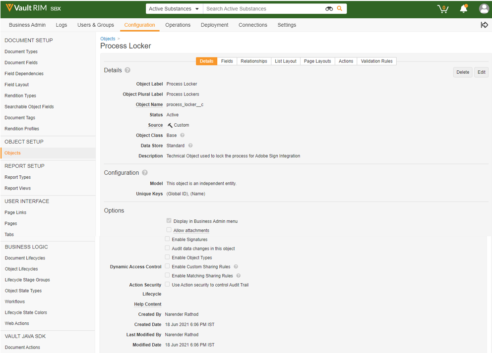
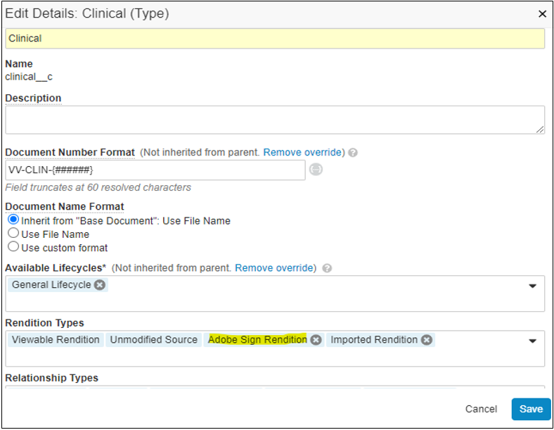
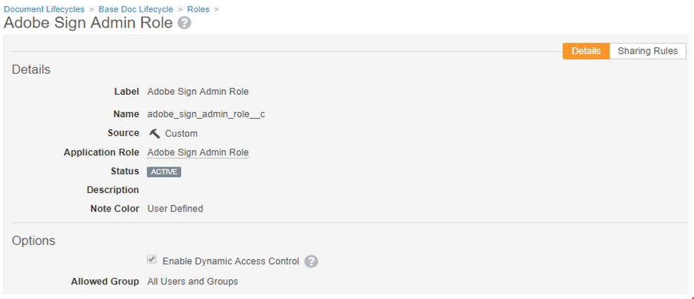
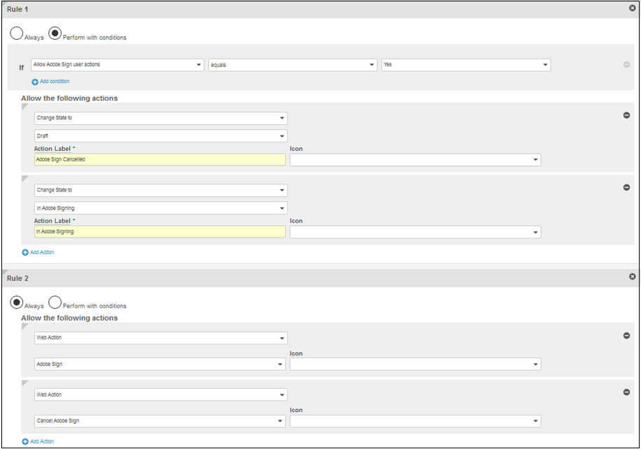
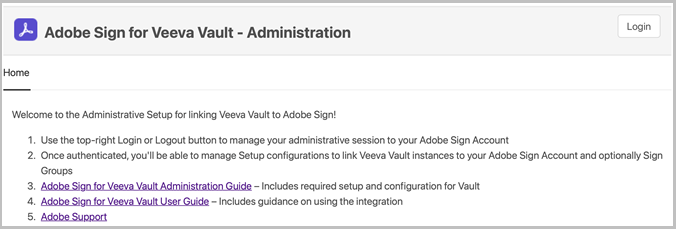

# [!DNL Veeva Vault] インストールガイド{#veeva-installation-guide}

[**Adobe Sign サポートへのお問い合わせ**](https://adobe.com/go/adobesign-support-center)

## 概要 {#overview}

このドキュメントでは、Adobe Signと[!DNL Veeva Vault]プラットフォームの統合を確立する方法について説明します。 [!DNL Veeva Vault] は、ライフサイエンス向けに構築されたECM（エンタープライズ・コンテンツ管理）プラットフォームです。「Vault」は、規制の申請、調査報告、アプリケーションの交付、一般契約などの一般的な用途を持つコンテンツおよびデータ・リポジトリです。 1つの企業に複数の「Vault」を設定できます。これらは別々に管理する必要があります。

統合を完了するための高レベルの手順は次のとおりです。

* Adobe Signで管理アカウントを有効にする（新規のお客様のみ）
* Vaultで免除承諾ライフサイクルの履歴を追跡するオブジェクトを作成します。
* 新しいセキュリティプロファイルを作成します。
* [!DNL Veeva Vault]統合ユーザーを保持するように、Adobe Signでグループを設定します。
* ドキュメントのフィールドとレンディションを作成します。
* Webアクションを設定し、ドキュメントのライフサイクルを更新します。
* ドキュメントタイプのユーザーとユーザーロールの設定を作成します。

>[!NOTE]
>
>Adobe Sign管理者は、Adobe Sign内でAdobe Signの設定手順を実行する必要があります。

## [!DNL Veeva Vault]の構成

Adobe Signとの統合用に[!DNL Veeva Vault]を設定するには、Vaultで契約ライフサイクルの履歴を追跡するのに役立つ特定のオブジェクトを作成します。 管理者は次のオブジェクトを作成する必要があります：

* 署名
* 署名者
* 署名イベント
* プロセスロッカー

### Signatureオブジェクトの作成  {#create-signature-object}

契約に関連する情報を格納するために、署名オブジェクトが作成されます。 Signatureオブジェクトは、次の特定のフィールドの下に情報を含むデータベースです。

**Signatureオブジェクトフィールド**

| フィールド | ラベル | タイプ | 説明 |
| --- | --- | ---| --- | 
| 外部ID__c | 契約書 ID | 文字列(100) | Adobe Signの一意の契約IDを保持します |
| file_hash__c | ファイルハッシュ | 文字列(50) | Adobe Signに送信されたファイルのmd5 cksumを保持します |
| name__v | 名前 | 文字列(128) | 契約名を保持します |
| 送信者_c | 送信者 | オブジェクト（ユーザー） | 免除承諾を作成したVaultユーザへの参照を保持します。 |
| signature_status__c | 署名の状態 | 文字列(75) | Adobe Signで契約のステータスを保持 |
| signature_type__c | 署名タイプ | 文字列(20) | Adobe Sign （WRITTENまたはESIGN）で契約の署名の種類を保持 |
| start_date__c#start_date_c# | 開始日 | DateTime | 署名のために契約が送信された日付 |
| cancellation_date__c | キャンセル日 | 日付時刻 | 契約がキャンセルされた日付を保持します。 |
| completion_date__c#completion_date_c# | 完了日 | 日付時刻 | 契約が完了した日付を保持します。 |
| viewable_rendition_used_c | 表示可能なレンディションの使用 | ブール値 | 表示可能なレンディションが署名用に送信されたかどうかを示すフラグ。 （デフォルトではtrue） |

### 署名者オブジェクトの作成 {#create-signatory-object}

署名者オブジェクトは、参加者に関連する情報を免除承諾に保存するために作成されます。 次の特定のフィールドに関する情報が含まれます。

**署名者オブジェクトフィールド**

| フィールド | ラベル | タイプ | 説明 |
| --- | --- | ---| --- | 
| 電子メール__c | 電子メール | 文字列(120) | Adobe Signの一意の契約IDを保持します |
| 外部ID__c | 参加者ID | 文字列(80) | Adobe Signの一意の参加者の識別子を保持 |
| name__v | 名前 | 文字列(128) | Adobe Signの参加者の名前を保持します |
| 注文__c | 順序 | 数値 | Adobe Sign契約の参加者の注文番号を保持します |
| 役割_c | 役割 | 文字列(30) | Adobe署名契約参加者のロールを保持します |
| シグネチャー_c | 署名 | オブジェクト（署名） | 署名の親レコードへの参照を保持します |
| signature_status__c | 署名の状態 | 文字列(100) | Adobe署名契約の参加者のステータスを保持します |
| ユーザー__c | ユーザー | オブジェクト（ユーザー） | 参加者がVaultユーザの場合、署名者のユーザレコードへの参照を保持します |

### Create Signature Eventオブジェクト  {#create-signature-event}

Signature Eventオブジェクトは、免除承諾のイベント関連情報を格納するために作成されます。 次の特定のフィールドに関する情報が含まれます。

| フィールド | ラベル | タイプ | 説明 |
| --- | --- | ---| --- | 
| acting_user_email_c | 代行ユーザー電子メール | 文字列 | イベントの生成を引き起こしたアクションを実行したAdobe Signユーザーの電子メールを保持します |
| acting_user_name__c#acting_user_name_c# | 操作中のユーザー名 | 文字列 | イベントの生成を引き起こしたアクションを実行したAdobe Signユーザーの名前を保持します |
| __c_______________________________________________________________________________________________________________________________________________________________________________________________________________________________________________________ | 説明 | 文字列 | Adobe Signイベントの説明を保持します |
| event_date__c | イベント日 | 日付時刻 | Adobe Signイベントの日付と時刻を保持します |
| event_type__c | イベントの種類 | 文字列 | Adobe Signイベントの種類を保持します |
| name__v | 名前 | 文字列 | 自動生成されたイベント名 |
| participant_comment__c | 参加者のコメント | 文字列 | Adobe Signの参加者のコメントがある場合は保持します |
| participant_email__c | 参加者の電子メール | 文字列 | Adobe Signの参加者の電子メールを保持 |
| participant_role__c | 参加者の役割 | 文字列 | Adobe Signの参加者のロールを保持します |
| シグネチャー_c | 署名 | オブジェクト（署名） | 署名の親レコードへの参照を保持します |

### Process Lockerオブジェクトの作成  {#create-process-locker}

Process Lockerオブジェクトが作成され、Adobe Sign統合プロセスがロックされます。 カスタムフィールドは必要ありません。

## セキュリティプロファイルの作成{#security-profiles}

Vaultを正常に統合するために、*Adobe Sign Integration Profile*&#x200B;という新しいセキュリティプロファイルが作成され、*Adobe Sign Admin Actions*&#x200B;に対する権限が設定されます。 Adobe Sign Integration Profileはシステムアカウントに割り当てられ、Vault APIを呼び出す際に統合によって使用されます。 このプロファイルで許可されるアクセス許可：

* Vault API
* 読み取り、作成、編集、削除：署名、署名者、署名イベント、およびProcess Lockerオブジェクト

VaultでAdobe Signの履歴へのアクセスを必要とするユーザのセキュリティプロファイルには、Signature、Signator、およびSignature Eventオブジェクトの読み取り権限が必要です。

## グループの作成 {#create-group}

[!DNL Vault]用にAdobe Signを設定するには、*Adobe Sign Admin Group*&#x200B;という新しいグループを作成します。 このグループは、Adobe Sign関連のフィールドのドキュメントフィールドレベルのセキュリティを設定するために使用され、デフォルトでは&#x200B;*Adobe Sign Integration Profile*&#x200B;を含める必要があります。

## ユーザーを作成 {#create-user}

Adobe Sign統合のVaultシステムアカウントを使用するには、次の操作を行う必要があります。

* Adobe Sign Integration Profileを使用する
* セキュリティプロファイルを持つ
* パスワードの有効期限を無効にする特定のセキュリティポリシーを持つ
* Adobe Sign Admin Groupのメンバーになる。

特定のドキュメントライフサイクルで、システムアカウントユーザーがAdobe Sign Admin Groupに属していることを確認するには、ユーザーロール設定レコードを作成する必要があります。

## アプリケーションロールの作成 {#create-application-roles}

*Adobe署名管理者ロール*&#x200B;という名前のアプリケーションロールを作成する必要があります。 このロールは、Adobe署名に適した各文書型のライフサイクルで定義する必要があります。 Adobe Sign固有のライフサイクル状態ごとに、Adobe Sign Adminロールが追加され、適切な権限で設定されます。

## ドキュメントフィールドの作成 {#create-fields}

Adobe Signとの統合を確立するには、管理者は次の2つの新しい共有ドキュメントフィールドを作成する必要があります。

* 署名(signature__c)
* Adobe Signのユーザー操作を許可する(allow_adobe_sign_user_actions__c)

これらの共有フィールドは、Adobe署名に適したすべての文書型に追加する必要があります。 両方のフィールドには、Adobe Sign Admin Groupのメンバーのみが値を更新できる特定のセキュリティが必要です。

管理者は、既存の共有フィールド&#x200B;*「Vaultオーバーレイを無効にする」(disable_vault_overlays__v)*&#x200B;を追加し、Adobe署名に適したすべてのドキュメントタイプに対して「アクティブ」に設定する必要があります。 必要に応じて、このフィールドには、Adobe Sign Adminグループのメンバーのみがその値を更新できる特定のセキュリティを設定できます。

## ドキュメントのレンディションの作成 {#create-renditions}

管理者は、Vault統合で署名済みのPDFドキュメントをAdobe Signにアップロードする際に使用する、*Adobe Sign Rendition (adobe_sign_rendition__c)*&#x200B;という新しいレンディションタイプを作成する必要があります。 Adobe Signレンディションは、Adobe Signatureに適した各文書型に対して宣言する必要があります。

## Webアクションの構成 {#web-actions}

Adobe SignとVaultの統合では、次の2つのWebアクションを作成して設定する必要があります。

* **Adobe署名の作成**:Adobe Sign Agreementを作成または表示します。

   種類：文書
ターゲット：Vault内で表示
URL:<https://{integrationDomain}/adobe-sign-int/signature?docId=${Document.id}&majVer=${Document.major_version_number__v}&minVer=${Document.minor_version_number__v}&sessionId=${Session.id}&vaultId=${Vault.Id>}

* **Adobe署名のキャンセル**:Adobe Signの既存の契約を取り消し、ドキュメントの状態を初期の状態に戻します。

   種類：文書
ターゲット：Vault内で表示
URL:<https://{integrationDomain}/adobe-sign-int/cancel?docId=${Document.id}&majVer=${Document.major_version_number__v}&minVer=${Document.minor_version_number__v}&sessionId=${Session.id}&vaultId=${Vault.Id>}

## ドキュメントライフサイクルの更新 {#document-lifecycle}

Adobe署名に適した各文書型に対して、新しいライフサイクルロールと状態を追加して、対応する文書ライフサイクルを更新する必要があります。

### ライフサイクルロール {#lifecycle-role}

Adobe Sign Adminアプリケーションロールは、Adobe Signatureの対象となるドキュメントで使用されるすべてのライフサイクルに追加する必要があります。 このロールは、次のオプションで作成する必要があります。

* 動的アクセス制御を有効にする
* ドキュメントタイプグループのみを含むドキュメント共有ルール

### ライフサイクルの状態 {#lifecycle-states}

Adobe Sign Agreementのライフサイクルには、次の状態があります。

* ドラフト
* AUTHORINGまたはDOCUMENTS_NOT_YET_PROCESSED
* OUT_FOR_SIGNATUREまたはOUT_FOR_APPROVAL
* 署名済みまたは承認済み
* キャンセル済み
* 期限切れ

VaultドキュメントをAdobe Signに送信する場合、その状態は免除承諾の状態に対応する必要があります。 これを行うには、Adobe署名の対象となるドキュメントで使用されるすべてのライフサイクルに次の状態を追加します。

* **Adobe署名** （レビュー済み）前：これは、ドキュメントをAdobe Signに送信する際の状態のプレースホルダ名です。ドキュメントタイプに基づいて、「下書き」または「レビュー済み」の状態を指定できます。 ドキュメントの状態ラベルは、お客様の要件に従ってカスタマイズできます。 Adobe署名の状態では、次の2つのユーザーアクションを定義する必要があります。

   * ドキュメントの状態を&#x200B;*Adobe署名の下書き*&#x200B;の状態に変更するアクション。 このユーザーアクションの名前は、ライフサイクルのすべてのドキュメントタイプで同じにする必要があります。 必要に応じて、このアクションの条件を「Adobe Signユーザーアクションを許可」に設定できます。
   * Webアクション「Adobe Sign」を呼び出すアクション。 この状態には、Adobe Sign Adminロールで次の操作を行えるセキュリティが必要です。ドキュメントの表示、コンテンツの表示、フィールドの編集、関係の編集、ソースのダウンロード、表示可能なレンディションの管理、状態の変更を行います。

   

* **Adobe Sign Draftで**:これは、ドキュメントが既にAdobe Signにアップロードされ、契約がDRAFT状態であることを示す状態のプレースホルダ名です。必須の状態です。 この状態は、次の5つのユーザー操作に従って定義する必要があります。

   * ドキュメントの状態を&#x200B;*Adobe署名の作成*&#x200B;の状態に変更するアクションです。 このユーザーアクションの名前は、ライフサイクルのすべてのドキュメントタイプで同じにする必要があります。 必要に応じて、このアクションの条件を「Adobe Signユーザーアクションを許可」に設定できます。
   * ドキュメントの状態を&#x200B;*Adobe署名状態*&#x200B;に変更するアクションです。 このユーザーアクションの名前は、ライフサイクルのすべてのドキュメントタイプで同じにする必要があります。 必要に応じて、このアクションの条件を「Adobe Signユーザーアクションを許可」に設定できます。
   * ドキュメントの状態を&#x200B;*Adobe署名のキャンセル*&#x200B;状態に変更するアクションです。 このユーザーアクションの名前は、ライフサイクルのすべてのドキュメントタイプで同じにする必要があります。 必要に応じて、このアクションの条件を「Adobe Signユーザーアクションを許可」に設定できます。
   * Webアクション「Adobe Sign」を呼び出すアクション。
   * Webアクション「Adobe署名のキャンセル」を呼び出すアクション。 この状態には、Adobe Sign Adminの役割で次の操作を行えるセキュリティが必要です。ドキュメントの表示、コンテンツの表示、フィールドの編集、関係の編集、ソースのダウンロード、表示可能なレンディションの管理、状態の変更を行います。

   

* **Adobe Sign Authoringで**:これは、ドキュメントが既にAdobe Signにアップロードされ、免除承諾がAUTHORINGまたはDOCUMENTS_NOT_YET_PROCESSEDの状態であることを示す状態のプレースホルダ名です。必須の状態です。 この状態には、次の4つのユーザーアクションを定義する必要があります。

   * ドキュメントの状態をAdobe署名の取り消し状態に変更するアクションです。 このユーザーアクションの名前は、ライフサイクルに関係なく、すべてのドキュメントタイプで同じにする必要があります。 必要に応じて、このアクションの条件を「Adobe Signユーザーアクションを許可」に設定できます。
   * ドキュメントの状態をAdobe署名中に変更するアクションです。 このユーザーアクションの名前は、ライフサイクルに関係なく、すべてのドキュメントタイプで同じにする必要があります。 必要に応じて、このアクションの条件を「Adobe Signユーザーアクションを許可」に設定できます。
   * Webアクション「Adobe Sign」を呼び出すアクション
   * Webアクション「Adobe署名のキャンセル」を呼び出すアクション。 この状態には、Adobe Sign Adminの役割で次の操作を行えるセキュリティが必要です。ドキュメントの表示、コンテンツの表示、フィールドの編集、関係の編集、ソースのダウンロード、表示可能なレンディションの管理、状態の変更を行います。

   

* **Adobe Signing**:これは、ドキュメントがAdobe Signにアップロードされ、その免除承諾が参加者（OUT_FOR_SIGNATUREまたはOUT_FOR_APPROVAL状態）に既に送信されていることを示す状態のプレースホルダ名です。必須の状態です。 この状態には、次の5つのユーザーアクションを定義する必要があります。

   * ドキュメントの状態をAdobe署名の取り消し状態に変更するアクションです。 このアクションのターゲット状態は、お客様の要件に応じて異なる場合があり、異なるタイプに対して異なる場合もあります。 このユーザーアクションの名前は、ライフサイクルに関係なく、すべてのドキュメントタイプで同じにする必要があります。 必要に応じて、このアクションの条件を「Adobe Signユーザーアクションを許可」に設定できます。
   * ドキュメントの状態をAdobe署名拒否の状態に変更するアクションです。 このアクションのターゲット状態は、お客様の要件に応じて異なる場合があり、異なるタイプに対して異なる場合もあります。 このユーザーアクションの名前は、ライフサイクルに関係なく、すべてのドキュメントタイプで同じにする必要があります。 必要に応じて、このアクションの条件を「Adobe Signユーザーアクションを許可」に設定できます。
   * ドキュメントの状態をAdobe Signed状態に変更するアクションです。 このアクションのターゲット状態は、お客様の要件に応じて異なる場合があり、異なるタイプに対して異なる場合もあります。 ただし、このユーザーアクションの名前は、ライフサイクルに関係なく、すべてのドキュメントタイプで同じにする必要があります。 必要に応じて、このアクションの条件を「Adobe Signユーザーアクションを許可」に設定できます。
   * Webアクション&#x200B;*Adobe Sign*&#x200B;を呼び出すアクション。
   * Webアクション&#x200B;*Adobe署名のキャンセル*&#x200B;を呼び出すアクション。 この状態には、Adobe Sign Adminの役割で次の操作を行えるセキュリティが必要です。ドキュメントの表示、コンテンツの表示、フィールドの編集、関係の編集、ソースのダウンロード、表示可能なレンディションの管理、状態の変更を行います。

   

* **Adobe署名済み（承認済み）**:これは、ドキュメントがAdobe Signにアップロードされ、その契約が完了したことを示す状態（SIGNED状態またはAPPROVED状態）のプレースホルダ名です。これは必須の状態で、[承認済み]のように既存のライフサイクル状態になる場合があります。
この状態では、ユーザー操作は必要ありません。 この状態には、Adobe Sign Adminの役割に次の機能を許可するセキュリティが必要です。ドキュメントの表示、コンテンツの表示、フィールドの編集を行います。

次の図は、「Adobe署名前」の状態が「ドラフト」であるAdobe署名契約とVaultドキュメントの状態間のマッピングを示しています。

## ドキュメントタイプグループとユーザーロールの設定の作成  {#document-type-group-user-role}

### 文書型グループの作成 {#create-document-type-group}

管理者は、「Adobe Sign Document」という新しいドキュメントタイプグループレコードを作成する必要があります。 この文書型グループは、Adobe署名プロセスに適したすべての文書分類に追加されます。 文書型グループプロパティは、型からサブタイプへ、またはサブタイプから分類レベルへは継承されないため、Adobe Signに適した各文書の分類に対して設定する必要があります。

### ユーザーロールの作成の設定 {#create-user-role-setup}

ライフサイクルが適切に設定されたら、Adobe Signプロセスに適したすべてのドキュメントに対して、DACによってAdobe Sign Adminユーザーが追加されるようにする必要があります。 これを行うには、次の項目を指定する適切なユーザーロール設定レコードを作成します。

* ドキュメントタイプグループを&#39;Adobe Sign Document&#39;として、
* &#39;Adobe署名管理者ロール&#39;としてのアプリケーションロール
* 統合ユーザー。

>[!NOTE]
>
>ユーザーロール設定オブジェクトに、ドキュメントタイプグループオブジェクトを参照するフィールドが含まれていない場合は、このフィールドを追加する必要があります。

## ミドルウェアを使用して[!DNL Veeva Vault]をAdobe Signに接続 {#connect-middleware}

[!DNL Veeva Vault]とAdobe Sign Adminアカウントの設定が完了したら、管理者はミドルウェアを使用して2つのアカウント間の接続を作成する必要があります。 [!DNL Veeva Vault]とAdobe Signアカウント接続は、Adobe Sign Identityによって開始され、Veeva Vault IDの保存に使用されます。
システムのセキュリティと安定性を確保するため、管理者は、`bob.smith@xyz.com`などの個人ユーザーアカウントの代わりに、`adobe.for.veeva@xyz.com`などの専用の[!DNL Veeva Vault]システム/サービス/ユーティリティアカウントを使用する必要があります。

Adobe Signアカウント管理者は、次の手順に従って、ミドルウェアを使用して[!DNL Veeva Vault]をAdobe Signに接続する必要があります。

1. [ [!DNL Veeva Vault] ホームページ](https://static.adobesigncdn.com/veevavaultintsvc/index.html)のAdobe Signに移動します。
1. 右上隅から[**[!UICONTROL ログイン]**]を選択します。

   

1. 開いたAdobe署名のログインページで、アカウント管理者の電子メールとパスワードを入力し、[****&#x200B;で使用]を選択します。

   

   正常にサインインすると、次に示すように、関連する電子メールIDと[設定]タブがページに表示されます。

   

1. [**[!UICONTROL 設定]**]タブを選択します。

   次に示すように、[設定]ページに使用可能な接続が表示され、最初の接続設定の場合は[なし]と表示されます。

   

1. **[!UICONTROL 「接続を追加]**」を選択して、新しい接続を追加します。

1. 開いた[接続の追加]ダイアログで、[!DNL Veeva Vault]資格情報を含む必要な詳細情報を入力します。

   Adobe Sign Credentialsは、最初のAdobe Signログインから自動的に入力されます。

   

1. **[!UICONTROL [検証]**]を選択して、アカウントの詳細を検証します。

   検証に成功すると、次に示すように、「ユーザーが正常に検証されました」という通知が表示されます。

   

1. 特定のAdobe署名グループに使用を制限するには、**[!UICONTROL 「グループ]**」ドロップダウンリストを展開し、使用可能なグループの1つを選択します。

   

1. **[!UICONTROL [保存]]**&#x200B;を選択して、新しい接続を保存します。

   「設定」タブの下に、[!DNL Veeva Vault]とAdobe Signの統合が正常に行われたことを示す新しい接続が表示されます。

   

## パッケージの導入ライフサイクル {#deployment-lifecycle}

### 一般的な導入ライフサイクル {#general-deployment}

**手順 1.** &#39;Adobe Sign Admin Role&#39;という名前の新しいアプリケーションロールを作成します。

**手順 2.** &#39;Adobe Sign Document&#39;という新しいドキュメントタイプグループを作成します。

**手順 3.** パッケージを配備します。

**手順4.** 「Adobe Sign Admin Group」という名前の新しいユーザー管理グループを作成します。

**手順5.** セキュリティプロファイル「Adobe Sign Integration Profile」を使用してIntegration Userプロファイルを作成し、Adobe Sign Admin Groupに割り当てます。

**手順6.** VaultでAdobe署名の履歴にアクセスする必要があるユーザに対して、すべてのセキュリティプロファイルの読み取り権限を、署名、署名、および署名イベントオブジェクトに割り当てます。

**手順7.** Adobe署名に適した各文書型のライフサイクルで、Adobe署名管理者ロールを定義します。Adobe Sign固有のライフサイクル状態ごとに、このロールが追加され、適切な権限で設定されます。

**手順8.** Adobe署名に適した各文書型に対してAdobe Sign Renditionを宣言します。

**手順9.** Adobe署名に適した各文書型に対して、新しいライフサイクルロールと状態を追加して、対応する文書ライフサイクルを更新します。

**手順10.** Adobe Signプロセスに適したすべての文書分類に、「Adobe Sign Document」という文書型グループを追加します。

**手順11.** すべての構成が完了したら、Adobe Signプロセスに適したすべてのドキュメントに対して、DACによってAdobe Sign Adminユーザーが追加されるようにする必要があります。これを行うには、ドキュメントタイプグループを「Adobe Sign Document」、アプリケーションロールを「Adobe Sign Admin Role」、および統合ユーザーとして指定する適切なユーザーロール設定レコードを作成します。

### 特定の導入ライフサイクル {#specific-deployment}

**手順 1.** &#39;Adobe Sign Admin Role&#39;という名前の新しいアプリケーションロールを作成します。

**手順 2.** &#39;Adobe Sign Document&#39;という新しいドキュメントタイプグループを作成します。

**手順 3.** パッケージを配備します。

**手順4.** 「Adobe Sign Admin Group」という名前の新しいユーザー管理グループを作成します。

**手順5.** &#39;Adobe Sign Integration Profile&#39;というセキュリティプロファイルを持つ統合ユーザープロファイルを1つ作成し、Adobe Sign Admin Groupに割り当てます。
