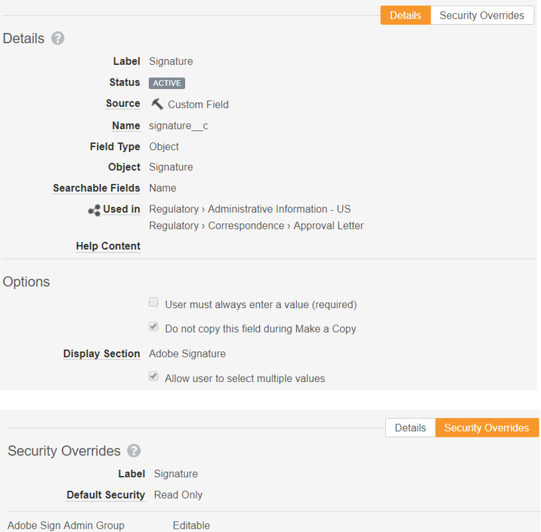
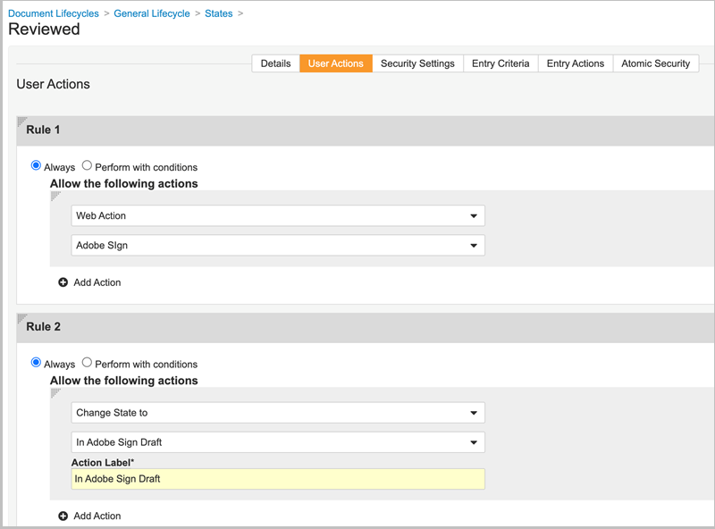

# [!DNL Veeva Vault] インストールガイド{#veeva-installation-guide}

[**Adobe Sign サポートへのお問い合わせ**](https://adobe.com/go/adobesign-support-center)

## 概要 {#overview}

この文書では、Adobe Signと [!DNL Veeva Vault] プラットフォーム。 [!DNL Veeva Vault] は、ライフサイエンス業界向けに構築されたエンタープライズコンテンツ管理 (ECM) プラットフォームです。 「保管庫」とは、コンテンツとデータのリポジトリのことで、規制機関への申請、調査レポート、申請書の作成、一般契約書の作成などに使用されます。 1 つの企業で複数の「ボールト」を保持し、個別に管理する必要があります。

統合を完了するための高度な手順は次のとおりです。

* Adobe Signで管理アカウントをアクティベートする（新規顧客のみ）
* オブジェクトを作成して、Vault の契約書ライフサイクルの履歴を追跡します。
* 新しいセキュリティプロファイルを作成します。
* Adobe Signで、 [!DNL Veeva Vault] 統合ユーザー。
* 文書フィールドとレンディションを作成します。
* Web アクションを設定し、ドキュメントライフサイクルを更新します。
* ドキュメントタイプのユーザーおよびユーザーロールの設定を作成します。

>[!NOTE]
>
>Adobe Sign管理者は、Adobe Sign内でAdobe Signの設定手順を実行する必要があります。

## 設定 [!DNL Veeva Vault]

設定するには [!DNL Veeva Vault] Adobe Signとの統合のために、Vault の契約書ライフサイクルの履歴を追跡するのに役立つ特定のオブジェクトを作成します。 管理者は、次のオブジェクトを作成する必要があります。

* 署名
* 署名者
* 署名イベント
* Process Locker

### 署名オブジェクトの作成  {#create-signature-object}

署名オブジェクトは、契約書関連の情報を格納するために作成されます。 Signature オブジェクトは、次の特定のフィールドに情報を格納するデータベースです。

**署名オブジェクトフィールド**

| フィールド | ラベル | タイプ | 説明 |
| --- | --- | ---| --- | 
| external_id__c | 契約書 ID | 文字列 (100) | Adobe Signの一意の契約書 ID を保持 |
| file_hash__c | ファイルハッシュ | 文字列 (50) | Adobe Signに送信されたファイルの md5 チェックサムを保持します |
| name__v | 名前 | 文字列 (128) | 契約書名を保持 |
| sender__c | 送信者 | オブジェクト（ユーザー） | 契約書を作成した Vault ユーザーへの参照を保持します |
| signature_status__c | 署名のステータス | 文字列 (75) | Adobe Signでの契約書のステータスを保持します |
| signature_type__c | 署名タイプ | 文字列 (20) | Adobe Signでの契約書の署名タイプ（手書きまたは電子サイン）を保持します。 |
| start_date__c | 開始日 | DateTime | 契約書が署名用に送信された日付 |
| cancellation_date__c | 解約日 | DateTime | 契約書がキャンセルされた日付を保持します。 |
| completion_date__c | 完了日 | DateTime | 契約書が完了した日付を保持します。 |
| viewable_rendition_used__c | 表示可能なレンディションを使用 | ブール値 | 表示可能なレンディションが署名用に送信されたかどうかを示すフラグ。 （デフォルトでは true） |

### 署名者オブジェクトの作成 {#create-signatory-object}

署名者オブジェクトは、契約書の参加者に関する情報を保存するために作成されます。 以下の特定のフィールドに情報が含まれています。

**署名者オブジェクトフィールド**

| フィールド | ラベル | タイプ | 説明 |
| --- | --- | ---| --- | 
| email__c | 電子メール | 文字列 (120) | Adobe Signの一意の契約書 ID を保持 |
| external_id__c | 参加者 Id | 文字列 (80) | Adobe Signの一意の参加者の識別子を保持します |
| name__v | 名前 | 文字列 (128) | Adobe Sign参加者の名前を保持 |
| order__c | 順序 | 数値 | Adobe Sign契約書参加者の注文番号を保持 |
| role__c | 役割 | 文字列 (30) | Adobe Sign契約書参加者のロールを保持 |
| signature__c | 署名 | オブジェクト（署名） | 署名の親レコードへの参照を保持します |
| signature_status__c | 署名のステータス | 文字列 (100) | Adobe Sign契約書参加者のステータスを保持 |
| user__c | ユーザー | オブジェクト（ユーザー） | 参加者が Vault ユーザの場合、署名者のユーザレコードへの参照を保持します |

### 署名イベントオブジェクトの作成  {#create-signature-event}

署名イベントオブジェクトは、契約書のイベント関連情報を保存するために作成されます。 以下の特定のフィールドに情報が含まれています。

| フィールド | ラベル | タイプ | 説明 |
| --- | --- | ---| --- | 
| acting_user_email__c | 代行ユーザー電子メール | 文字列 | イベントが生成される原因となったアクションを実行したAdobe Signユーザーの電子メールを保持します |
| acting_user_name__c | 代理ユーザー名 | 文字列 | イベントが生成される原因となったアクションを実行したAdobe Signユーザーの名前を保持します |
| description__c | 説明 | 文字列 | Adobe Signイベントの説明を保持します |
| event_date__c | イベント日 | DateTime | Adobe Signイベントの日時を保持します |
| event_type__c | イベントタイプ | 文字列 | Adobe Signイベントのタイプを保持します |
| name__v | 名前 | 文字列 | 自動生成されたイベント名 |
| participant_comment__c | 参加者のコメント | 文字列 | Adobe Sign参加者のコメントがある場合、そのコメントを保持します |
| participant_email__c | 参加者の電子メール | 文字列 | Adobe Sign参加者の電子メールを保持 |
| participant_role__c | 参加者の役割 | 文字列 | Adobe Sign参加者のロールを保持します |
| signature__c | 署名 | オブジェクト（署名） | 署名の親レコードへの参照を保持します |

### Process Locker オブジェクトの作成  {#create-process-locker}

Process Locker オブジェクトは、Adobe Sign統合プロセスをロックするために作成されます。 カスタムフィールドは必要ありません。

## セキュリティプロファイルの作成{#security-profiles}

Vault を正常に統合するために、新しいセキュリティプロファイルとして *Adobe Sign統合プロファイル* が作成され、その権限が *Adobe Sign管理者のアクション*&#x200B;を選択します。 Adobe Sign統合プロファイルは、システムアカウントに割り当てられ、Vault API を呼び出すときに統合によって使用されます。 このプロファイルは、次の権限を許可します。

* Vault API
* 読み取り、作成、編集、削除：署名、署名者、署名イベント、および Process Locker オブジェクト

Vault 内のAdobe Sign履歴へのアクセスを必要とするユーザのセキュリティプロファイルには、署名、署名者、および署名イベントオブジェクトに対する読み取り権限が必要です。

## グループの作成 {#create-group}

Adobe Signを [!DNL Vault]という名前の新しいグループが *Adobe Sign Admin Group* が作成されます。 このグループは、Adobe Sign関連フィールドの文書フィールドレベルのセキュリティを設定するために使用され、以下を含める必要があります *Adobe Sign統合プロファイル* デフォルトです。

## ユーザーを作成 {#create-user}

Adobe Sign統合の Vault システムアカウントユーザは、次のことを行う必要があります。

* Adobe Sign統合プロファイルを使用
* セキュリティプロファイルの使用
* パスワードの有効期限を無効にする特定のセキュリティポリシーがある
* Adobe Sign Admin Group のメンバーであること。

システムアカウントユーザーが特定のドキュメントライフサイクルのAdobe Sign Admin Group に属するようにするには、ユーザーロールの設定レコードを作成する必要があります。

## アプリケーションロールの作成 {#create-application-roles}

アプリケーションロールを作成する必要があります。 *Adobe Sign管理者ロール*&#x200B;を選択します。 このロールは、ライフサイクル署名の対象となる各文書タイプのライフサイクルで定義する必要があります。Adobe署名は、 Adobe Sign固有のライフサイクル状態ごとに、Adobe Sign管理者ロールが追加され、適切な権限で設定されます。

## 文書フィールドを作成 {#create-fields}

Adobe Signとの統合を確立するには、管理者は次の 2 つの新しい共有ドキュメントフィールドを作成する必要があります。

* 署名 (signature__c)
* Adobe Signユーザーアクションを許可する (allow_adobe_sign_user_actions__c)

これらの共有フィールドは、署名が可能なすべての文書タイプに追加する必要があります。Adobe署名。 両方のフィールドに、Adobe Sign Admin Group のメンバーのみが値を更新できる特定のセキュリティが設定されている必要があります。

管理者は、既存の共有フィールドを追加する必要があります *ボールトオーバーレイを無効にする (disable_vault_overlays__v)* を選択し、署名の対象となるすべての文書タイプに対して「有効」にAdobeします。 必要に応じて、Adobe Sign Admin グループのメンバーのみが値を更新できる特定のセキュリティをフィールドに設定できます。

## ドキュメントのレンディションの作成 {#create-renditions}

管理者は、 *Adobe Sign Rendition(adobe_sign_rendition__c)*&#x200B;を使用して、署名済みPDF文書をAdobe Signにアップロードします。 Adobe Signレンディションは、Adobe署名の対象となる文書型ごとに宣言する必要があります。

## Web アクションの設定 {#web-actions}

Adobe Signと Vault の統合では、次の 2 つの Web アクションを作成および設定する必要があります。

* **Adobe Sign**:Adobe Sign Agreement が作成または表示されます。

   種類：文書のターゲット：Vault URL 内に表示： <https://{integrationDomain}/veevavaultintsvc/partner/agreement?docId=${Document.id}&majVer=${Document.major_version_number__v}&minVer=${Document.minor_version_number__v}&vaultId=${Vault.Id>}

* **Adobe Sign**:Adobe Signの既存の契約書をキャンセルし、文書の状態を最初の状態に戻します。

   種類：文書のターゲット：Vault URL 内に表示： <https://{integrationDomain}/veevavaultintsvc/partner/agreement/cancel?docId=${Document.id}&majVer=${Document.major_version_number__v}&minVer=${Document.minor_version_number__v}&vaultId=${Vault.Id>}

## ドキュメントライフサイクルの更新 {#document-lifecycle}

ライフサイクル署名の対象となる各文書タイプについて、Adobeの新しい役割と状態を追加して、対応する文書ライフサイクルを更新する必要があります。

### ライフサイクルロール {#lifecycle-role}

アプリケーション署名の対象となる文書で使用されるすべてのライフサイクルに、Adobe Sign管理者アプリケーションロールを追加する必要があります。Adobe署名は必須です。 この役割は、次のオプションを使用して作成する必要があります。

* 動的アクセス制御を有効にする
* ドキュメントタイプグループのみを含むドキュメント共有ルール

### ライフサイクルの状態 {#lifecycle-states}

Adobe Sign契約書のライフサイクルには、次の状態があります。

* ドラフト
* AUTHORING または DOCUMENTS_NOT_YET_PROCESSED
* OUT_FOR_SIGNATURE または OUT_FOR_APPROVAL
* 署名済みまたは承認済み
* キャンセル済み
* 期限切れ

Vault ドキュメントをAdobe Signに送信する場合、その状態は契約書の状態と一致する必要があります。 これを行うには、ライフサイクル署名の対象となる文書で使用されるすべてのライフサイクルに次のAdobeを追加します。

* **署名Adobe前** （確認）:これは、ドキュメントをAdobe Signに送信できる状態のプレースホルダー名です。 ドキュメントタイプに基づいて、「ドラフト」状態または「レビュー済み」状態にすることができます。 ドキュメント状態ラベルは、お客様の要件に合わせてカスタマイズできます。 Adobe前の署名状態では、次の 2 つのユーザーアクションを定義する必要があります。

   * ドキュメントの状態を *Adobe Sign Draft* を選択します。 このユーザアクションの名前は、すべてのライフサイクルのすべてのドキュメントタイプで同じである必要があります。 必要に応じて、このアクションの条件を「Adobe Signユーザーアクションを許可する」に設定できます。
   * Web アクションを「Adobe Sign」と呼ぶアクション。 この状態には、Adobe Sign管理者ロールが次の操作を実行できるセキュリティが必要です。文書の表示、コンテンツの表示、フィールドの編集、関係の編集、ソースのダウンロード、表示可能なレンディションの管理、および状態の変更を行います。

   

* **Adobe Sign Draft**:これは、ドキュメントが既にAdobe Signにアップロードされ、その契約書がドラフト状態であることを示す状態のプレースホルダー名です。 必須状態です。 この状態では、次の 5 つのユーザーアクションを定義する必要があります。

   * ドキュメントの状態を *Adobe Sign Authoring* を選択します。 このユーザアクションの名前は、すべてのライフサイクルのすべてのドキュメントタイプで同じである必要があります。 必要に応じて、このアクションの条件を「Adobe Signユーザーアクションを許可する」に設定できます。
   * ドキュメントの状態を *署名Adobe状態*&#x200B;を選択します。 このユーザアクションの名前は、すべてのライフサイクルのすべてのドキュメントタイプで同じである必要があります。 必要に応じて、このアクションの条件を「Adobe Signユーザーアクションを許可する」に設定できます。
   * ドキュメントの状態を *Adobe Sign Cancelled* を選択します。 このユーザアクションの名前は、すべてのライフサイクルのすべてのドキュメントタイプで同じである必要があります。 必要に応じて、このアクションの条件を「Adobe Signユーザーアクションを許可する」に設定できます。
   * Web アクションを「Adobe Sign」と呼ぶアクション。
   * Web アクション「Adobe Signをキャンセル」を呼び出すアクション。 この状態には、Adobe Sign 管理者ロールが次の操作を実行できるセキュリティが必要です。文書の表示、コンテンツの表示、フィールドの編集、関係の編集、ソースのダウンロード、表示可能なレンディションの管理、および状態の変更を行います。

   

* **Adobe Sign Authoring**:これは、文書が既にAdobe Signにアップロードされ、その契約書が AUTHORING または DOCUMENTS_NOT_YET_PROCESSED 状態であることを示す、状態のプレースホルダー名です。 必須状態です。 この状態には、次の 4 つのユーザーアクションを定義する必要があります。

   * ドキュメントの状態を「Adobe Sign Cancelled」状態に変更するアクション。 このユーザーアクションの名前は、ライフサイクルに関係なくすべてのドキュメントタイプで同じである必要があります。 必要に応じて、このアクションの条件を「Adobe Signユーザーアクションを許可する」に設定できます。
   * ドキュメントの状態を「署名中」状態に変更するAdobeです。 このユーザーアクションの名前は、ライフサイクルに関係なくすべてのドキュメントタイプで同じである必要があります。 必要に応じて、このアクションの条件を「Adobe Signユーザーアクションを許可する」に設定できます。
   * Web アクションを「Adobe Sign」と呼ぶアクション
   * Web アクション「Adobe Signをキャンセル」を呼び出すアクション。 この状態には、Adobe Sign 管理者ロールが次の操作を実行できるセキュリティが必要です。文書の表示、コンテンツの表示、フィールドの編集、関係の編集、ソースのダウンロード、表示可能なレンディションの管理、および状態の変更を行います。

   

* **署名Adobe**:これは、文書がAdobe Signにアップロードされ、その契約書が参加者に既に送信されていることを示すステート（OUT_FOR_SIGNATURE または OUT_FOR_APPROVAL ステート）のプレースホルダー名です。 必須状態です。 この状態には、次の 5 つのユーザーアクションを定義する必要があります。

   * ドキュメントの状態を「Adobe Sign Cancelled」状態に変更するアクション。 このアクションのターゲット状態は、顧客の要件に応じて異なる場合があります。 このユーザーアクションの名前は、ライフサイクルに関係なくすべてのドキュメントタイプで同じである必要があります。 必要に応じて、このアクションの条件を「Adobe Signユーザーアクションを許可する」に設定できます。
   * ドキュメントの状態を「Adobe Signの拒否済み」状態に変更するアクション。 このアクションのターゲット状態は、顧客の要件に応じて異なる場合があります。 このユーザーアクションの名前は、ライフサイクルに関係なくすべてのドキュメントタイプで同じである必要があります。 必要に応じて、このアクションの条件を「Adobe Signユーザーアクションを許可する」に設定できます。
   * ドキュメントの状態を署名済みAdobeに変更する操作。 このアクションのターゲット状態は、顧客の要件に応じて異なる場合があります。 ただし、このユーザーアクションの名前は、ライフサイクルに関係なく、すべてのドキュメントタイプで同じである必要があります。 必要に応じて、このアクションの条件を「Adobe Signユーザーアクションを許可する」に設定できます。
   * Web アクションを呼び出すアクション *Adobe Sign*&#x200B;を選択します。
   * Web アクションを呼び出すアクション *Adobe Sign*&#x200B;を選択します。 この状態には、Adobe Sign 管理者ロールが次の操作を実行できるセキュリティが必要です。文書の表示、コンテンツの表示、フィールドの編集、関係の編集、ソースのダウンロード、表示可能なレンディションの管理、および状態の変更を行います。

   

* **Adobe署名済み（承認済み）**:これは、文書がAdobe Signにアップロードされ、契約書が完了したことを示す状態（署名済みまたは承認済みの状態）のプレースホルダー名です。 これは必須の状態であり、「承認済み」などの既存のライフサイクル状態にすることができます。
この状態では、ユーザー操作は必要ありません。 この状態には、Adobe Sign管理者の役割で次の操作を実行できるセキュリティが必要です。文書の表示、コンテンツの表示、フィールドの編集ができます。

次の図は、Adobe Sign契約書と Vault ドキュメント状態のマッピングを示しています。この場合、「Adobe署名前」状態はドラフトです。

## ドキュメントタイプグループとユーザーロールの設定の作成  {#document-type-group-user-role}

### ドキュメントタイプグループの作成 {#create-document-type-group}

管理者は、「Adobe Sign Document」という名前の新しいドキュメントタイプグループレコードを作成する必要があります。 このドキュメントタイプグループは、Adobe Signプロセスの対象となるすべてのドキュメント分類に追加されます。 ドキュメントタイプグループプロパティは、タイプからサブタイプまたはサブタイプから分類レベルに継承されないため、Adobe Signに適格な各ドキュメントの分類に対して設定する必要があります。

### ユーザーロール設定の作成 {#create-user-role-setup}

ライフサイクルが適切に設定されたら、Adobe Signプロセスの対象となるすべての文書に対して、Adobe Sign Admin ユーザーが DAC によって追加されていることを確認する必要があります。 これを行うには、次を指定する適切なユーザーロール設定レコードを作成します。

* 「Adobe Sign Document」としてのドキュメントタイプグループ、
* 「Adobe Sign管理者ロール」としてのアプリケーションロール
* 統合ユーザー。

>[!NOTE]
>
>ユーザーロール設定オブジェクトに、文書型グループオブジェクトを参照するフィールドが含まれていない場合は、このフィールドを追加する必要があります。

## Connect [!DNL Veeva Vault] ミドルウェアを使用してAdobe Signへ {#connect-middleware}

の設定が完了したら [!DNL Veeva Vault] とAdobe Sign Admin アカウントを使用する場合、管理者はミドルウェアを使用して 2 つのアカウント間の接続を作成する必要があります。 この [!DNL Veeva Vault] Adobe Signアカウントの接続はAdobe Sign Identity によって開始され、Veeva Vault ID の保存に使用されます。
システムのセキュリティと安定性を確保するため、管理者は専用の [!DNL Veeva Vault] システム/サービス/ユーティリティアカウント ( `adobe.for.veeva@xyz.com`などの個人ユーザーアカウントの代わりに、 `bob.smith@xyz.com`を選択します。

Adobe Signアカウント管理者は、次の手順に従って接続する必要があります [!DNL Veeva Vault] ミドルウェアを使用してAdobe Signするには：

1. DITA マップの「 [Adobe Sign [!DNL Veeva Vault] ホームページ](https://static.adobesigncdn.com/veevavaultintsvc/index.html)を選択します。
1. 選択 **[!UICONTROL ログイン]** を選択します。

   

1. 開いたAdobe Signログインページで、アカウント管理者の電子メールとパスワードを入力し、「 **[!UICONTROL 歌う]**&#x200B;を選択します。

   

   ログインに成功すると、以下に示すように、関連付けられている電子メール ID と「設定」タブがページに表示されます。

   

1. 次の **[!UICONTROL 設定]** 」タブをクリックします。

   次に示すように、設定ページには使用可能な接続が表示され、最初の接続が設定されている場合は「なし」が表示されます。

   

1. 選択 **[!UICONTROL 接続の追加]** をクリックして、新しい接続を追加します。

1. 表示された接続を追加ダイアログで、 [!DNL Veeva Vault] 資格情報。

   Adobe Sign資格情報は、Adobe Signの初期ログインから自動的に入力されます。

   

1. 選択 **[!UICONTROL 検証]** 」をクリックして、アカウントの詳細を検証します。

   検証が成功すると、次のように「ユーザーが正常に検証されました」という通知が表示されます。

   

1. 特定のAdobe Signグループのみに使用を制限するには、 **[!UICONTROL グループ]** 」ドロップダウンリストを表示し、使用可能なグループのいずれかを選択します。

   

1. 選択 **[!UICONTROL 保存]** 」をクリックして新しい接続を保存します。

   新しい接続が「設定」タブに表示され、 [!DNL Veeva Vault] そしてAdobe Sign。

   

## パッケージ展開のライフサイクル {#deployment-lifecycle}

### 一般的な展開ライフサイクル {#general-deployment}

**手順 1.** 「Adobe Sign Admin Role」という新しいアプリケーションロールを作成します。

**手順 2.** 「Adobe Sign Document」という名前の新しいドキュメントタイプグループを作成します。

**手順 3.** パッケージをデプロイします。

**手順 4.** 「Adobe Sign Admin Group」という名前の新しいユーザー管理グループを作成します。

**手順 5.** セキュリティプロファイル「Adobe Sign統合プロファイル」を使用して統合ユーザープロファイルを作成し、Adobe Sign Admin Group に割り当てます。

**手順 6.** Vault 内のAdobe Sign履歴へのアクセスを必要とするユーザの署名、署名者、署名イベントオブジェクトに、すべてのセキュリティプロファイルの読み取り権限を割り当てます。

**手順 7.** 管理者の署名に適格な各文書タイプのライフサイクルで、Adobe Sign管理者ロールをAdobeします。 Adobe Sign固有のライフサイクル状態ごとに、この役割が追加され、適切な権限で設定されます。

**手順 8.** Adobe Sign Rendition を、署名の対象となる文書タイプごとにAdobeします。

**手順 9.** ライフサイクル署名の対象となる各文書タイプについて、Adobeの新しい役割と状態を追加して、対応する文書ライフサイクルを更新します。

**手順 10.** Adobe Signプロセスの対象となるすべての文書分類に、「Adobe Sign Document」という文書タイプグループを追加します。

**手順 11.** すべての設定が完了したら、Adobe Signプロセスの対象となるすべての文書に対して DAC がAdobe Sign Admin ユーザーを追加します。 これを行うには、適切なユーザーロール設定レコードを作成します。このレコードで、ドキュメントタイプグループを「Adobe Signドキュメント」、アプリケーションロールを「Adobe Sign管理者ロール」、統合ユーザーを指定します。

### 特定の導入ライフサイクル {#specific-deployment}

**手順 1.** 「Adobe Sign Admin Role」という新しいアプリケーションロールを作成します。

**手順 2.** 「Adobe Sign Document」という名前の新しいドキュメントタイプグループを作成します。

**手順 3.** パッケージをデプロイします。

**手順 4.** 「Adobe Sign Admin Group」という、ユーザーが管理する新しいグループを作成します。

**手順 5.** 「Adobe Sign統合プロファイル」というセキュリティプロファイルを持つ統合ユーザープロファイルを 1 つ作成し、Adobe Sign Admin Group に割り当てます。
