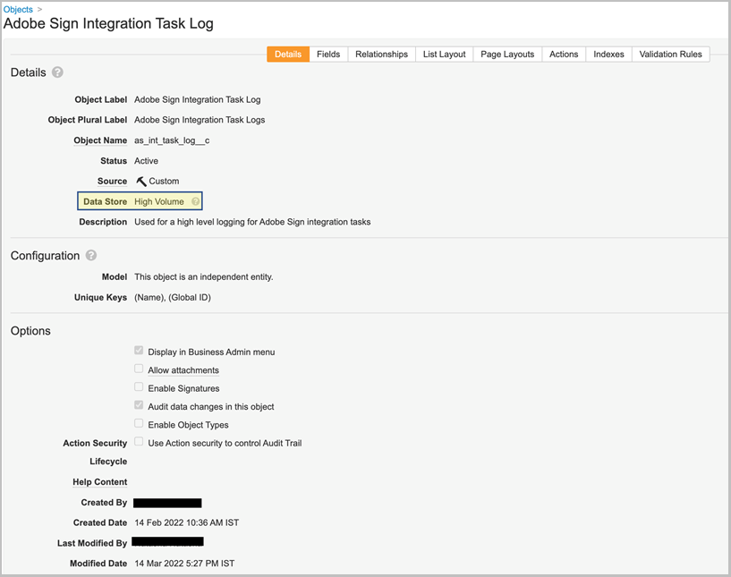
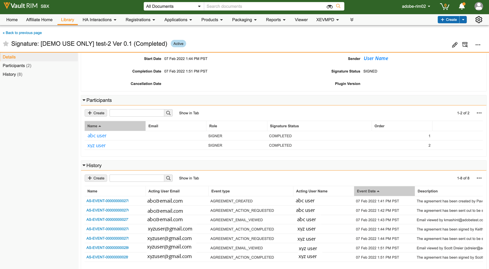
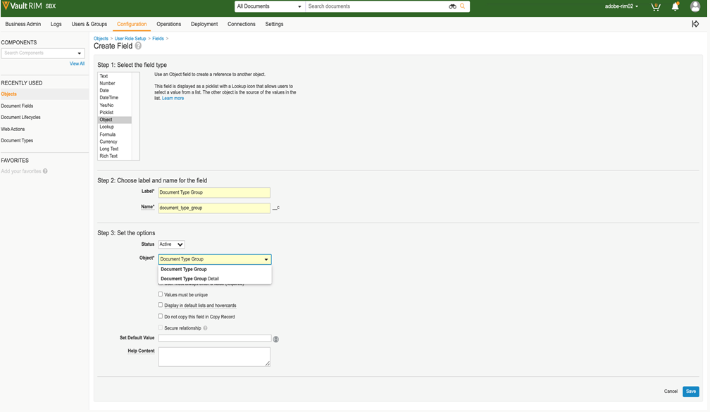
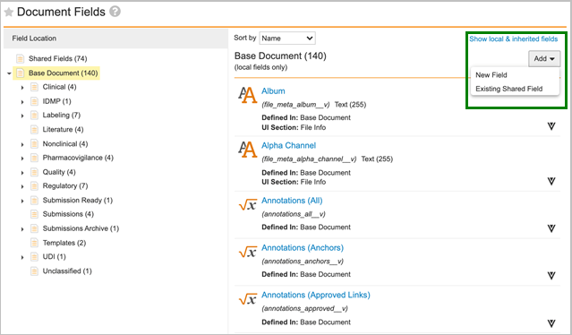
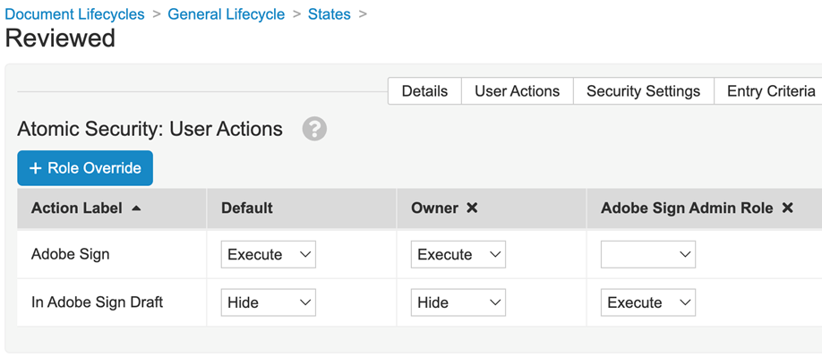
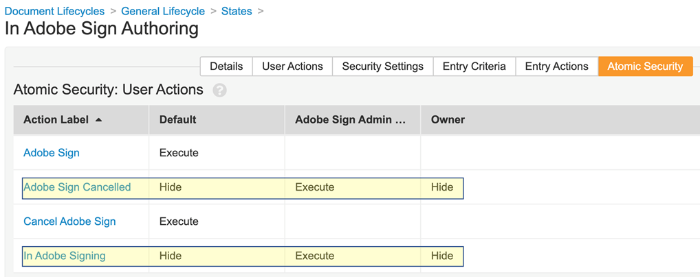
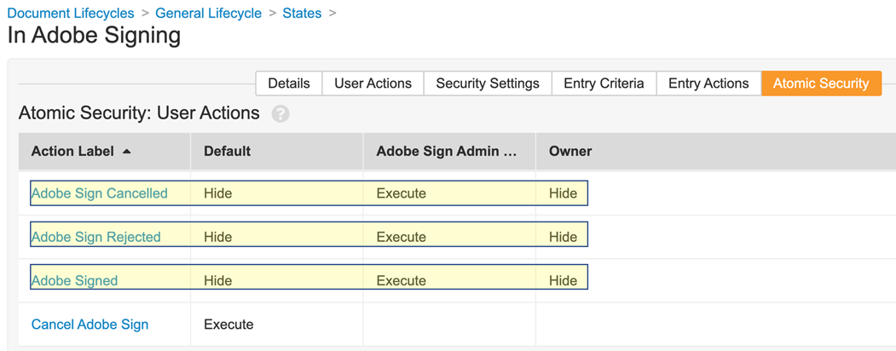
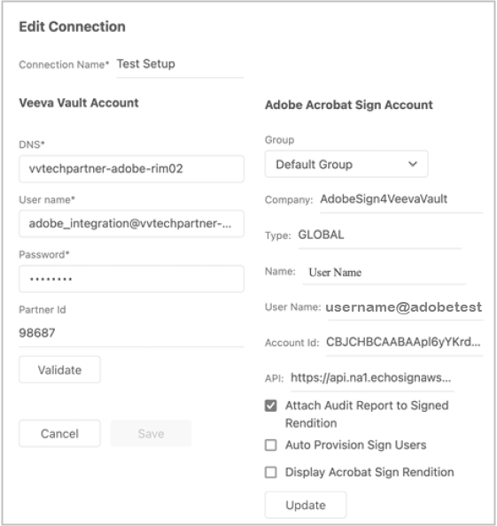

# [!DNL Veeva Vault] インストールガイド{#veeva-installation-guide}

[**Adobe Acrobat Signサポート**](https://adobe.com/go/adobesign-support-center_jp)

## 概要 {#overview}

この文書では、Adobe Acrobat Signと [!DNL Veeva Vault] プラットフォーム。 [!DNL Veeva Vault] は、ライフサイエンス業界向けに構築された ECM（エンタープライズ・コンテンツ管理）プラットフォームです。 「Vault」とは、規制書類の提出、調査レポートの作成、申請書類の提出、一般契約書の作成などに使用されるコンテンツとデータのリポジトリです。 1 つの企業で複数の「ボールト」を使用し、個別に管理する必要があります。

統合を完了するための高度な手順は次のとおりです。

* Adobe Acrobat Signで管理アカウントをアクティベートします（新規顧客のみ）。
* オブジェクトを作成して、Vault の契約書ライフサイクルの履歴を追跡します。
* 新しいセキュリティプロファイルを作成します。
* Adobe Acrobat Signで、 [!DNL Veeva Vault] 統合ユーザー。
* 文書フィールドとレンディションを作成します。
* Web アクションを設定し、ドキュメントライフサイクルを更新します。
* ドキュメントタイプのユーザーおよびユーザーロールの設定を作成します。
* ミドルウェアを使用して Veeva Vault をAdobe Acrobat Signに接続します。

>[!NOTE]
>
>Adobe Sign管理者は、Adobe Acrobat Sign内でAdobe Acrobat Signの設定手順を実行する必要があります。

## 設定 [!DNL Veeva Vault] {#configure-veeva}

設定するには [!DNL Veeva Vault] Adobe Acrobat Signと統合するには、以下の手順を実装する必要があります。

### 手順 1. グループの作成 {#create-group}

Adobe Acrobat Signを [!DNL Vault]という新しいグループが *Adobe Sign Admin Group* が作成されます。 このグループは、Adobe Acrobat Sign関連フィールドの文書フィールドレベルのセキュリティを設定するために使用され、以下を含める必要があります *Adobe Sign統合プロファイル* デフォルトです。

### 手順 2. パッケージのデプロイ {#deploy-package}

[パッケージのデプロイ](https://helpx.adobe.com/content/dam/help/en/PKG-AdobeSign-Integration-veeva.zip) の手順に従います。 デプロイされると、パッケージは次のものを作成します。

* カスタムオブジェクト：Signature オブジェクト、Signatory オブジェクト、Signature Event オブジェクト、Process Locker オブジェクト
* 署名オブジェクトのページレイアウト
* 署名イベントオブジェクトのページレイアウト
* 署名者オブジェクトページレイアウト
* Process Locker オブジェクトページレイアウト
* Adobe Sign Integration Task Log オブジェクト・ページ・レイアウト
* Adobe Sign Rendition type
* 元のレンディションの種類
* 共有フィールドの署名__c
* Adobe Sign Web Action
* Adobe Sign Web アクションのキャンセル
* Adobe Sign Admin Actions 権限セット
* Adobe Sign統合プロファイルセキュリティプロファイル
* アプリケーションロールAdobe Sign管理者ロール
* 文書型グループ&#39;Adobe Sign Document&#39;
* Adobe Sign Integration Task ログオブジェクト

#### Signature オブジェクト {#signature-object}

署名オブジェクトは、契約書に関連する情報を格納するために作成されます。 Signature オブジェクトは、次の特定のフィールドに情報を格納するデータベースです。

**署名オブジェクトフィールド**

| フィールド | ラベル | タイプ | 説明 |
|:---|:---|:---|:------- | 
| external_id__c | 契約書 ID | 文字列 (100) | Adobe Acrobat Signの一意の契約書 ID を保持 |
| file_hash__c | ファイルハッシュ | 文字列 (50) | Adobe Acrobat Signに送信されたファイルの md5 チェックサムを保持します |
| name__v | 名前 | 文字列 (128) | 契約書名を保持します |
| sender__c | 送信者 | オブジェクト（ユーザー） | 契約書を作成した Vault ユーザーへの参照を保持します |
| signature_status__c | 署名ステータス | 文字列 (75) | Adobe Acrobat Signでの契約書のステータスを保持 |
| signature_type__c | 署名タイプ | 文字列 (20) | Adobe Acrobat Signでの契約書の署名タイプ（手書きまたは電子サイン）を保持します。 |
| start_date__c | 開始日 | DateTime | 契約書が署名用に送信された日付 |
| cancellation_date__c | 解約日 | DateTime | 契約書がキャンセルされた日付を保持します。 |
| completion_date__c | 完了日 | DateTime | 契約が完了した日付を保持します。 |
| viewable_rendition_used__c | 表示可能なレンディション使用 | ブール値 | 表示可能なレンディションが署名用に送信されたかどうかを示すフラグ。 （デフォルトでは true） |
| plugin_version__c | プラグインバージョン | テキスト (10) | これは、新しいバージョン 4.0 がデプロイされる前に作成されたすべての契約書を適切に処理するために使用されます。 注意：4.0 カスタム Web アプリケーションバージョンがデプロイされると、署名レコードが作成されるたびに、このフィールドは 4.0 に設定されます。 |
| external_environment__c | 外部環境 | テキスト (20) | 契約書が作成されたAdobe Signの環境名を保持します。 |

#### 署名者オブジェクト {#signatory-object}

署名者オブジェクトは、契約書の参加者に関連する情報を格納するために作成されます。 以下の特定のフィールドに情報が含まれています。

**署名者オブジェクトフィールド**

| フィールド | ラベル | タイプ | 説明 |
|:---|:---|:---|:------- | 
| email__c | 電子メール | 文字列 (120) | Adobe Acrobat Signの一意の契約書 ID を保持 |
| external_id__c | 参加者 ID | 文字列 (80) | Adobe Acrobat Signの一意の参加者の識別子を保持します |
| name__v | 名前 | 文字列 (128) | Adobe Acrobat Sign参加者の名前を保持 |
| order__c | 順序 | 数値 | Adobe Acrobat Sign契約書の参加者の注文番号を保持 |
| role__c | 役割 | 文字列 (30) | Adobe Acrobat Sign契約書の参加者のロールを保持 |
| signature__c | 署名 | オブジェクト（署名） | 署名の親レコードへの参照を保持します |
| signature_status__c | 署名ステータス | 文字列 (100) | Adobe Acrobat Sign契約書の参加者のステータスを保持 |
| user__c | ユーザー | オブジェクト（ユーザー） | 参加者が Vault ユーザである場合、署名者のユーザレコードへの参照を保持します |

#### Signature Event オブジェクト {#signature-event}

署名イベントオブジェクトは、契約書のイベント関連情報を保存するために作成されます。 以下の特定のフィールドに情報が含まれています。

署名イベントオブジェクトフィールド

| フィールド | ラベル | タイプ | 説明 |
|:---|:---|:---|:-------- | 
| acting_user_email__c | 代行ユーザー電子メール | 文字列 | イベントを生成する原因となったアクションを実行したAdobe Acrobat Signユーザーの電子メールを保持します |
| acting_user_name__c | 代行ユーザー名 | 文字列 | イベントを生成する原因となったアクションを実行したAdobe Acrobat Signユーザーの名前を保持します |
| description__c | 説明 | 文字列 | Adobe Acrobat Signイベントの説明を保持します |
| event_date__c | イベント日 | DateTime | Adobe Acrobat Signイベントの日時を保持します |
| event_type__c | イベントタイプ | 文字列 | Adobe Acrobat Signイベントのタイプを保持します |
| name__v | 名前 | 文字列 | 自動生成されたイベント名 |
| participant_comment__c | 参加者コメント | 文字列 | Adobe Acrobat Sign参加者のコメントがある場合に、コメントを保持します |
| participant_email__c | 参加者の電子メール | 文字列 | Adobe Acrobat Sign参加者の電子メールを保持 |
| participant_role__c | 参加者の役割 | 文字列 | Adobe Acrobat Sign参加者のロールを保持します |
| signature__c | 署名 | オブジェクト（署名） | 署名の親レコードへの参照を保持します |
| external_id__c | 外部 ID | テキスト (200) | Adobe Signによって生成された契約イベント識別子を保持します。 |

#### Process Locker オブジェクト {#process-locker}

Process Locker オブジェクトが作成され、Adobe Acrobat Sign統合プロセスがロックされます。 カスタムフィールドは必要ありません。

#### Adobe Sign Integration Task Log オブジェクト {#task-log}

Adobe Sign統合タスクログ (as_int_task_log__c) を作成します。 AgreementsEventsSynchronizerJob および AgreementsEventsProcessingJob の実行をトレースするために使用される大容量オブジェクトです。
AgreementsEventsSynchronizerJob:このタスクにより、Adobe Signで見つからないすべての契約イベントが、過去 N 日間に Vault で作成されたすべての署名に対するアクティブな署名イベントとして Vault に作成されます。
AgreementsEventsProcessingJob:このタスクにより、アクティブな署名イベントレコードを持つすべての文書が、イベントタイプに応じて処理されます。

Adobe Sign統合タスクログオブジェクトフィールド

| フィールド | ラベル | タイプ | 説明 |
|:--|:--|:--|:---------| 
| start_date__c | 開始日 | DateTime | タスク開始日 |
| end_date__c | 終了日 | DateTime | タスク終了日 |
| task_status__c | タスクの状態 | 候補リスト | 保留タスクの状態：   完了 (task_completed__c) 完了（エラーあり） (task_completed_with_errors__c) 失敗 (task_failed__c) |
| task_type__c | タスクタイプ | 候補リスト | 保留タスクの種類：    契約イベント同期 (agreements_events_synchronization__c) 契約イベント処理 (agreements_events_processing__c) |
| messages__c | メッセージ | 長い (32000) | タスクメッセージを保持 |

展開パッケージの一部として含まれる Signature、Signatory、Signature Event、Process Locker、および Task Log の各オブジェクトでは、[ このオブジェクトのデータ変更を監査する ] プロパティが既定で有効になっています。

**注意：** [ データ変更の監査 ] 設定を有効にすると、Vault キャプチャオブジェクトで監査ログにデータ変更を記録できます。 この設定はデフォルトでオフになっています。 この設定を有効にしてレコードを作成すると、レコードを無効にできなくなります。 この設定がオフで、レコードが存在する場合は、Vault の所有者のみが設定を更新できます。

#### **署名オブジェクトの参加者と履歴を表示** {#display-participants-history}

デプロイメントパッケージの一部として提供される Signature オブジェクトは、 [署名詳細ページレイアウト](https://vvtechpartner-adobe-rim.veevavault.com/ui/#admin/content_setup/object_schema/pagelayout?t=signature__c&amp;d=signature_detail_page_layout__c)を選択します。 ページレイアウトには、参加者と履歴のセクションがあります。

* この *参加者* セクションには、次の図に示すように構成された「関連オブジェクト」セクションがあります。

   

* 以下に示すように、参加者に表示される列を編集できます。

   

* この *履歴* セクションには、次の図に示すように構成された「関連オブジェクト」セクションがあります。

   

* 以下に示すように、履歴に表示される列を編集できます。

   

#### **Adobe Acrobat Sign Document の参加者と監査履歴の表示** {#view-participants-audit-history}

* Adobe Acrobat Sign文書の参加者と監査履歴を表示するには、文書の「Adobe署名」セクションのリンクを選択します。

   

* 開いたページに、Adobe Acrobat Signドキュメントの参加者と履歴が表示されます（以下を参照）。

   

* 以下のように、署名の監査証跡を表示します。

   

### 手順 3. セキュリティプロファイルの設定 {#security-profiles}

手順 2 でパッケージを正常にデプロイすると、Adobe Sign統合プロファイルが作成されます。 Adobe Sign統合プロファイルは、システムアカウントに割り当てられ、Vault API を呼び出すときに統合によって使用されます。 このプロファイルは、次の権限を許可します。

* Vault API
* 読み取り、作成、編集、削除：署名、署名者、署名イベント、および Process Locker オブジェクト

以下の画像に示すように、含まれるセキュリティプロファイルをAdobe Sign統合プロファイルに設定して、Adobe Sign Admin Group（手順 1 で作成）を更新する必要があります。

### 手順 4. ユーザーを作成 {#create-user}

Adobe Acrobat Sign統合の Vault システムアカウントユーザは、次のことを行う必要があります。

* Adobe Sign統合プロファイルを使用する
* セキュリティプロファイルの使用
* パスワードの有効期限を無効にする特定のセキュリティポリシーを設定する
* Adobe Sign Admin Group のメンバーであること。

これを行うには、次の手順に従います。

1. Adobe Acrobat Sign統合の Vault システムアカウントユーザを作成します。

   

2. ユーザーをAdobe Sign Admin Group に追加します。

   

### 手順 5. ドキュメントタイプグループの設定 {#create-document-type-group}

Adobe Acrobat Signパッケージをデプロイすると、「Adobe Sign Document」という名前のドキュメントタイプグループレコードが作成されます。

Adobe Acrobat Signプロセスに適格なすべての文書分類に対して、この文書タイプグループを追加する必要があります。 ドキュメントタイプグループプロパティは、タイプからサブタイプまたはサブタイプから分類レベルに継承されないため、Adobe Acrobat Signに適格な各ドキュメントの分類に対して設定する必要があります。

**注意：** ユーザーロール設定オブジェクトに、ドキュメントタイプグループオブジェクトを参照するフィールドが含まれていない場合は、フィールドを追加する必要があります。 そのためには、 **[!UICONTROL オブジェクト]** > **[!UICONTROL ユーザーロールの設定]** > **[!UICONTROL フィールド]** 次の図に示すように、必要な手順を実行します。

### 手順 6. ユーザーロール設定の作成 {#create-user-role-setup}

ライフサイクルが適切に設定されたら、Adobe Signプロセスの対象となるすべての文書に対して DAC がAdobe Acrobat Sign Admin ユーザーを追加します。 これを行うには、次を指定する適切なユーザーロール設定レコードを作成します。

* 文書タイプグループをAdobe Sign Document に設定
* アプリケーションロール (Adobe Sign管理者ロール )
* 統合ユーザー

### 手順 7. 文書フィールドの設定 {#create-fields}

パッケージをデプロイすると、統合を確立するために必要な次の新しい共有ドキュメントフィールドが作成されます。

* 署名 (signature__c)

文書フィールドを設定するには：

1. 「構成」タブに移動し、「 **[!UICONTROL 文書フィールド]** > **[!UICONTROL 共有フィールド]**&#x200B;を選択します。
1. 「表示セクション」フィールドで、 **[!UICONTROL 表示セクションの作成]** を選択し、 **[!UICONTROL Adobe署名]** をセクションラベルとして使用します。

   

1. 共有文書フィールド (signature__c) の場合、UI セクションを **[!UICONTROL Adobe署名]** をセクションラベルとして使用します。
1. Adobe Acrobat署名の対象となるすべての文書タイプに 2 つの共有フィールドを追加します。 これを行うには、ベースドキュメントページで、「 **[!UICONTROL 追加]** > **[!UICONTROL 既存の共有フィールド]** を選択します。

   

   

   

1. 両方のフィールドに、Adobe Sign Admin Group のメンバーのみが値を更新できる特定のセキュリティが設定されている必要があります。

   

[ ボールトオーバーレイを無効にする ](disable_vault_overlays__v) は、既存の共有フィールドです。 必要に応じて、Adobe Sign Admin グループのメンバーのみが値を更新できる特定のセキュリティをフィールドに設定できます。

### 手順 8. 文書のレンディションを宣言 {#declare-renditions}

新しいレンディションのタイプは *Adobe Signレンディション (adobe_sign_rendition__c)* は、Vault との統合によって、署名済みPDF文書をAdobe Acrobat Signにアップロードします。 Adobe Acrobat Signature に適格な各文書タイプに対してAdobe Signレンディションを宣言する必要があります。

新しいレンディションのタイプは *元のレンディション (original_rendition__c)* は、Vault 統合によって、元の表示可能なレンディションの保存に使用するレンディションの名前として使用されます（署名済みの文書が表示可能レンディションとしてインポートされた場合）。

### 手順 9. Web アクションの更新 {#web-actions}

Adobe Acrobat Signと Vault の統合では、次の 2 つの Web アクションを作成および設定する必要があります。

* **Adobe Sign**:Adobe Acrobat Sign Agreement が作成または表示されます。

   種類：文書のターゲット：Vault 資格情報に表示：メッセージ投稿 URL を使用してセッション投稿の資格情報を有効にする： <https://api.na1.adobesign.com/api/gateway/veevavaultintsvc/partner/agreement?docId=${Document.id}&majVer=${Document.major_version_number__v}&minVer=${Document.minor_version_number__v}&vaultid=${Vault.id}&useWaitPage=true>

   

* **Adobe Sign**:Adobe Acrobat Signの既存の契約書をキャンセルし、文書の状態を最初の状態に戻します。

   種類：文書のターゲット：Vault 資格情報に表示：メッセージ投稿 URL を使用してセッション投稿の資格情報を有効にする：: <https://api.na1.adobesign.com/api/gateway/veevavaultintsvc/partner/agreement/cancel?docId=${Document.id}&majVer=${Document.major_version_number__v}&minVer=${Document.minor_version_number__v}&vaultid=${Vault.id}&useWaitPage=true>

   

### 手順 10. ドキュメントライフサイクルの更新 {#document-lifecycle}

ライフサイクル署名の対象となる各文書タイプについて、Adobeの新しいロールと状態を追加して、対応する文書ライフサイクルを更新する必要があります。

Adobe Acrobat Sign契約書のライフサイクルには、次の状態があります。

* 下書き
* AUTHORING または DOCUMENTS_NOT_YET_PROCESSED
* OUT_FOR_SIGNATURE または OUT_FOR_APPROVAL
* 署名済みまたは承認済み
* キャンセル済み
* 期限切れ

ドキュメントライフサイクルを更新するには、次の手順に従います。

1. ライフサイクルロールの追加。 Adobe Sign署名の対象となる文書で使用されるすべてのライフサイクルに、Adobe Acrobat管理者アプリケーションロールを追加する必要があります（以下を参照）。

   

   管理者ロールは、次のオプションを使用して作成する必要があります。

   * 動的アクセス制御を有効にした。
   * 以下の画像に示すように、ドキュメントタイプグループのみを含むドキュメント共有ルール。

   

2. ライフサイクル状態を作成します。 そのためには、 **[!UICONTROL 設定]** > **[!UICONTROL 設定]** > **[!UICONTROL 文書のライフサイクル]** > **[!UICONTROL 一般的なライフサイクル]** > **[!UICONTROL ステート]** > **[!UICONTROL 作成]**&#x200B;を選択します。 次に、次のステートを作成します。

   * Adobe Sign Draft

   

   * Adobe Sign Authoring

   

   * 署名Adobe

   

3. 以下に示す状態にユーザーアクションを追加します。

   Vault ドキュメントをAdobe Acrobat Signに送信する場合、その状態は契約書の状態に対応している必要があります。 これを行うには、ライフサイクル署名の対象となる文書で使用されるすべてのライフサイクルに、次のAdobeを追加します。

   * **署名Adobe前** （確認）:これは、ドキュメントをAdobe Acrobat Signに送信できる状態のプレースホルダー名です。 ドキュメントタイプに基づいて、「ドラフト」状態または「レビュー済み」状態にすることができます。 ドキュメント状態ラベルは、お客様の要件に合わせてカスタマイズできます。 Adobe署名前の状態では、次の 2 つのユーザーアクションを定義する必要があります。

      * ドキュメントの状態を *Adobe Sign Draft* を選択します。 このユーザアクションの名前は、すべてのライフサイクルのすべてのドキュメントタイプで同じである必要があります。
      * Web アクションを&#39;Adobe Sign&#39;と呼び出すアクション。 この状態には、Adobe Sign管理者ロールが次の操作を実行できるセキュリティが必要です。ドキュメントの表示、コンテンツの表示、フィールドの編集、関係の編集、ソースのダウンロード、表示可能なレンディションの管理、状態の変更を行います。

      

      * 修正 *レビュー済み* アトミック・セキュリティの設定 *Adobe Sign Draft* デフォルトでは「非表示」、実行対象は「 *Adobe Sign管理者ロール*&#x200B;を選択します。
      **注意：** If *Adobe Sign管理者ロール* 役割は次のメンバーの一部ではありません *アトミックセキュリティ：ユーザーアクション*、追加 **[!UICONTROL Adobe Sign管理者ロール]** 選択 **[!UICONTROL 編集]**> **[!UICONTROL ロールの上書き]**&#x200B;を選択します。 次に、 **Adobe Sign管理者ロール** 対象 *レビュー済み* 都道府県

      
      
      

   * **Adobe Sign Draft**:これは、ドキュメントが既にAdobe Acrobat Signにアップロードされ、その契約書がドラフト状態であることを示す、状態のプレースホルダー名です。 必須状態です。 この状態では、次の 5 つのユーザーアクションを定義する必要があります。

      * ドキュメントの状態を *Adobe Sign Authoring* を選択します。 このユーザアクションの名前は、すべてのライフサイクルのすべてのドキュメントタイプで同じである必要があります。
      * ドキュメントの状態を *署名Adobe状態*&#x200B;を選択します。 このユーザアクションの名前は、すべてのライフサイクルのすべてのドキュメントタイプで同じである必要があります。
      * ドキュメントの状態を *Adobe Sign Cancelled* を選択します。 このユーザアクションの名前は、すべてのライフサイクルのすべてのドキュメントタイプで同じである必要があります。
      * Web アクションを呼び出すアクション *Adobe Sign*&#x200B;を選択します。
      * Web アクションを呼び出すアクション *Adobe Sign*&#x200B;を選択します。 この状態には、Adobe Sign管理者の役割で次の操作を実行できるセキュリティが必要です。ドキュメントの表示、コンテンツの表示、フィールドの編集、関係の編集、ソースのダウンロード、表示可能なレンディションの管理、状態の変更を行います。

      

      * 修正 *Adobe Sign Draft* 状態のアトミック・セキュリティ：actions *Adobe Sign Cancelled*, *Adobe Sign Authoring*, *署名Adobe* Adobe Sign管理者ロールを除くすべてのユーザーに対して非表示にする必要があります。
      **注意：** If *Adobe Sign管理者ロール* が *アトミック・セキュリティ：ユーザーアクション*、追加 **[!UICONTROL Adobe Sign管理者ロール]** 選択 **[!UICONTROL 編集]** > **[!UICONTROL ロールの上書き]**&#x200B;を選択します。 次に、 **[!UICONTROL Adobe Sign管理者ロール]** 役割 *Adobe Sign Draft* 都道府県

      

   * **Adobe Sign Authoring**:これは、文書が既にAdobe Acrobat Signにアップロードされており、その契約書の状態が AUTHORING または DOCUMENTS_NOT_YET_PROCESSED であることを示す、ステートのプレースホルダー名です。 必須状態です。 この状態には、次の 4 つのユーザーアクションを定義する必要があります。

      * ドキュメントの状態を「Adobe Sign Cancelled」状態に変更するアクション。 このユーザーアクションの名前は、ライフサイクルに関係なくすべてのドキュメントタイプで同じである必要があります。
      * ドキュメントの状態を「署名中」状態に変更するAdobeです。 このユーザーアクションの名前は、ライフサイクルに関係なくすべてのドキュメントタイプで同じである必要があります。
      * Web アクション「Adobe Sign」を呼び出すアクション
      * Web アクション「Adobe Signをキャンセル」を呼び出すアクション。 この状態には、Adobe Sign 管理者ロールが次の操作を実行できるセキュリティが必要です。ドキュメントの表示、コンテンツの表示、フィールドの編集、関係の編集、ソースのダウンロード、表示可能なレンディションの管理、状態の変更を行います。

      

      * 修正 *Adobe Sign Authoring* 状態のアトミック・セキュリティ：actions *Adobe Sign Cancelled* および *署名Adobe* Adobe Sign管理者ロールを除くすべてのユーザーに対して非表示にする必要があります。
      **注意：** If *Adobe Sign管理者ロール* が *アトミック・セキュリティ：ユーザーアクション*、追加 **[!UICONTROL Adobe Sign管理者ロール]** 選択 **[!UICONTROL 編集]** > **[!UICONTROL ロールの上書き]**&#x200B;を選択します。 次に、 **[!UICONTROL Adobe Sign管理者ロール]** 役割 *Adobe Sign Authoring* 都道府県

      

   * **署名Adobe**:これは、文書がAdobe Acrobat Signにアップロードされ、その契約書が既に参加者に送信されていることを示す状態（OUT_FOR_SIGNATURE または OUT_FOR_APPROVAL 状態）のプレースホルダー名です。 必須状態です。 この状態には、次の 5 つのユーザーアクションを定義する必要があります。

      * ドキュメントの状態を「Adobe Sign Cancelled」状態に変更するアクション。 このアクションのターゲット状態は、顧客の要件に応じて異なる場合があります。 このユーザーアクションの名前は、ライフサイクルに関係なくすべてのドキュメントタイプで同じである必要があります。
      * ドキュメントの状態を「Adobe Sign Rejected」状態に変更するアクション。 このアクションのターゲット状態は、顧客の要件に応じて異なる場合があります。 このユーザーアクションの名前は、ライフサイクルに関係なくすべてのドキュメントタイプで同じである必要があります。
      * ドキュメントの状態を署名済みAdobeに変更する操作。 このアクションのターゲット状態は、顧客の要件に応じて異なる場合があります。 ただし、このユーザーアクションの名前は、ライフサイクルに関係なくすべてのドキュメントタイプで同じである必要があります。
      * Web アクションを呼び出すアクション *Adobe Sign*&#x200B;を選択します。
      * Web アクションを呼び出すアクション *Adobe Sign*&#x200B;を選択します。 この状態には、Adobe Sign 管理者ロールが次の操作を実行できるセキュリティが必要です。ドキュメントの表示、コンテンツの表示、フィールドの編集、関係の編集、ソースのダウンロード、表示可能なレンディションの管理、状態の変更を行います。

      

      * 修正 *署名Adobe* 状態のアトミック・セキュリティ：actions *Adobe Sign Cancelled*, *Adobe Sign Rejected*&#x200B;および *Adobe署名* Adobe Sign管理者ロールを除くすべてのユーザーに対して非表示にする必要があります。
      **注意：** If *Adobe Sign管理者ロール* が *アトミック・セキュリティ：ユーザーアクション*、追加 **[!UICONTROL Adobe Sign管理者ロール]** 選択 **[!UICONTROL 編集]** > **[!UICONTROL ロールの上書き]**&#x200B;を選択します。 次に、 **[!UICONTROL Adobe Sign管理者ロール]** 役割 *署名Adobe* 都道府県

      

      * **Adobe署名済み（承認済み）**:これは、文書がAdobe Acrobat Signにアップロードされ、契約書が完了したことを示す状態（署名済みまたは承認済みの状態）のプレースホルダー名です。 これは必須の状態であり、「承認済み」などの既存のライフサイクル状態にすることができます。
この状態では、ユーザー操作は必要ありません。 Adobe Sign管理者ロールで次の操作を実行できるセキュリティが必要です。文書の表示、コンテンツの表示、フィールドの編集ができます。

   次の図は、Adobe Acrobat Sign契約書と Vault ドキュメント状態のマッピングを示しています。この場合、「Adobe署名前」状態は「ドラフト」です。

   

### 手順 11. ライフサイクル段階グループの一般ライフサイクルにAdobe Sign段階を追加

### 手順 12. ライフサイクル状態のユーザーロールの権限を設定します

ライフサイクル状態の各ユーザーロールに適切な権限を設定する必要があります（以下の図を参照）。

### 手順 13. ドキュメントの状態とユーザーの役割に基づいてアトミックなセキュリティを設定する

### 手順 14. Adobe Sign Cancel の文書メッセージを作成

## Connect [!DNL Veeva Vault] ミドルウェアを使用してAdobe Acrobat Signに {#connect-middleware}

のセットアップ完了後 [!DNL Veeva Vault] とAdobe Acrobat Sign Admin アカウントを使用する場合、管理者はミドルウェアを使用して 2 つのアカウント間の接続を作成する必要があります。 この [!DNL Veeva Vault] Adobe Acrobat Signアカウント接続はAdobe Acrobat Sign ID によって開始され、[!DNL Veeva Vault] ID。
システムのセキュリティと安定性を確保するため、管理者は専用の [!DNL Veeva Vault] システム/サービス/ユーティリティアカウント ( `adobe.for.veeva@xyz.com`のような個人ユーザーアカウントの代わりに、 `bob.smith@xyz.com`を選択します。

Adobe Acrobat Signアカウント管理者が接続するには、次の手順に従う必要があります [!DNL Veeva Vault] ミドルウェアを使用してAdobe Acrobat Signするには、次の手順に従います。

1. 次の [Adobe Acrobat Sign [!DNL Veeva Vault] ホームページ](https://static.adobesigncdn.com/veevavaultintsvc/index.html)を選択します。
1. 選択 **[!UICONTROL ログイン]** を選択します。

   

1. アプリケーションへのアクセスレベルを認証するには、Acrobat Sign OAuth スコープを **[!UICONTROL アカウント]** または **[!UICONTROL グループ]**&#x200B;を選択します。 次に、 **[!UICONTROL 承認]**&#x200B;を選択します。

   

1. 開いたAdobe Acrobat Signログインページで、アカウント管理者の電子メールアドレスとパスワードを入力し、「 **[!UICONTROL ログイン]**&#x200B;を選択します。

   

   ログインに成功すると、以下に示すように、関連付けられている電子メール ID と「設定」タブがページに表示されます。

   

1. ツールバーの「 **[!UICONTROL 設定]** タブを選択します。

   設定ページに使用可能な接続が表示され、 *接続がありません* 最初の接続セットアップの場合は、次のように設定します。

   

1. 選択 **[!UICONTROL 接続の追加]** をクリックして、新しい接続を追加します。

1. 表示された接続を追加ダイアログで、必要な詳細情報 ( [!DNL Veeva Vault] 資格情報。

   Adobe Acrobat Signの資格情報は、最初のAdobe Signログインから自動入力されます。

   

1. 選択 **[!UICONTROL 検証]** 」をクリックして、アカウントの詳細を確認します。

   検証が成功すると、次に示すように「ユーザーが正常に検証されました」という通知が表示されます。

   

1. 特定のAdobe Acrobat Signグループのみに使用を制限するには、 **[!UICONTROL グループ]** 」ドロップダウンリストを開き、使用可能なグループのいずれかを選択します。

   

1. 署名されたレンディションに監査レポートを添付するには、チェックボックスをオンにします **[!UICONTROL 署名されたレンディションに監査レポートを添付]**&#x200B;を選択します。

   

1. Adobe Acrobat Signでユーザーの自動プロビジョニングを許可するには、チェックボックスをオンにします **[!UICONTROL Sign ユーザーの自動プロビジョニング]**&#x200B;を選択します。

   **注意：** 新しいAdobe Acrobat Signユーザーの自動プロビジョニングは、有効に加えて、Adobe Acrobat SignのAdobe Acrobat Signアカウントレベルで有効になっている場合にのみ機能します **[!UICONTROL Sign ユーザーの自動プロビジョニング]** 」を[!DNL Veeva Vault] Adobe Acrobat Signアカウント管理者が以下に示すように、Adobe Acrobat Signとの統合。

   

1. オリジナルのレンディションではなく Veeva に表示されるようにAdobe Sign Rendition を設定するには、チェックボックスをオンにします **[!UICONTROL Acrobat Sign Rendition の表示]**&#x200B;を選択します。

   

1. 選択 **[!UICONTROL 保存]** 」をクリックして新しい接続を保存します。

   新しい接続が「設定」タブに表示され、 [!DNL Veeva Vault] Adobe Acrobat Sign

   

