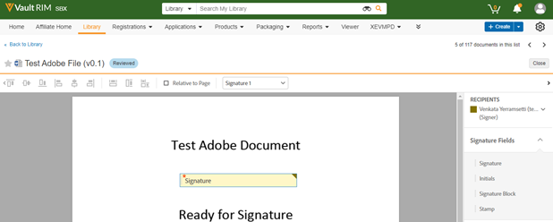
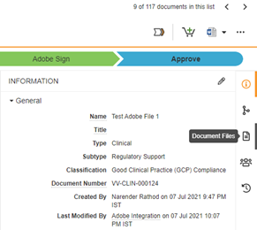
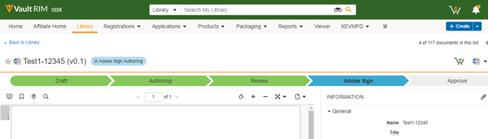

# [!DNL Veeva Vault]のAdobe Sign:ユーザーガイド {#veeva-vault-user-guide}

[**Adobe Sign サポートへのお問い合わせ**](https://adobe.com/go/adobesign-support-center)

このドキュメントは、[!DNL Veeva Vault]様が[!DNL Veeva Vault]の統合にAdobe Signを使用して契約を送信する方法を学ぶのに役立つように設計されています。

## 概要 {#overview}

[!DNL Veeva Vault]とのAdobe Signの統合により、法的な署名や監査可能なドキュメント処理が必要なドキュメントに対する署名や承認を取得するプロセスが容易になります。

署名用のドキュメントの送信プロセスは、全体的に電子メールの送信と似ているため、ほとんどのユーザーに対して簡単に採用できます。

[!DNL Veeva Vault]とのAdobe Signの統合により、ドキュメントと署名のワークフローを合理化し、迅速化できます。 統合ワークフローを使用すると、次のことが可能になります。

* スタイルメール、オーバーナイト、ファックスに費やす時間とリソースを節約。
* [!DNL Veeva Vault]から電子署名または承認の契約を送信し、リアルタイム契約履歴にアクセスし、保存済みの契約を表示します。
* 組織全体で案件をリアルタイムで追跡し、契約が表示、署名、取り消し、または拒否されたときに更新情報を取得します。
* 20以上の言語でeサインインし、世界中の50以上のロケールでファックスバックサービスをサポートします。
* 送信オプション用の再利用可能な契約テンプレートを作成します。

## [!DNL Veeva Vault]のAdobe Signを使用して契約を送信 {#send-sign-vault-agreement}

Adobe Sign for Veevaを使用して契約を送信するには：

1. [[!DNL Veeva Vault] ログイン・ページ](https://login.veevavault.com/)に移動し、ユーザー名とパスワードを入力します。 次に示すように、Vaultのホームページが開きます。

   

1. [**[!UICONTROL ライブラリ]**]タブを選択し、右上隅から[**[!UICONTROL 作成]**]を選択します。

   

1. [**[!UICONTROL アップロードして続行]**]を選択します。

1. ローカルドライブからドキュメントをアップロードします。

1. 表示されるダイアログで、**[!UICONTROL Type]**&#x200B;を&#x200B;*[!UICONTROL Clinical]*&#x200B;として選択し、必要に応じて&#x200B;**[!UICONTROL Subtype]**&#x200B;と&#x200B;**[!UICONTROL Classification]**&#x200B;を選択します。

   

1. [**[!UICONTROL OK]**]を選択して、ダイアログを閉じます。

1. [**[!UICONTROL 次へ]**]を選択します。

1. 表示されるウィンドウで、メタデータ・セクションの必須フィールドをすべて入力し、**[!UICONTROL 「保存]**」を選択します。

   

1. 次に示すように、**[!UICONTROL 下書き]**&#x200B;の状態でテストドキュメントを作成します。

   

1. 右上隅から、のドロップダウンメニューを選択し、**[!UICONTROL [レビューの開始]]**&#x200B;を選択します。

   

1. **[!UICONTROL 校閲者]**&#x200B;と&#x200B;**[!UICONTROL 校閲期限]**&#x200B;を選択します。

1. **[!UICONTROL 開始]**&#x200B;を選択します。 ドキュメントのステータスが[!UICONTROL IN REVIEW]に変更されます。

   

1. レビュー担当者の代わりに割り当てられたタスクを完了します。 完了すると、ドキュメントのステータスが[!UICONTROL REVIEWED]に変更されます。

   

1. のドロップダウンメニューを選択し、**[!UICONTROL Adobe Sign]**&#x200B;を選択します。

   

1. Vaultで開くiFrameウィンドウで、受信者の電子メールアドレスを入力し、**[!UICONTROL 次へ]**&#x200B;を選択します。

   

1. ドキュメントが処理されたら、右側のパネルから「署名」フィールドをドラッグ・アンド・ドロップし、「**[!UICONTROL 送信]**」を選択します。

   

1. ドキュメントが受信者に送信され、署名が必要になります。 受信者がドキュメントの電子メールを受け取ると、ドキュメントの状態が[!UICONTROL レビュー済み]から[!UICONTROL Adobe署名]に変わります。

   

1. Adobe Signですべての署名がキャプチャされ、完了すると、Vaultのドキュメントのステータスが[!UICONTROL 承認済み]に変わります。

1. [**[!UICONTROL ドキュメントファイル]**]オプションを選択し、Vaultの[**[!UICONTROL レンディション]**]セクションを展開します。 ドキュメントが「承認済み」状態になると、「Adobe Sign Rendition」という新しいレンディションが自動的に作成されます。

   

1. Adobe Sign Renditionをダウンロードして、受信者の署名を検証します。

   

## [!DNL Veeva Vault]のAdobe Signを使用した契約のキャンセル {#cancel-sign-vault-agreement}

1. [[!DNL Veeva Vault] ログイン・ページ](https://login.veevavault.com/)に移動し、ユーザー名とパスワードを入力します。 次に示すように、Vaultのホームページが開きます。

   

1. [**[!UICONTROL ライブラリ]**]タブを選択し、ドキュメントを選択します。 ドキュメントのステータスは次のとおりです。[!UICONTROL Adobe Sign Draft]、[!UICONTROL Adobe Sign Authoring]、または[!UICONTROL Adobe Signing]の場合。

   

1. 「**[!UICONTROL Adobe署名のキャンセル]**」を選択します。

   

1. Webアクションが起動され、[!UICONTROL Vault]にiFrameウィンドウがロードされます。

   

1. ドキュメントの状態は自動的に[!UICONTROL レビュー]に変わります。

   

ドキュメントの状態が[校閲]に変わったら、再度送信して署名を取得できます。
