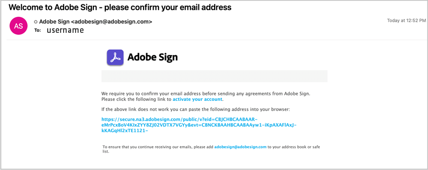

# Adobe Sign [!DNL Veeva Vault]:ユーザーガイド {#veeva-vault-user-guide}

[**Adobe Sign サポートへのお問い合わせ**](https://adobe.com/go/adobesign-support-center_jp)

この文書は、 [!DNL Veeva Vault] お客様がAdobe Sign [!DNL Veeva Vault] 統合をおこないます。

## 概要 {#overview}

Adobe Signと [!DNL Veeva Vault] では、法的な署名や監査可能な文書処理が必要な文書の署名や承認を取得するプロセスが容易になります。

署名用の文書を送信するプロセスは、全体的に電子メールの送信と同様なので、ほとんどのユーザーが簡単に採用できます。

Adobe Signと [!DNL Veeva Vault] 文書と署名のワークフローを効率化し、迅速化します。 統合ワークフローを使用すると、次のことができます。

* カタツムリのメールや夜間の通話、ファックスなどに費やす時間とリソースを節約できます。
* 電子サインまたは承認用に [!DNL Veeva Vault]リアルタイムの契約履歴にアクセスし、保存された契約を表示できます。
* 組織全体にわたる詳細をリアルタイムでトラックできます。また、契約書が表示、署名、キャンセル、拒否されたときに最新情報を受け取ることができます。
* 電子サインは 20 以上の言語に対応しており、Fax 返信サービスは世界中の 50 以上のロケールでサポートされています。
* オプションを送信するための再利用可能な契約テンプレートを作成します。

## Adobe Sign for [!DNL Veeva Vault] {#send-sign-vault-agreement}

Adobe Sign for Veeva を使用して契約書を送信するには：

1. 次の [[!DNL Veeva Vault] ログインページ](https://login.veevavault.com/) をクリックし、ユーザー名とパスワードを入力します。 次に示すように、Vault のホームページが開きます。

   

1. 選択 **[!UICONTROL ライブラリ]** 」タブをクリックし、「 **[!UICONTROL 作成]** を選択します。

   

1. 選択 **[!UICONTROL アップロードして続行]**&#x200B;を選択します。

1. ローカルドライブから文書をアップロードします。

1. 表示されるダイアログで、「 **[!UICONTROL 種類]** を *[!UICONTROL 臨床（性）]* を選択し、 **[!UICONTROL サブタイプ]** および **[!UICONTROL 分類]**&#x200B;を選択します。

   

1. 選択 **[!UICONTROL Ok]** を選択してダイアログを閉じます。

1. 選択 **[!UICONTROL 次へ]**&#x200B;を選択します。

1. 表示されるウィンドウで、メタデータセクションの必須フィールドをすべて入力し、「 **[!UICONTROL 保存]**&#x200B;を選択します。

   

1. これにより、 **[!UICONTROL ドラフト]** ステータスが表示されます。

   

1. 右上隅から、「  ドロップダウンメニューから **[!UICONTROL レビューを開始]**&#x200B;を選択します。

   

1. ツールバーの「 **[!UICONTROL Reviewer]** および **[!UICONTROL レビュー期限]**&#x200B;を選択します。

1. 選択 **[!UICONTROL 開始]**&#x200B;を選択します。 文書のステータスが「 [!UICONTROL レビュー中]を選択します。

   

1. レビュー担当者に代わって割り当てられたタスクを完了します。 完了すると、文書のステータスが「 [!UICONTROL レビュー済み]を選択します。

   

1. 選択  ドロップダウンメニューから **[!UICONTROL Adobe Sign]**&#x200B;を選択します。

   

1. Vault で開いた iFrame ウィンドウで、受信者の電子メールアドレスを入力し、 **[!UICONTROL 次へ]**&#x200B;を選択します。

   

   **注意：** 送信者の電子メールに対するAdobe Signユーザーアカウントが存在しない場合、以下に示すように、iFrame ウィンドウにメッセージが表示されます。 また、アカウントをアクティベートする手順を記載した電子メールがユーザーに送信されます。

   

   

   ただし、 *Sign ユーザーの自動プロビジョニング* 機能が無効になっていると、Adobe Signユーザーの作成に失敗し、Adobe Signアカウント管理者に問い合わせるように求めるメッセージが iFrame ウィンドウに表示されます。 Adobe Signアカウント管理者は、次のいずれかの操作を実行できます。

   * 以下を有効にします。 *Sign ユーザーの自動プロビジョニング* アカウントの機能。
   * Veeva Vault Adobe Sign Integration を使用する前に、Adobe Signでユーザを作成します。

   

1. 文書が処理されたら、右側のパネルから署名フィールドをドラッグ&amp;ドロップし、「 **[!UICONTROL 送信]**&#x200B;を選択します。

   

1. 署名用に受信者に文書が送信されます。 受信者が文書の電子メールを受信すると、文書のステータスは [!UICONTROL レビュー済み] を [!UICONTROL 署名Adobe]を選択します。

   

1. すべての署名が取得され、Adobe Signで完了すると、Vault 内の文書のステータスが「 [!UICONTROL 承認済み]を選択します。

1. 選択 **[!UICONTROL 文書ファイル]** 」オプションを選択し、「 **[!UICONTROL レンディション]** 」セクションを参照してください。 ドキュメントが承認済み状態になると、「Adobe Sign Rendition」という新しいレンディションが自動的に作成されます。

   

1. 受信者の署名を検証するためのAdobe Sign Rendition をダウンロードします。

   

## Adobe Sign for [!DNL Veeva Vault] {#cancel-sign-vault-agreement}

1. 次の [[!DNL Veeva Vault] ログインページ](https://login.veevavault.com/) をクリックし、ユーザー名とパスワードを入力します。 次に示すように、Vault のホームページが開きます。

   

1. 選択 **[!UICONTROL ライブラリ]** タブをクリックし、文書を選択します。 文書のステータスは次のとおりです。 [!UICONTROL Adobe Sign Draft], [!UICONTROL Adobe Sign Authoring]、または [!UICONTROL 署名Adobe]を選択します。

   

1. 選択 **[!UICONTROL Adobe Sign]**&#x200B;を選択します。

   

1. Web アクションがトリガーされ、 [!UICONTROL Vault]を選択します。

   

1. 文書のステータスが自動的にに「 [!UICONTROL レビュー]を選択します。

   

文書のステータスが「レビュー」に変わったら、もう一度署名用に送信できます。
