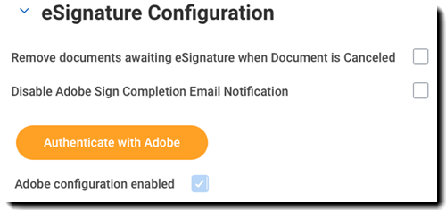

# [!DNL Workday] インストールガイド{#workday-installation-guide}

[**Adobe Sign サポートへのお問い合わせ**](https://adobe.com/go/adobesign-support-center_jp)

## 概要 {#overview}

この文書では、Adobe Signを [!DNL Workday] テナント Adobe Signを [!DNL Workday]を使用するには、の作成および変更方法を知っている必要があります [!DNL Workday] 項目：

* ビジネスプロセスフレームワーク
* テナントのセットアップと構成
* レポートと [!DNL Workday] studio の統合

統合を完了するための高度な手順は次のとおりです。

* Adobe Signで管理アカウントをアクティベートする（新規顧客のみ）
* Adobe Signで、 [!DNL Workday] 統合ユーザー
* ～間に OAuth 関係を確立する [!DNL Workday] とAdobe Sign

## Adobe Signアカウントの有効化 {#activating-your-adobe-sign-account}

既にアカウントを持っている既存のお客様は、 [Adobe Signを [!DNL Workday]](#config) 」トピックを参照してください。

Adobe Signを初めて使用するユーザーで、既存のログインをお持ちでない場合は、AdobeオンボーディングスペシャリストがAdobe Signでのアカウントのプロビジョニングを [!DNL Workday]を選択します。 完了すると、次のような確認メールが届きます。

電子メールの指示に従って、アカウントを初期化し、Adobe Signにアクセスする必要があります [!UICONTROL ホーム] ページを開きます。

## Adobe Signを [!DNL Workday] {#config}

Adobe Signを [!DNL Workday]を使用するには、Adobe Signシステムで次の 2 つの専用オブジェクトを生成する必要があります。

* **A [!DNL Workday] グループ**: [!DNL Workday] 統合機能を有効にするには、Adobe Signアカウント内で専用の「グループ」が必要です。 Adobe Signグループは、 [!DNL Workday] Adobe Signの使用 Salesforce.com や Arriba など、その他の利用可能性に影響はありません。 電子メール通知は [!DNL Workday] グループ化して、 [!DNL Workday] ユーザーは、 [!DNL Workday] 受信トレイ。

* **統合キーを保持する認証ユーザー**:A [!DNL Workday] グループには、統合キーの権限を持つグループレベルの管理者が 1 人だけ必要です。 管理者には、 `HR@MyDomain.com` ユーザーが将来無効になり、統合が無効になるリスクを軽減するために、個人用の電子メールの代わりに使用します。

### Adobe Signでのユーザーとグループの作成 {#create-a-user-and-group-in-adobe-sign}

Adobe Sign でユーザーを作成するには：

1. アカウント管理者として Adobe Sign にログインします。。
1. 次の場所に移動 **[!UICONTROL アカウント]** > **[!UICONTROL ユーザー]**&#x200B;を選択します。
1. ツールバーの「  」をクリックして、新しいユーザーを作成します。

   

1. 表示されたダイアログで、新しいユーザーの詳細を入力します。

   * アクセスできる機能する電子メールを入力します。
   * 適切な姓名の値を入力します。
   * 選択 **[!UICONTROL このユーザーの新しいグループを作成]** を選択します。
   * 次の **[!UICONTROL 新しいグループ名]** ～のような直観的な名前で *[!DNL Workday]*&#x200B;を選択します。

   

1. 「**[!UICONTROL 保存]**」をクリックします。

   これで、 [!UICONTROL ユーザー] 新しいユーザーが **[!UICONTROL 作成済み]** ステータス

   

ステータスが「作成済み」のユーザーの電子メールアドレスを確認するには：

1. 新しいユーザーの電子メールにログインします。
2. 「Welcome to Adobe Sign」という電子メールを見つけます。
3. 表示される場所をクリック **[!UICONTROL ここをクリックしてパスワードを設定]**&#x200B;を選択します。
4. パスワードを設定します。

電子メールアドレスを確認すると、ユーザーのステータスが [!UICONTROL 作成済み] を [!UICONTROL アクティブ]を選択します。

### 管理者権限ユーザーの定義 {#define-the-authenticating-user}

新しいユーザーを [!DNL Workday] グループ：

1. 次の場所にある [!UICONTROL ユーザー] ページを開きます（まだ開いていない場合）。
2. リポジトリマネージャーウィンドウで [!DNL Workday] を選択します。

   これにより、 [!UICONTROL 編集] ページにユーザー権限が表示されます。

3. 確認するには、 **[!UICONTROL グループ管理者]**&#x200B;を選択します。
4. 「**[!UICONTROL 保存]**」をクリックします。

## 以下を設定します [!DNL Workday] テナント {#configure-workday}

DITA マップの [!DNL Workday] テナントとAdobe Signは、サービス間に信頼関係を確立する必要があります。 完了すると、Adobe Signを使用した署名プロセスを有効にする「Review Document」ステップを追加できます。

>[!NOTE]
>
>Adobe Signは、 [!DNL Workday] 環境

信頼関係を確立するには、次の手順を実行します。

1. ログイン先 [!DNL Workday] アカウント管理者
1. パネルの「 **[!UICONTROL テナントのセットアップの編集 — ビジネスプロセス]** ページを開きます。
1. 「[!UICONTROL 電子サイン設定]」セクションを探します。

   

1. クリック **[!UICONTROL 認証Adobe]**&#x200B;を選択します。

   これにより、OAuth2.0 認証シーケンスが開始されます。

1. 確認メッセージが表示されたら、前に作成したAdobe Signグループ管理者の資格情報を入力します。
1. Adobe Signへのアクセスを承認します。

>[!NOTE]
>
>続行する前に、他のAdobe Signインスタンスから完全にログアウトしていることを確認してください。

接続が完了すると、「Adobe構成を有効にする」チェックボックスが設定され、 [!DNL Workday]を選択します。

### 「Review Document」ステップの設定 {#configure-review}

「Review Document」ステップの文書は、次のいずれかになります。

* 静的ドキュメント
* 同じビジネス・プロセス内の「文書の生成」ステップによって生成された文書
* 書式設定されたレポート ( [!DNL Workday] レポートデザイナ

これらのドキュメントには、 [Adobeのテキストタグ](https://adobe.com/go/adobesign_text_tag_guide_jp) 特定のコンポーネントに署名するAdobeの外観と位置を制御する 文書ソースは、ビジネスプロセス定義内に指定する必要があります。ビジネスプロセスの実行中にその場で文書をアップロードすることはできません。

「Review Document」ステップでAdobe Signを使用する独自の機能として、直列化された署名者グループを設定できます。 これにより、署名の順番が決められている、役割に基づくグループを指定できます。Adobe Signは、並行署名グループをサポートしていません。

Review Document ステップの設定については、 [クイックスタートガイド](https://adobe.com//go/adobesign_workday_quick_start){target=&quot;_blank&quot;}。

## サポート {#support}

### [!DNL Workday] サポート {#workday-support}

[!DNL Workday]この統合の所有者は です。したがって、統合の範囲、機能の要求、日常的処理の問題に関して疑問点が出てきた場合は、まず Workday に問い合わせることになります。

以下を参照してください [!DNL Workday] 統合のトラブルシューティング方法とドキュメントの生成方法に関するコミュニティ記事：

* [電子サイン統合のトラブルシューティング](https://doc.workday.com/#/reader/3DMnG~27o049IYFWETFtTQ/zhA~hYllD3Hv1wu0CvHH_g)
* [「Review documents」ステップ](https://doc.workday.com/#/reader/3DMnG~27o049IYFWETFtTQ/TboWWKQemecNipWgxLAjqg)
* [動的なドキュメント生成](https://community.workday.com/saml/login?destination=/articles/176443)
* [オファー文書生成のヒント](https://community.workday.com/node/183242)

### Adobe Signのサポート {#adobe-sign-support}

Adobe Sign は統合パートナーです。この統合で署名を取得できない場合や、保留中の署名の通知が適切に実行されない場合は、Adobe Sign に問い合わせてください。

Adobe Sign のユーザーは、カスタマーサクセスマネージャー（CSM）に連絡してサポートを受ける必要があります。または、アドビテクニカルサポートに連絡していただくこともできます。その場合は、1-866-318-4100 に電話し、製品リストが読み上げられるのを待って、指示に従って 4、2 の順番に番号を入力します。

* [文書へのAdobeテキストタグの追加](https://adobe.com/go/adobesign_text_tag_guide)
* [文書の構成と例の確認](https://www.adobe.com//go/adobesign_workday_quick_start)

## よくある質問 {#faq}

### ステータスがで更新されない理由 [!DNL Workday] 文書が完全に署名されている場合でも、 {#why-is-the-status-not-being-updated-within-workday-even-the-document-is-fully-signed}

の文書ステータス [!DNL Workday] 候補者が「[!UICONTROL 送信]」ボタンをクリックします。

例： [!DNL Workday] 電子サイン署名ステータスの確認タスク：プロセスを開始するために、ユーザーは関連する受信トレイタスクを送信できます。

例： [!DNL Workday] 開発：元の署名は、ユーザーが文書に署名した後に受信トレイタスクを送信した場合にのみ、プロセスを完了します。 署名後、iframe が閉じられ、ユーザーは同じタスクにリダイレクトされます。ここで、 [!UICONTROL 送信] 」ボタンをクリックしてプロセスを完了します。
