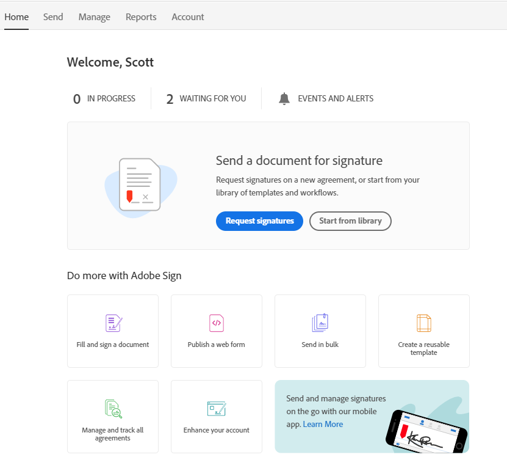
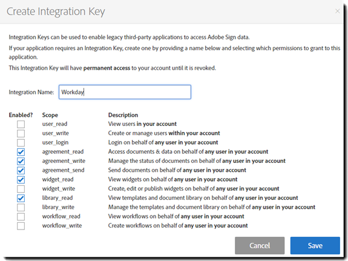
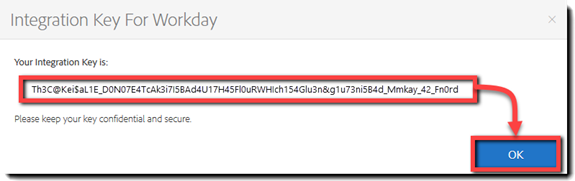
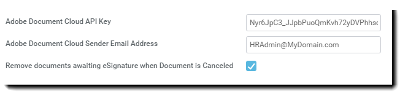

# [!DNL Workday] 体験版のインストール{#workday-trial-installation}

## 概要 {#overview}

この文書は、 [!DNL Workday] お客様は、Adobe Signで体験版アカウントを有効化し、そのアカウントを [!DNL Workday] テナント Adobe Signを [!DNL Workday]を作成する方法と変更する方法を知っている必要があります [!DNL Workday] 項目：

* ビジネスプロセスフレームワーク
* テナントのセットアップと構成
* レポートと [!DNL Workday] Studio との連携

**注意**:既存のAdobe Signアカウントがある場合は、体験版を開始する必要はありません。 お客様は、クライアントサクセスマネージャーに連絡して依頼することができます [!DNL Workday] 統合。

次に、統合手順の概要を示します。

* Adobe Sign で体験版アカウントを有効にします。
* Adobe Signでの統合キーの生成
* 統合キーを [!DNL Workday] テナント

## Adobe Sign体験版アカウントの有効化 {#activate-sign-trial-account}

Adobe Signの 30 日間体験版をリクエストするには、こちらに入力する必要があります [登録フォーム](https://land.echosign.com/esign-trial-workday-registration.html)を選択します。

**注意**:体験版の作成には、一時的なメールアドレスではなく、有効な機能メールアドレスを使用することを強くお勧めします。 アカウントを確認するためにこの電子メールにアクセスする必要があるため、アドレスは有効である必要があります。

Adobe Signのオンボーディングスペシャリストは、1 営業日以内に [!DNL Workday]を選択します。 完了すると、以下のような確認メールが届きます。

アカウントを初期化してAdobe Signにアクセスするには [!UICONTROL ホーム] ページで、「電子メール」に記載されている手順に従います。

## 統合キーの生成 {#generate-an-integration-key}

新規インストールの場合は、Adobe Signで統合キーを生成し、 [!DNL Workday]を選択します。 このキーは、Adobe Signと [!DNL Workday] お互いを信頼し合い、コンテンツを共有する環境

Adobe Sign で統合キーを生成するには：

1. Adobe Sign で管理者アカウントにログインします。。
1. 次の場所に移動 **[!UICONTROL **アカウント]** > **[!UICONTROL 個人環境設定]** > **[!UICONTROL アクセストークン**]**&#x200B;を選択します。
1. ツールバーの「 **丸で囲まれたプラスアイコン** 窓の右側に

   パネルが開きます。 [!UICONTROL 統合キーの作成] します。

   

1. キーにわかりやすい名前を指定します ( 例： [!DNL Workday]を選択します。

   統合キーでは、以下の要素を有効にする必要があります。

   * agreement_read
   * agreement_write
   * agreement_send
   * widget_read
   * library_read

   

1. 「**[!UICONTROL 保存]**」をクリックします。

   アカウントに指定されているキーを示す「[!UICONTROL アクセストークン]」ページが表示されます。

1. 作成されたキー定義をクリックします。 [!DNL Workday]を選択します。

   この [!UICONTROL 統合キー] リンクが定義の上部に表示されます。

1. ツールバーの「 **[!UICONTROL 統合キー]** リンク、

   統合キーが表示されます。

   

1. このキーは、次の手順で使用するので、コピーして安全な場所に保存します。
1. クリック **[!UICONTROL OK]**&#x200B;を選択します。

   

## 以下を設定します [!DNL Workday] テナント {#configuring-the-workday-tenant}

### 統合キーのインストール {#install-the-integration-key}

統合キーを [!DNL Workday] テナントはAdobe Signと信頼関係を確立します。 関係が確立されると、あらゆるビジネスプロセスに [!UICONTROL 「Review Document」ステップ] 署名プロセスを有効にするために追加されました。

**注意**[!DNL Workday]：Adobe Sign は、 環境では「Adobe Document Cloud」というブランド名で呼ばれます。

統合キーをインストールするには：

1. ログイン先 [!DNL Workday] アカウント管理者
1. ファイルを検索して **[!UICONTROL テナントのセットアップの編集 — ビジネスプロセス]** ページを開きます。

1. 次の 4 つのフィールドに情報を入力します。

   * **[!UICONTROL Adobe Document Cloud Acknowledgment]**:統合に関する確認応答の固定テキスト。

   * **[!UICONTROL Adobe Document Cloud API キー]**:統合キーのインストール先

   * **[!UICONTROL Adobe Document Cloud Sender Email Address]**:Adobe Signのグループレベルの管理者の電子メールアドレス

   * **[!UICONTROL 文書のキャンセル時に電子サイン待ちの文書を削除]**:で文書がキャンセルされた場合に、署名サイクルから文書を削除するオプションの設定 [!DNL Workday]を選択します。

   

1. 次に、インストールを完了します。

   1. 統合キーを [!UICONTROL Adobe Sign API 統合キー] 」フィールドに入力します。
   1. Adobe Sign管理者の電子メールアドレスを「 [!UICONTROL Adobe Document Cloud Sender Email Address] 」フィールドに入力します。
   1. クリック **[!UICONTROL OK]**&#x200B;を選択します。

   

Adobe Sign機能は、 [!UICONTROL 「Review Document」ステップ] を使用するように設定し、 **[!UICONTROL Adobe]** を電子サインの種類として設定します。

### 「Review Document」ステップの設定 {#configure-the-review-document-step}

「Review Document」ステップのドキュメントは、静的ドキュメントである場合もあります。同じビジネスプロセス内の「ドキュメントの生成」ステップによって生成されたドキュメントまたは、 [!DNL Workday] レポート・デザイナ。 これらいずれの場合でも、[アドビのテキストタグ](https://adobe.com/go/adobesign_text_tag_guide_jp)を使用して、Adobe Sign 固有のコンポーネントの外観や位置を制御できます。文書ソースは、ビジネスプロセス定義内に指定する必要があります。ビジネスプロセスの実行中にアドホック文書をアップロードすることはできません。

「Review Document」ステップでAdobe Signを使用する独自の機能として、直列化された署名者グループを設定できます。 署名者グループを使用すると、ログイン順序が指定された役割ベースのグループを指定できます。 Adobe Signは、並行署名グループをサポートしていません。

Review Document ステップの設定については、 [クイックスタートガイド](https://adobe.com//go/adobesign_workday_quick_start){target=&quot;_blank&quot;}。

## サポート {#support}

### [!DNL Workday] サポート {#workday-support}

[!DNL Workday]この統合の所有者は です。したがって、統合の範囲、機能の要求、日常的処理の問題に関して疑問点が出てきた場合は、まず Workday に問い合わせることになります。

この [!DNL Workday] コミュニティには、統合のトラブルシューティング方法やドキュメントの生成方法に関する次のような優れた記事があります。

* [電子サイン統合のトラブルシューティング](https://doc.workday.com/#/reader/3DMnG~27o049IYFWETFtTQ/zhA~hYllD3Hv1wu0CvHH_g)
* [「Review Document（文書を確認）」ステップ](https://doc.workday.com/#/reader/3DMnG~27o049IYFWETFtTQ/TboWWKQemecNipWgxLAjqg)
* [動的な文書の生成](https://community.workday.com/node/176443)

* [オファー文書生成の設定のヒント](https://community.workday.com/node/183242)

### Adobe Signのサポート {#adobe-sign-support}

Adobe Sign は統合パートナーです。この統合で署名を取得できない場合や、保留中の署名の通知が適切に実行されない場合は、Adobe Sign に問い合わせてください。

Adobe Sign のユーザーは、カスタマーサクセスマネージャー（CSM）に連絡してサポートを受ける必要があります。または、Adobeテクニカルサポートに電話で連絡することもできます。1-866-318-4100;製品リストが表示されるまで待ち、次のように入力します。プロンプトに従って 4 と 2

* [文書へのアドビのテキストタグの追加](https://adobe.com/go/adobesign_text_tag_guide)

* [文書の構成と例の確認](https://www.adobe.com//go/adobesign_workday_quick_start){target=&quot;_blank&quot;}

[**Adobe Sign サポートへのお問い合わせ**](https://www.adobe.com/go/adobesign-support-center)
