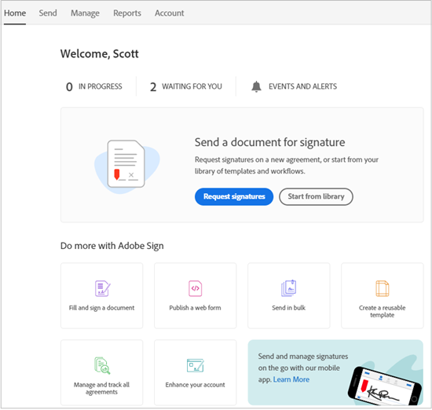

# [!DNL Workday] 体験版のインストール{#workday-trial-installation}

## 概要 {#overview}

このドキュメントは、[!DNL Workday]様がAdobe Signで試用版アカウントをアクティブ化し、[!DNL Workday]テナントに統合する方法を学ぶのに役立つように設計されています。 [!DNL Workday]内でAdobe Signを使用するには、次のような[!DNL Workday]アイテムの作成と変更方法を知る必要があります。

* ビジネスプロセスフレームワーク
* テナントの設定と構成
* レポート作成と[!DNL Workday] Studioの統合

**注**:既存のAdobe Signアカウントを持っている場合は、試用版を開始する必要はありません。[!DNL Workday]の統合を要求するには、クライアント成功マネージャに問い合わせてください。

次に、統合手順の概要を示します。

* Adobe Sign で体験版アカウントを有効にします。
* Adobe Signで統合キーを生成する
* 統合キーを[!DNL Workday]テナントにインストールします

## Adobe Sign試用版アカウントを有効にする {#activate-sign-trial-account}

30日間のAdobe Signの試用版をリクエストするには、この[登録フォーム](https://land.echosign.com/esign-trial-workday-registration.html)に記入する必要があります。

**注**:試用版を作成する際には、有効な機能の電子メールアドレスを使用し、一時的な電子メールではなく使用することを強くお勧めします。アカウントを確認するには、この電子メールにアクセスする必要があります。そのため、アドレスは有効である必要があります。

1営業日以内に、Adobe Signのオンボーディングスペシャリストが、[!DNL Workday]のアカウントを（Adobe Signで）準備します。 完了すると、次に示す確認の電子メールが届きます。

電子メールの指示に従って、アカウントを初期化し、Adobe Sign [!UICONTROL ホーム]ページにアクセスします。

## 統合キーの生成 {#generate-an-integration-key}

新規インストールの場合は、Adobe Signで統合キーを生成し、[!DNL Workday]に入力する必要があります。 このキーは、Adobe Sign環境と[!DNL Workday]環境を認証し、互いに信頼し合い、コンテンツを共有します。

Adobe Sign で統合キーを生成するには：

1. Adobe Sign で管理者アカウントにログインします。。
1. **[!UICONTROL **アカウント]** > **[!UICONTROL 個人設定]** **[!UICONTROL アクセストークン**]**&#x200B;に移動します。
1. ウィンドウの右側にある&#x200B;**丸付きのプラスアイコン**&#x200B;をクリックします。

   [!UICONTROL 統合キーの作成]インターフェイスが開きます。

   

1. [!DNL Workday]のように、キーの直感的な名前を指定します。

   統合キーでは、以下の要素を有効にする必要があります。

   * agreement_read
   * agreement_write
   * agreement_send
   * widget_read
   * library_read

   

1. 「**[!UICONTROL 保存]**」をクリックします。

   アカウントに指定されているキーを示す「[!UICONTROL アクセストークン]」ページが表示されます。

1. [!DNL Workday]用に作成されたキー定義をクリックします。

   [!UICONTROL Integration Key]リンクは、定義の最上部に表示されます。

1. **[!UICONTROL Integration Key]**&#x200B;リンクをクリックします。

   統合キーを公開します。

   

1. このキーをコピーし、次の手順で安全な場所に保存します。
1. **[!UICONTROL OK]**&#x200B;をクリックします。

   

## [!DNL Workday]テナントの構成 {#configuring-the-workday-tenant}

### 統合キーのインストール {#install-the-integration-key}

[!DNL Workday]テナントに統合キーをインストールすると、Adobe Signとの信頼関係が確立されます。 この関係が確立されると、任意のビジネスプロセスに[!UICONTROL ドキュメントのレビュー手順]を追加し、署名プロセスを有効にできます。

**注意**[!DNL Workday]：Adobe Sign は、 環境では「Adobe Document Cloud」というブランド名で呼ばれます。

統合キーをインストールするには：

1. [!DNL Workday]にアカウント管理者としてログインします。
1. **[!UICONTROL [テナントの設定の編集 – ビジネスプロセス]**]ページを検索して開きます。

1. 次の4つのフィールドに情報を入力します。

   * **[!UICONTROL Adobe Document Cloudの確認]**:統合に関する固定テキスト確認。

   * **[!UICONTROL Adobe Document Cloud APIキー]**:統合キーがインストールされている場所

   * **[!UICONTROL Adobe Document Cloud Senderの電子メールアドレス]**:Adobe Signのグループレベル管理者の電子メールアドレス

   * **[!UICONTROL ドキュメントが取り消されたときにeSignatureを待っているドキュメントを削除]**:でドキュメントが取り消された場合に、署名サイクルからドキュメントを削除するオプションの構 [!DNL Workday]成。

   

1. 次に、インストールを完了します。

   1. 統合キーを[!UICONTROL Adobe Sign API統合キー]フィールドに貼り付けます。
   1. Adobe Sign管理者の電子メールアドレスを、「Adobe Document Cloud Sender E-mail Address」]フィールドに入力します。[!UICONTROL 
   1. **[!UICONTROL OK]**&#x200B;をクリックします。

   

[!UICONTROL ドキュメントのレビュー手順]を追加し、**[!UICONTROL Adobe]**&#x200B;によるeSignをeSignatureの種類として使用するように設定することで、Adobe Sign機能を任意のビジネスプロセスに追加できるようになりました。

### ドキュメントの確認手順の構成 {#configure-the-review-document-step}

「ドキュメントのレビュー」ステップのドキュメントは、静的ドキュメントにすることができます。同じビジネス・プロセス内で「ドキュメントの生成」ステップによって生成されるドキュメントまたは、[!DNL Workday]レポート・デザイナで作成されたフォーマット済のレポート。 これらいずれの場合でも、[アドビのテキストタグ](https://adobe.com/go/adobesign_text_tag_guide_jp)を使用して、Adobe Sign 固有のコンポーネントの外観や位置を制御できます。文書ソースは、ビジネスプロセス定義内に指定する必要があります。ビジネスプロセスの実行中は、アドホックドキュメントをアップロードできません。

レビュードキュメントステップでAdobe Signを使用する場合に特有な機能は、シリアル化された署名者グループを持つ機能です。 署名者グループを使用すると、順番にサインインするロールベースのグループを指定できます。 Adobe Signは並列署名グループをサポートしていません。

ドキュメントの確認手順の構成については、[クイックスタートガイド](https://adobe.com//go/adobesign_workday_quick_start){target=&quot;_blank&quot;}を参照してください。

## サポート {#support}

### [!DNL Workday] 支援 {#workday-support}

[!DNL Workday]この統合の所有者は です。したがって、統合の範囲、機能の要求、日常的処理の問題に関して疑問点が出てきた場合は、まず Workday に問い合わせることになります。

[!DNL Workday]コミュニティには、統合のトラブルシューティングとドキュメントの生成に関する優れた記事がいくつかあります。

* [電子サイン統合のトラブルシューティング](https://doc.workday.com/#/reader/3DMnG~27o049IYFWETFtTQ/zhA~hYllD3Hv1wu0CvHH_g)
* [「Review Document（文書を確認）」ステップ](https://doc.workday.com/#/reader/3DMnG~27o049IYFWETFtTQ/TboWWKQemecNipWgxLAjqg)
* [動的な文書の生成](https://community.workday.com/node/176443)

* [オファー文書生成の設定のヒント](https://community.workday.com/node/183242)

### Adobe Signのサポート {#adobe-sign-support}

Adobe Sign は統合パートナーです。この統合で署名を取得できない場合や、保留中の署名の通知が適切に実行されない場合は、Adobe Sign に問い合わせてください。

Adobe Sign のユーザーは、カスタマーサクセスマネージャー（CSM）に連絡してサポートを受ける必要があります。または、Adobeテクニカルサポートに電話で問い合わせることもできます。1-866-318-4100;製品リストを待ってから、次のように入力します。4、2の順に入力します（プロンプトが表示されます）。

* [文書へのアドビのテキストタグの追加](https://adobe.com/go/adobesign_text_tag_guide)

* [文書の構成と例の確認](https://experienceleague.adobe.com/docs/dc-sign-integrations/using/workday/quick-start.html)

[**Adobe Sign サポートへのお問い合わせ**](https://adobe.com/go/adobesign-support-center)
